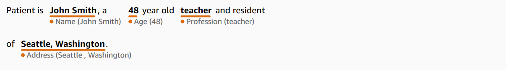

# Detect PHI

Use the **DetectPHI** operation when you only want to detect Protected Health Information (PHI) data when scanning the clinical text. To detect all available entities in the clinical text use **DetectEntitiesV2**.

This API is best for a use case where only detecting PHI entities is required. For information about information in the non-PHI categories, see [Detect entities (Version 2)](textanalysis-entitiesv2.md "textanalysis-entitiesv2.md").

###### Important

Amazon Comprehend Medical provides confidence scores that indicate the level of confidence in the accuracy of the detected entities. Evaluate these confidence scores and identify the right confidence threshold for your use case. For specific compliance use cases, we recommend
that you use additional human review or other methods to confirm the accuracy of detected PHI.

Under the HIPAA act, PHI that is based on a list of 18 identifiers must be treated with
special care. Amazon Comprehend Medical detects entities associated with these identifiers but these entities
don't map 1:1 to the list specified by the Safe Harbor method. Not all identifiers are
contained in unstructured clinical text, but Amazon Comprehend Medical does cover all the relevant
identifiers. These identifiers consist of data that can be used to identify an individual
patient, including the following list. For more information, see [Health Information Privacy](https://www.hhs.gov/hipaa/for-professionals/privacy/special-topics/de-identification/index.html "https://www.hhs.gov/hipaa/for-professionals/privacy/special-topics/de-identification/index.html") on the _U.S. Government Health and Human
Services_ website.

Each PHI-related entity includes a score (`Score` in the response) that
indicates the level of confidence Amazon Comprehend Medical has in the accuracy of the detection. Identify the
right confidence threshold for your use case and filter out entities that do not meet it.
When identifying occurrences of PHI, it may be better to use a low confidence threshold for
filtering to capture more potential detected entities. This is especially true when not
using the values of the detected entities in compliance use cases.

The following PHI-related entities can be detected by running the **DetectPHI** or **DetectEntitiesV2** operations:

| Detected PHI Entities | Entity                                                                                                                                                                                                                                                                                                                                                  | Description                                                                                                                                                                                                                                                         | HIPAA Category |
| --------------------- | ------------------------------------------------------------------------------------------------------------------------------------------------------------------------------------------------------------------------------------------------------------------------------------------------------------------------------------------------------- | ------------------------------------------------------------------------------------------------------------------------------------------------------------------------------------------------------------------------------------------------------------------- | -------------- |
| AGE                   | All components of age, spans of age, and any age mentioned, be it<br>patient or family member or others involved in the note. Default is in<br>years unless otherwise noted.                                                                                                                                                                            | 3. Dates related to an individual                                                                                                                                                                                                                                   |
| DATE                  | Any date related to patient or patient care.                                                                                                                                                                                                                                                                                                            | 3. Dates related to an individual                                                                                                                                                                                                                                   |
| NAME                  | All names mentioned in the clinical note, typically belonging to<br>patient, family, or provider.                                                                                                                                                                                                                                                       | 1. Name                                                                                                                                                                                                                                                             |
| PHONE_OR_FAX          | Any phone, fax, pager; excludes named phone numbers such as<br>1-800-QUIT-NOW as well as 911.                                                                                                                                                                                                                                                           | 4. Phone number<br>5. FAX number                                                                                                                                                                                                                                    |
| EMAIL                 | Any email address.                                                                                                                                                                                                                                                                                                                                      | 6. Email addresses                                                                                                                                                                                                                                                  |
| ID                    | Any sort of number associated with the identity of a patient. This<br>includes their social security number, medical record number, facility<br>identification number, clinical trial number, certificate or license<br>number, vehicle or device number. It also includes biometric numbers,<br>and numbers identifying the place of care or provider. | 7. Social Security Number<br>8. Medical Record number<br>9. Health Plan number<br>10. Account numbers<br>11. Certificate/License numbers<br>12. Vehicle identifiers<br>13. Device numbers<br>16. Biometric information<br>18. Any other identifying characteristics |
| URL                   | Any web URL.                                                                                                                                                                                                                                                                                                                                            | 14. URLs                                                                                                                                                                                                                                                            |
| ADDRESS               | This includes all geographical subdivisions of an address of any<br>facility, named medical facilities, or wards within a facility.                                                                                                                                                                                                                     | 2. Geographic location                                                                                                                                                                                                                                              |
| PROFESSION            | Includes any profession or employer mentioned in a note as it pertains<br>to the patient or the patient’s family.                                                                                                                                                                                                                                       | 18. Any other identifying characteristics                                                                                                                                                                                                                           |

###### Example

The text "Patient is John Smith, a 48-year-old teacher and resident of Seattle,

Washington." returns:

- "John Smith" as an _entity_ of type `NAME` in the
  `PROTECTED_HEALTH_INFORMATION` category.
- "48" as an _entity_ of type `AGE` in the
  `PROTECTED_HEALTH_INFORMATION` category.
- "teacher" as an _entity_ of type `PROFESSION`
  (identifying characteristic) in the `PROTECTED_HEALTH_INFORMATION`
  category.
- "Seattle, Washington" as an `ADDRESS`
  _entity_ in the `PROTECTED_HEALTH_INFORMATION`
  category.
  In the Amazon Comprehend Medical console, this is shown like this:


When using the **DetectPHI**
operation, the response appears like this. When you use the **StartPHIDetectionJob**
operation, Amazon Comprehend Medical creates a file in the output location with this structure.

```
{
    "Entities": [
        {
            "Id": 0,
            "BeginOffset": 11,
            "EndOffset": 21,
            "Score": 0.997368335723877,
            "Text": "John Smith",
            "Category": "PROTECTED_HEALTH_INFORMATION",
            "Type": "NAME",
            "Traits": []
        },
        {
            "Id": 1,
            "BeginOffset": 25,
            "EndOffset": 27,
            "Score": 0.9998362064361572,
            "Text": "48",
            "Category": "PROTECTED_HEALTH_INFORMATION",
            "Type": "AGE",
            "Traits": []
        },
        {
            "Id": 2,
            "BeginOffset": 37,
            "EndOffset": 44,
            "Score": 0.8661606311798096,
            "Text": "teacher",
            "Category": "PROTECTED_HEALTH_INFORMATION",
            "Type": "PROFESSION",
            "Traits": []
        },
        {
            "Id": 3,
            "BeginOffset": 61,
            "EndOffset": 68,
            "Score": 0.9629441499710083,
            "Text": "Seattle",
            "Category": "PROTECTED_HEALTH_INFORMATION",
            "Type": "ADDRESS",
            "Traits": []
        },
        {
            "Id": 4,
            "BeginOffset": 78,
            "EndOffset": 88,
            "Score": 0.38217034935951233,
            "Text": "Washington",
            "Category": "PROTECTED_HEALTH_INFORMATION",
            "Type": "ADDRESS",
            "Traits": []
        }
    ],
    "UnmappedAttributes": []
}
```
