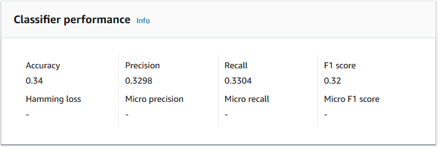

# Custom classifier metrics

Amazon Comprehend provides metrics to help you estimate how well a custom classifier performs. Amazon Comprehend calculates the metrics
using the test data from the classifier training job. The metrics accurately represent the performance of the model
during training, so they approximate the model performance for classification of similar data.

Use API operations such as [DescribeDocumentClassifier](../APIReference/API_DescribeDocumentClassifier.md "../APIReference/API_DescribeDocumentClassifier.md") to retrieve the metrics for a custom classifier.

###### Note

Refer to [Metrics: Precision, recall, and FScore](https://scikit-learn.org/stable/modules/generated/sklearn.metrics.precision_recall_fscore_support.html "https://scikit-learn.org/stable/modules/generated/sklearn.metrics.precision_recall_fscore_support.html") for an understanding of the underlying Precision, Recall, and F1
score metrics. These metrics are defined at a class level. Amazon Comprehend uses **macro**
averaging to combine these metrics into the test set P,R, and F1, as discussed in the following.

###### Topics

- [Metrics](#cer-doc-class-metrics "#cer-doc-class-metrics")
- [Improving your custom classifier's performance](#improving-metrics-doc "#improving-metrics-doc")

## Metrics

Amazon Comprehend supports the following metrics:

######

- [Accuracy](#class-accuracy-metric "#class-accuracy-metric")
- [Precision (macro precision)](#class-macroprecision-metric "#class-macroprecision-metric")
- [Recall (macro recall)](#class-macrorecall-metric "#class-macrorecall-metric")
- [F1 score (macro F1 score)](#class-macrof1score-metric "#class-macrof1score-metric")
- [Hamming loss](#class-hammingloss-metric "#class-hammingloss-metric")
- [Micro precision](#class-microprecision-metric "#class-microprecision-metric")
- [Micro recall](#class-microrecall-metric "#class-microrecall-metric")
- [Micro F1 score](#class-microf1score-metric "#class-microf1score-metric")

To view the metrics for a Classifier, open the **Classifier Details** page in the
console.

### Accuracy

Accuracy indicates the percentage of labels from the test data that the model predicted accurately. To compute
accuracy, divide the number of accurately predicted labels in the test documents by the total number of labels
in the test documents.

For example

| Actual label | Predicted label | Accurate/Incorrect |
| ------------ | --------------- | ------------------ | ---------------------------------------------------------------------------------------------------------------------------------------------------------------------------------------------------------------------------------------------------------------------------------------------------------------------------------------------------------------------------------------------------------------------------------------------------------------------------------------------------------------------------------------------------------------------------------------------------------------------------------------------------------------------------------------------------------------------------------------------------------------------------------------------------------------------------------------------------------------------------------------------------------------------------------------------------------------------------------------------------------------------------------------------------------------------------------------------------------------------------------------------------------------------------------------------------------------------------------------------------------------------------------------------------------------------------------------------------------------------------------------------------------------------------------------------------------------------------------------------------------------------------------------------------------------------------------------------------------------------------------------------------------------------------------------------------------------------------------------------------- |
| 1            | 1               | Accurate           |
| 0            | 1               | Incorrect          |
| 2            | 3               | Incorrect          |
| 3            | 3               | Accurate           |
| 2            | 2               | Accurate           |
| 1            | 1               | Accurate           |
| 3            | 3               | Accurate           | The accuracy consists of the number of accurate predictions divided by the number of overall test samples = 5/7 = 0.714, or 71.4% ### Precision (macro precision) Precision is a measure of the usefulness of the classifier results in the test data. It's defined as the number of documents accurately classified, divided by the total number of classifications for the class. High precision means that the classifier returned significantly more relevant results than irrelevant ones. The `Precision` metric is also known as _Macro Precision_. The following example shows precision results for a test set.                                                                                                                                                                                                                                                                                                                                                                                                                                                                                                                                                                                                                                                                                                                                                                                                                                                                                                                                                                                                                                                                                                                             |
| Label        | Sample size     | Label precision    |
| ---          | ---             | ---                |
| Label_1      | 400             | 0.75               |
| Label_2      | 300             | 0.80               |
| Label_3      | 30000           | 0.90               |
| Label_4      | 20              | 0.50               |
| Label_5      | 10              | 0.40               | The Precision (Macro Precision) metric for the model is therefore: `Macro Precision = (0.75 + 0.80 + 0.90 + 0.50 + 0.40)/5 = 0.67` ### Recall (macro recall) This indicates the percentage of correct categories in your text that the model can predict. This metric comes from averaging the recall scores of all available labels. Recall is a measure of how complete the classifier results are for the test data. High recall means that the classifier returned most of the relevant results. The `Recall` metric is also known as _Macro Recall_. The following example shows recall results for a test set.                                                                                                                                                                                                                                                                                                                                                                                                                                                                                                                                                                                                                                                                                                                                                                                                                                                                                                                                                                                                                                                                                                                                 |
| Label        | Sample size     | Label recall       |
| ---          | ---             | ---                |
| Label_1      | 400             | 0.70               |
| Label_2      | 300             | 0.70               |
| Label_3      | 30000           | 0.98               |
| Label_4      | 20              | 0.80               |
| Label_5      | 10              | 0.10               | The Recall (Macro Recall) metric for the model is therefore: `Macro Recall = (0.70 + 0.70 + 0.98 + 0.80 + 0.10)/5 = 0.656` ### F1 score (macro F1 score) The F1 score is derived from the `Precision` and `Recall` values. It measures the overall accuracy of the classifier. The highest score is 1, and the lowest score is 0. Amazon Comprehend calculates the _Macro F1 Score_. It's the unweighted average of the label F1 scores. Using the following test set as an example:                                                                                                                                                                                                                                                                                                                                                                                                                                                                                                                                                                                                                                                                                                                                                                                                                                                                                                                                                                                                                                                                                                                                                                                                                                                                 |
| Label        | Sample size     | Label F1 score     |
| ---          | ---             | ---                |
| Label_1      | 400             | 0.724              |
| Label_2      | 300             | 0.824              |
| Label_3      | 30000           | 0.94               |
| Label_4      | 20              | 0.62               |
| Label_5      | 10              | 0.16               | The F1 Score (Macro F1 Score) for the model is calculated as follows: `Macro F1 Score = (0.724 + 0.824 + 0.94 + 0.62 + 0.16)/5 = 0.6536` ### Hamming loss The fraction of labels that are incorrectly predicted. Also seen as the fraction of incorrect labels compared to the total number of labels. Scores closer to zero are better. ### Micro precision Original: Similar to the precision metric, except that micro precision is based on the overall score of all precision scores added together. ### Micro recall Similar to the recall metric, except that micro recall is based on the overall score of all recall scores added together. ### Micro F1 score The Micro F1 score is a combination of the Micro Precision and Micro Recall metrics. ## Improving your custom classifier's performance The metrics provide an insight into how your custom classifier performs during a classification job. If the metrics are low, the classification model might not be effective for your use case. You have several options to improve your classifier performance: 1. In your training data, provide concrete examples that define clear separation of the categories. For example, provide documents that use unique words/sentences to represent the category. 2. Add more data for under-represented labels in your training data. 3. Try to reduce skew in the categories. If the largest label in your data has more than 10 times the documents in the smallest label, try increasing the number of documents for the smallest label. Make sure to reduce the skew ratio to at most 10:1 between highly represented and least represented classes. You can also try removing input documents from the highly represented classes. |
