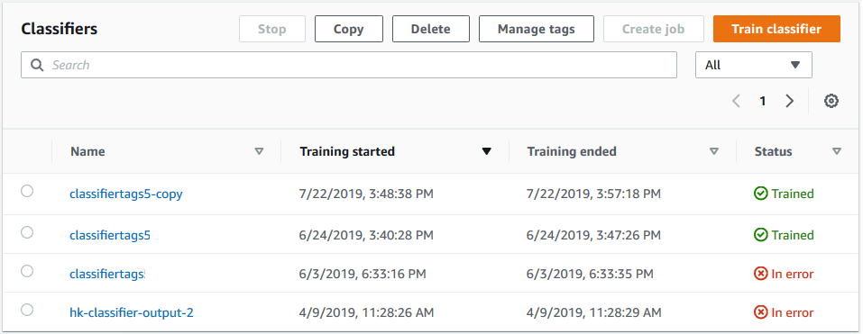

# Train custom classifiers (console)

You can create and train a custom classifier using the console, and then use the custom
classifier to analyze your documents.

To train a custom classifier, you need a set of training documents. You label these documents with the
categories that you want the document classifier to recognize. For information about preparing your training documents,
see [Preparing classifier training data](prep-classifier-data.md "prep-classifier-data.md").

###### To create and train a document classifier model

1. Sign in to the AWS Management Console and open the Amazon Comprehend console at [https://console.aws.amazon.com/comprehend/](https://console.aws.amazon.com/comprehend/ "https://console.aws.amazon.com/comprehend/")
2. From the left menu, choose **Customization** and then choose
   **Custom Classification**.
3. Choose **Create new model**.
4. Under **Model settings**, enter a model name for the classifier. The name must be unique
   within your account and current Region.

(Optional) Enter a version name. The name must be unique within your account and current Region. 5. Select the language of the training documents. To see the languages that classifiers support, see [Training classification models](training-classifier-model.md "training-classifier-model.md"). 6. (Optional) If you want to encrypt the data in the storage volume while Amazon Comprehend processes your training job,
choose **Classifier encryption**. Then choose whether to use a KMS key associated with your
current account, or one from another account.

    * If you are using a key associated with the current account, choose the key ID for
     **KMS key ID**.
    * If you are using a key associated with a different account, enter the ARN for the key ID under
     **KMS key ARN**.

###### Note

For more information on creating and using KMS keys and the associated encryption, see [AWS Key Management Service (AWS KMS)](../../../kms/latest/developerguide/overview.md "../../../kms/latest/developerguide/overview.md"). 7. Under **Data specifications**, choose the **Training model type** to
use.

    * **Plain text documents:** Choose this option to create
     a plain text model. Train the model using plain text documents.
    * **Native documents:** Choose this option to create a native document model. Train the
     model using native documents (PDF, Word, images).

8.  Choose the **Data format** of your training data. For information about the data formats,
    see [Classifier training file formats](prep-class-data-format.md "prep-class-data-format.md").
    - **CSV file:** Choose this option if your training data
      uses the CSV file format.
    - **Augmented manifest:** Choose this option if you used Ground Truth to create augmented
      manifest files for your training data. This format is available if you chose **Plain
      text documents** as the training model type.

9.  Choose the **Classifier mode** to use.
    - **Single-label mode:** Choose this mode if the categories you're assigning to
      documents are mutually exclusive and you're training your classifier to assign one label to each document.
      In the Amazon Comprehend API, single-label mode is known as multi-class mode.
    - **Multi-label mode:** Choose this mode if multiple categories can be applied to a
      document at the same time, and you are training your classifier to assign one or more labels to each
      document.

10. If you choose **Multi-label mode**, you can select the **Delimiter for
    labels**. Use this delimiter character to separate labels when there are multiple classes for a
    training document. The default delimiter is the pipe character.
11. (Optional) If you chose **Augmented manifest** as the data format, you can input up to five
    augmented manifest files. Each augmented manifest file contains either a training dataset or a test dataset. You
    must provide at least one training dataset. Test datasets are optional. Use the following steps to configure the
    augmented manifest files:
    1. Under **Training and test dataset**, expand the **Input location**
       panel.
    2. In **Dataset type**, choose **Training data** or **Test
       data**.
    3. For the **SageMaker AI Ground Truth augmented manifest file S3 location**, enter the location
       of the Amazon S3 bucket that contains the manifest file or navigate to it by choosing **Browse
       S3**. The IAM role that you're using for access permissions for the training job must have read
       permissions for the S3 bucket.
    4. For the **Attribute names**, enter the name of the attribute that contains your annotations.
       If the file contains annotations from multiple chained labeling jobs, add an attribute for each job.
    5. To add another input location, choose **Add input location** and then configure the next
       location.

12. (Optional) If you chose **CSV file** as the data format, use the following steps to
    configure the training dataset and optional test dataset:
    1. Under **Training dataset**, enter the location of the Amazon S3 bucket that contains
       your training data CSV file or navigate to it by choosing **Browse S3**. The IAM role that you're
       using for access permissions for the training job must have read permissions for the S3 bucket.

    (Optional) If you chose **Native documents** as the training model type, you also
    provide the URL of the Amazon S3 folder that contains the training example files. 2. Under **Test dataset**, select whether you are providing extra data for Amazon Comprehend to
    test the trained model.

        * **Autosplit**: Autosplit automatically selects 10% of your training data to
         reserve for use as testing data.
        * (Optional) **Customer provided**: Enter the URL of the test data CSV file in
         Amazon S3. You can also navigate to its location in Amazon S3 and choose **Select
         folder**.

        (Optional) If you chose **Native documents** as the training model type, you also
         provide the URL of the Amazon S3 folder that contains the test files.

13. (Optional) For **Document read mode**, you can override the default text extraction
    actions. This option isn't required for plain-text models, as it applies to text extraction for scanned
    documents. For more information, see [Setting text extraction options](idp-set-textract-options.md "idp-set-textract-options.md").
14. (Optional for plain-text models) For **Output data**, enter the location of an Amazon S3 bucket to
    save training output data, such as the confusion matrix. For more information, see [Confusion matrix](train-classifier-output.md#conf-matrix "train-classifier-output.md#conf-matrix").

(Optional) If you choose to encrypt the output result from your training job, choose
**Encryption**. Then choose whether to use a KMS key associated with the current account,
or one from another account.

    * If you are using a key associated with the current account, choose the key alias for **KMS key
     ID**.
    * If you are using a key associated with a different account, enter the ARN for the key alias or
     ID under **KMS key ID**.

15. For **IAM role**, choose **Choose an existing IAM
    role**, and then choose an existing IAM role that has read permissions for the S3
    bucket that contains your training documents. The role must have a trust policy that begins
    with `comprehend.amazonaws.com` to be valid.

If you don't already have an IAM role with these permissions, choose **Create an IAM role** to make one.
Choose the access permissions to grant
this role, and then choose a name suffix to distinguish the role from IAM roles in your account.

###### Note

For encrypted input documents, the IAM role used must also have `kms:Decrypt` permission. For more
information, see [Permissions required to use KMS encryption](security_iam_id-based-policy-examples.md#auth-kms-permissions "security_iam_id-based-policy-examples.md#auth-kms-permissions"). 16. (Optional) To launch your resources into Amazon Comprehend from a VPC, enter the VPC ID under **VPC** or
choose the ID from the dropdown list.

    1. Choose the subnet under **Subnets(s)**. After you select the first subnet,
     you can choose additional ones.
    2. Under **Security Group(s)**, choose the security group to use if you
     specified one. After you select the first security group, you can choose additional
     ones.

###### Note

When you use a VPC with your classification job, the `DataAccessRole` used for the Create and Start
operations must have permissions to the VPC that accesses the input documents and the output bucket. 17. (Optional) To add a tag to the custom classifier, enter a key-value pair under
**Tags**. Choose **Add tag**. To remove this pair before creating
the classifier, choose **Remove tag**. For more information, see
[Tagging your resources](tagging.md "tagging.md"). 18. Choose **Create**.
The console displays the **Classifiers** page. The new classifier appears in the table, showing
`Submitted` as its status. When the classifier starts processing the training documents, the status
changes to `Training`. When a classifier is ready to use, the status changes to `Trained` or
`Trained with warnings`. If the status is `TRAINED_WITH_WARNINGS`, review the skipped files
folder in the [Classifier training output](train-classifier-output.md "train-classifier-output.md").

If Amazon Comprehend encountered errors during creation or training, the status changes to `In error`.
You can choose a classifier job in the table to get more information about the classifier, including any error
messages.

