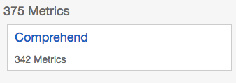
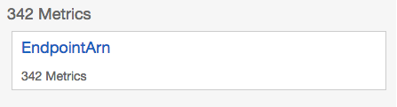
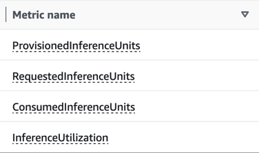
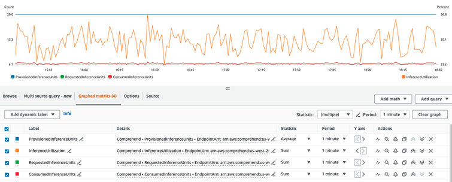

# Monitoring Amazon Comprehend endpoints

You can adjust the throughput of your endpoint by increasing or decreasing the number of
inference units (IUs). For more information on updating your endpoint, see [Updating Amazon Comprehend endpoints](manage-endpoints-update.md "manage-endpoints-update.md").

You can determine how to best adjust your endpoint's throughput by monitoring its usage with
the Amazon CloudWatch console.

###### Monitor your endpoint usage with CloudWatch

1. Sign in to the AWS Management Console and open the [CloudWatch console](https://console.aws.amazon.com/cloudwatch/ "https://console.aws.amazon.com/cloudwatch/").
2. On the left, choose **Metrics** and select **All
   metrics**.
3. Under **All metrics**, choose **Comprehend**.

 4. The CloudWatch console displays the dimensions for the **Comprehend** metrics.
Choose the **EndpointArn** dimension.

The console displays **ProvisionedInferenceUnits**,
**RequestedInferenceUnits**, **ConsumedInferenceUnits**, and
**InferenceUtilization** for each of your endpoints.

Select the four metrics and navigate to the **Graphed metrics** tab. 5. Set the Statistic columns for **RequestedInferenceUnits** and
**ConsumedInferenceUnits** to **Sum**. 6. Set the Statistic column for
**InferenceUtilization** to **Sum**. 7. Set the Statistic column for **ProvisionedInferenceUnits** to
**Average**. 8. Change the Period column for all metrics to **1 Minute**. 9. Select **InferenceUtilization** and select the arrow to move it to a
separate **Y Axis**.

Your graph is ready for analysis.

Based on the CloudWatch metrics, you can also set up auto scaling to automatically adjust the
throughput of your endpoint. For more information about using auto scaling with your endpoints,
see [Auto scaling with endpoints](comprehend-autoscaling.md "comprehend-autoscaling.md").

- **ProvisionedInferenceUnits** - This metric represents the number of
  average provisioned IUs at the time the request was made.
- **RequestedInferenceUnits** - This is based on the usage of each
  request submitted to the service that was sent to be processed. This can be helpful
  to compare the request sent to be processed to what was actually processed without
  getting throttling (ConsumedInferenceUnits). The value for this metric is calculated by
  taking the number of characters sent to be processed and dividing it by the number
  of characters that can be processed in a minute for 1 IU.
- **ConsumedInferenceUnits** - This is based on the usage of each request
  submitted to the service that was successfully processed (not throttled). This can be helpful when you
  compare what you're consuming against your provisioned IUs. The value for this metric is
  calculated by taking the number of characters processed and dividing it by the number of
  characters that can be processed in a minute for 1 IU.
- **InferenceUtilization** - This is emitted per request. This value is
  calculated by taking the consumed IUs defined in **ConsumedInferenceUnits**
  and dividing it by **ProvisionedInferenceUnits** and converting to a
  percentage out of 100.

###### Note

All of the metrics are emitted only for successful requests. The metric won't appear if
it's from a request that is throttled or fails with an internal server error or a customer
error.
