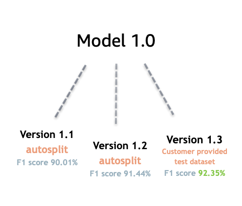

# Model versioning with Amazon Comprehend

Artificial intelligence and machine learning (AI/ML) is all about rapid experimentation. With
Amazon Comprehend, you train and build out models which you use to gain insight on your data.
With model versioning you can keep track of your modeling history and scores associated with
running results of your models as you provide more or different sets of data. You can use
versioning with your custom classification models or your custom entity recognition models.
Taking a look at your different versions over time you can gain insight on how successful
they've performed and gain insight on what parameters you used to get to your state of success.

When you train a new version of an existing custom classifier model or entity recognition
model, all you need to do is create a new version from the model details page and all the
details populate for you. The new version will have the same name as your earlier model — what
we call the versionID — although you will give it a unique version name during creation. As you
add new versions to a model, you can see all the previous versions and their details in one view
from the model details page. With versioning, you can see how model performance changes as you
make changes to your training dataset.

###### Create a new **Custom classifier** version (console)

1. Sign in to the AWS Management Console and open the Amazon Comprehend console at [https://console.aws.amazon.com/comprehend/](https://console.aws.amazon.com/comprehend/ "https://console.aws.amazon.com/comprehend/")
2. From the left menu, choose **Customization** and then choose
   **Custom classification**.
3. From the **Classifiers** list, choose the name of the custom model from
   which you want to create a new version. The custom model details page is displayed.
4. On the top right, select **Create new model.** A screen opens
   with prepopulated details from the parent custom classification model.
5. Under **Version name** add a unique name to the new
   version.
6. Under version details, you can change the language and number of labels associated with
   your new model.
7. Under the **Data specifications** section configure how you
   want to provide the data to your new version— make sure to provide full data, which includes
   documents from your previous model and your new documents. You can change the **Classifier mode** (single-label, or multi-label), **Data format** (CSV file, Augmented manifest), your **Training dataset**, and your **Test
   dataset** (autosplit, or your custom test data configuration).
8. (Optional) update the S3 location for your output data
9. Under **Access permissions**, create or use an existing IAM
   role.
10. (Optional) Update your VPC settings
11. (Optional) Add tags to your new version to help keep track of the details.

For more information about creating custom classifiers, see [Create a Custom Classifier](create-custom-classifier-console.md "create-custom-classifier-console.md")

###### Create a new **Custom entity recognizer** version (console)

1. Sign in to the AWS Management Console and open the Amazon Comprehend console at [https://console.aws.amazon.com/comprehend/](https://console.aws.amazon.com/comprehend/ "https://console.aws.amazon.com/comprehend/")
2. From the left menu, choose **Customization** and then choose
   **Custom entity recognition**.
3. From the **Recognizer model** list, choose the name of the recognizer from
   which you want to create a new version. The details page is displayed.
4. On the top right, select **Train new version.** A screen opens
   with prepopulated details from the parent entity recognizer.
5. Under **Version name** add a unique name to the new
   version.
6. Under Custom entity type, add the custom labels or label you want the recognizer to
   identify in your dataset and select **Add type**. Choose a custom
   entity type from the annotations or entity list you've provided. The recognizer will then use
   all of the included entity types to identify entities in the data set when running your job.
   Each entity type must be upper-case and separated by and underscore if it uses multiple words. A
   maximum of 25 types are allowed.
7. (Optional) Select **Recognizer encryption** to encrypt the
   data in the storage volume while your job is being processed.
8. Under the Training data section, specify the **Annotation and data
   format** details (CSV file, Augmented manifest)single-label, or multi-label),
   **Data format** (CSV, Augmented manifest), your **Training dataset**, and your **Test dataset**
   (autosplit, or your custom test data configuration).
9. (Optional) update the S3 location for your output data
10. Under **Access permissions**, create or use an existing IAM
    role.
11. (Optional) Update your VPC settings
12. (Optional) Add tags to your new version to help keep track of the details.
    To learn more about custom entity recognizers, see [Custom Entity Recognition](custom-entity-recognition.md "custom-entity-recognition.md") and [Creating a Custom Entity Recognizer Using the Console](realtime-analysis-cer.md "realtime-analysis-cer.md").
