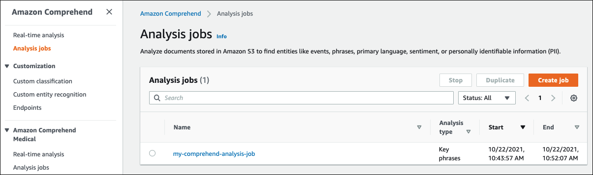
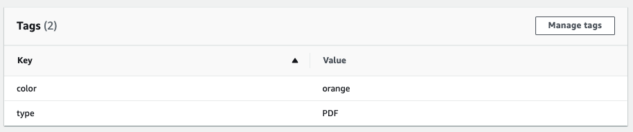
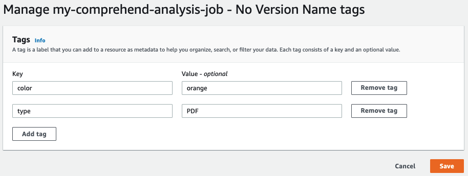

# Viewing, editing, and deleting tags associated with a resource

You can view tags associated with an **Analysis job**, a
**Custom classification** model, or a
**Custom entity recognition** model.

1. Sign in to the AWS Management Console and open the Amazon Comprehend console at [https://console.aws.amazon.com/comprehend/](https://console.aws.amazon.com/comprehend/ "https://console.aws.amazon.com/comprehend/")
2. Select the resource (Analysis job, Custom classification, or Custom entity recognition) that
   contains the file with the tags you want to view, modify, or delete. This displays the
   list of existing files for your selected resource.

 3. Click the name of the file (or model) whose tags you want to view, modify, or delete.
This takes you to the details page for that file (or model). Scroll down until you see a
**Tags** box. Here, you can see all the tags associated with your
selected file (or model).

Select **Manage tags** to edit or remove tags from your
resource. 4. Click on the text you want to modify, then edit your tag. You can also remove the
tag by selecting **Remove tag**. To add a new tag, select
**Add tag**, then enter your desired text in the blank fields.

When you're finished modifying your tags, select **Save**.
