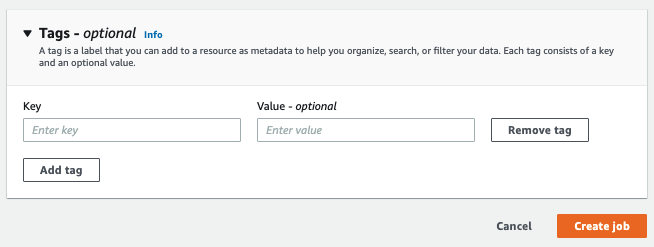

# Tagging a new resource

You can add tags to an **Analysis job**, a
**Custom classification** model, a **Custom entity recognition**
model, or **endpoints**.

1. Sign in to the AWS Management Console and open the Amazon Comprehend console at [https://console.aws.amazon.com/comprehend/](https://console.aws.amazon.com/comprehend/ "https://console.aws.amazon.com/comprehend/")
2. Select the resource (Analysis job, Custom classification, or Custom entity recognition)
   you want to create from the left navigation pane.
3. Click **Create job** (or **Create new
   model**). This takes you to the main 'create' page for your resource.
   At the bottom of this page, you'll see a '**Tags -**
   _optional_' panel.



Enter a tag key and, optionally, a tag value. Choose **Add tag**
to add another tag to the resource. Repeat this process until all your tags are
added. Note that tag keys must be unique per resource. 4. Select the **Create** or **Create job** button
to continue creating your resource.
You can also add tags using the AWS CLI. This example shows how to add tags
with the [start-entities-detection-job](../../../cli/latest/reference/comprehend/start-entities-detection-job.md "../../../cli/latest/reference/comprehend/start-entities-detection-job.md")
command.

```
aws comprehend start-entities-detection-job \
--language-code "`en`" \
--input-data-config "{\"S3Uri\": \"s3://`test-input/TEST.csv`\"}" \
--output-data-config "{\"S3Uri\": \"s3://`test-output`\"}" \
--data-access-role-arn arn:aws:iam::`123456789012`:role/`test` \
--tags "[{\"Key\": \"`color`\",\"Value\": \"`orange`\"}]"
```
