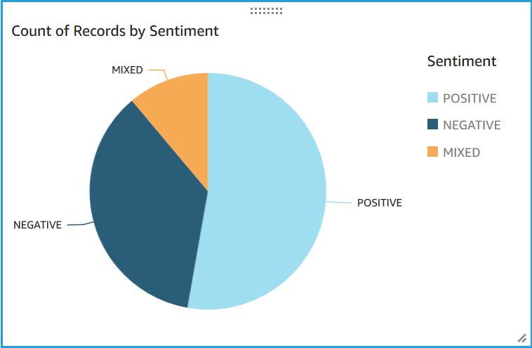
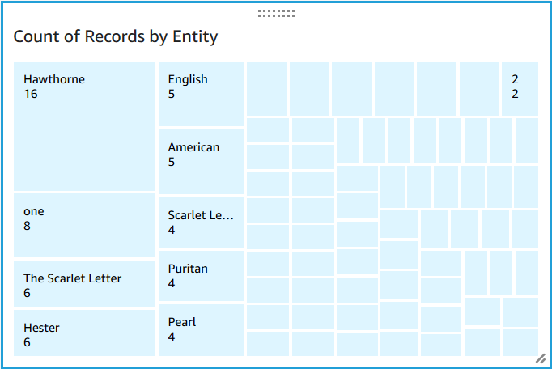
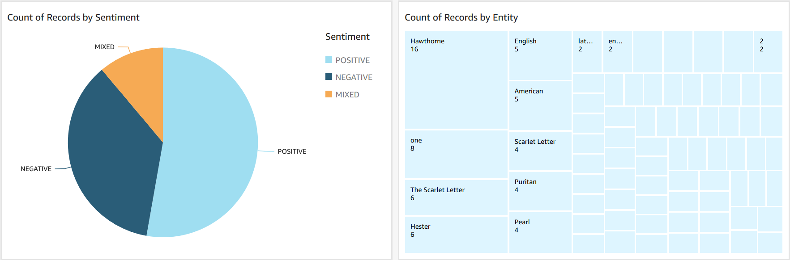

# Step 5: Visualizing Amazon Comprehend output in Quick Suite

After storing the Amazon Comprehend results in tables, you can connect to and visualize the data with
Quick Suite. Quick Suite is an AWS managed business intelligence (BI) tool for visualizing data. Quick Suite
makes it easy to connect to your data source and create powerful visuals. In this step, you
connect Quick Suite to your data, create visualizations that extract insights from the data, and
publish a dashboard of visualizations.

###### Topics

- [Prerequisites](#tutorial-reviews-visualize-prereqs "#tutorial-reviews-visualize-prereqs")
- [Give Quick Suite access](#tutorial-reviews-visualize-access "#tutorial-reviews-visualize-access")
- [Import the datasets](#tutorial-reviews-visualize-import "#tutorial-reviews-visualize-import")
- [Create a sentiment visualization](#tutorial-reviews-visualize-sentiment "#tutorial-reviews-visualize-sentiment")
- [Create an entities visualization](#tutorial-reviews-visualize-entities "#tutorial-reviews-visualize-entities")
- [Publish a dashboard](#tutorial-reviews-visualize-dashboard "#tutorial-reviews-visualize-dashboard")
- [Clean up](#tutorial-reviews-visualize-clean "#tutorial-reviews-visualize-clean")

## Prerequisites

Before you begin, complete [Step 4: Preparing the Amazon Comprehend output for data
visualization](tutorial-reviews-tables.md "tutorial-reviews-tables.md").

## Give Quick Suite access

To import the data, Quick Suite requires access to your Amazon Simple Storage Service (Amazon S3) bucket and
Amazon Athena tables. To give Quick Suite access to your data, you must be signed in as
a QuickSight administrator and have access to edit the resource permissions. If you are
unable to complete the following steps, review the IAM prerequisites from the overview
page [Tutorial: Analyzing insights from customer reviews with
Amazon Comprehend](tutorial-reviews.md "tutorial-reviews.md").

###### To give Quick Suite access to your data

1. Open the [Quick Suite
   console](https://quicksight.aws.amazon.com/sn/start "https://quicksight.aws.amazon.com/sn/start").
2. If this is the first time you have used Quick Suite, the console prompts you to
   create a new administrator user by providing an email address. For
   **Email address**, enter the same email address as your AWS account.
   Choose **Continue**.
3. After signing in, choose your profile name in the navigation bar and choose
   **Manage QuickSight**. You must be signed in as an
   administrator to view the **Manage QuickSight** option.
4. Choose **Security and permissions**.
5. For **QuickSight access to AWS services**, choose
   **Add or remove**.
6. Choose **Amazon S3**.
7. From **Select Amazon S3 buckets**, choose your S3 bucket for both
   **S3 Bucket** and **Write permissions for Athena
   Workgroup**.
8. Choose **Finish**.
9. Choose **Update**.

## Import the datasets

Before creating visualizations, you must add the sentiment and entities datasets to
Quick Suite. You do this with the Quick Suite console. You import your unnested sentiment and unnested
entities tables from Amazon Athena.

###### To import your datasets

1. Open the [Quick Suite
   console](https://quicksight.aws.amazon.com/sn/start "https://quicksight.aws.amazon.com/sn/start").
2. In the navigation bar, in **Datasets**, choose **New
   dataset**.
3. For **Create a Data Set**, choose
   **Athena**.
4. For **Data source name**, enter
   `reviews-sentiment-analysis` and choose **Create data
   source**.
5. For **Database**, choose the database
   `comprehend-results`.
6. For **Tables**, choose the sentiment table
   `sentiment_results_final` and then choose
   **Select**.
7. Choose **Import to SPICE for quicker analytics** and choose
   **Visualize**. SPICE is QuickSight's in-memory calculation
   engine that provides faster analyses than direct querying when creating
   visualizations.
8. Return to the Quick Suite console and choose **Datasets**. Repeat
   steps 1-7 to create an entities dataset, but make the following changes:
   1. For **Data source name**, enter
      `reviews-entities-analysis`.
   2. For **Tables**, choose the entities table
      `entities_results_final`.

## Create a sentiment visualization

Now that you can access your data in Quick Suite, you can begin creating visualizations. You
create a pie chart with the Amazon Comprehend sentiment data. The pie chart shows what proportion of
the reviews are positive, neutral, mixed, and negative.

###### To visualize sentiment data

1. In the Quick Suite console, choose **Analyses** and then choose
   **New analysis**.
2. From **Your Data Sets**, choose the sentiment dataset
   `sentiment_results_final` and then choose **Create
   analysis**.
3. In the visual editor, in **Fields list**, choose
   **sentiment**.

###### Note

The values in the **Fields list** depend on the column
names you used to create the tables in Amazon Athena. If you changed
the provided column names in the SQL queries, the **Fields
list** names will be different than the names used in these
visualization examples. 4. For **Visual types**, choose **Pie
chart**.

A pie chart similar to the following with positive, neutral, mixed, and negative
sections is displayed. To see the count and percentage of a section, hover over it.

## Create an entities visualization

Now create a second visualization with the entities dataset. You create a tree map of
the distinct entities in the data. Each block in the tree map represents an entity, and
the size of the block correlates to the number of times that the entity appears in the
dataset.

###### To visualize entities data

1. In the **Visualize** control pane, next to **Data
   set**, choose the **Add, edit, replace, and remove data
   sets** icon.
2. Choose **Add data set**.
3. For **Choose data set to add**, choose your entities dataset
   `entities_results_final` from the list of datasets and choose
   **Select**.
4. In the **Visualize** control pane, choose the **Data
   set** drop down menu and choose the entities dataset
   `entities_results_final`.
5. In **Fields list**, choose
   **entity**.
6. For **Visual types**, choose **Tree
   map**.

A tree map similar to the following is displayed next to your pie chart. To see the
count of a specific entity, hover over a block.

## Publish a dashboard

After creating the visualizations, you can publish them as a dashboard. You can
perform various tasks with a dashboard, such as sharing it with users in your AWS account,
saving it as a PDF, or emailing it as a report (limited to the Enterprise
edition of Quick Suite). In this step, you publish the visualizations as a dashboard in your
account.

###### To publish your dashboard

1. In the navigation bar, choose **Share**.
2. Choose **Publish dashboard**.
3. Choose **Publish new dashboard as** and enter the
   name `comprehend-analysis-reviews` for the dashboard.
4. Choose **Publish dashboard**.
5. Close the **Share dashboard with users** pane by
   choosing the close button in the upper-right corner.
6. In the Quick Suite console, in the navigation pane, choose **Dashboards**. A thumbnail of your new dashboard
   `comprehend-analysis-reviews` should appear under
   **Dashboards**. Choose the dashboard to view it.

You now have a dashboard with sentiment and entities visualizations that looks similar to
the following example.

###### Tip

If you want to edit the visualizations in your dashboard, return to
**Analyses** and edit the visualization that you want to update. Then,
publish the dashboard again either as a new dashboard or as a replacement of the existing
dashboard.

## Clean up

After completing this tutorial, you might want to clean up any AWS resources you no
longer want to use. Active AWS resources can continue to incur charges in your
account.

The following actions can help prevent incurring ongoing charges:

- Cancel your Quick Suite subscription. Quick Suite is a monthly subscription service. To
  cancel your subscription, see [Canceling your
  subscription](../../../quicksight/latest/user/closing-account.md "../../../quicksight/latest/user/closing-account.md") in the _Quick Suite User Guide_.
- Delete your Amazon S3 bucket. Amazon S3 charges you for storage. To clean up your Amazon S3
  resources, delete your bucket. For information about deleting a bucket, see
  [How do I delete an S3 Bucket?](../../../AmazonS3/latest/user-guide/delete-bucket.md "../../../AmazonS3/latest/user-guide/delete-bucket.md") in the _Amazon Simple Storage Service User Guide_. Make sure that you save all of your important
  files before deleting your bucket.
- Clear your AWS Glue Data Catalog. The AWS Glue Data Catalog charges you monthly for storage. You
  can delete your databases to prevent incurring ongoing charges. For information
  about managing your AWS Glue Data Catalog databases, see [Working with databases on the
  AWS Glue console](../../../glue/latest/dg/console-databases.md "../../../glue/latest/dg/console-databases.md") in the _AWS Glue Developer Guide_.
  Make sure that you export your data before clearing
  any databases or tables.
