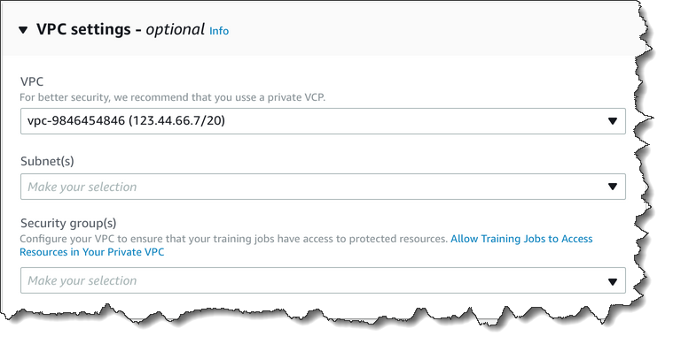

# Protect jobs by using an Amazon Virtual Private Cloud

Amazon Comprehend uses a variety of security measures to ensure the safety of your data with our job containers where it's stored
while being used by Amazon Comprehend. However, job containers access AWS resources—such as the Amazon S3 buckets where you
store data and model artifacts—over the internet.

To control access to your data, we recommend that you create a _virtual private
cloud_ (VPC) and configure it so that the data and containers aren't accessible over the internet. For
information about creating and configuring a VPC, see [Getting
Started With Amazon VPC](../../../vpc/latest/userguide/getting-started-ipv4.md "../../../vpc/latest/userguide/getting-started-ipv4.md") in the _Amazon VPC User Guide_. Using a VPC helps to
protect your data because you can configure your VPC so that it is not connected to the internet. Using a VPC also
allows you to monitor all network traffic in and out of our job containers by using VPC flow logs. For more information,
see [VPC Flow Logs](../../../vpc/latest/userguide/flow-logs.md "../../../vpc/latest/userguide/flow-logs.md") in the _Amazon VPC User Guide_.

You specify your VPC configuration when you create a job, by specifying the subnets and
security groups. When you specify the subnets and security groups, Amazon Comprehend creates _elastic
network interfaces_ (ENIs) that are associated with your security groups in one of the
subnets. ENIs allow our job containers to connect to resources in your VPC. For information
about ENIs, see [Elastic Network Interfaces](../../../vpc/latest/userguide/VPC_ElasticNetworkInterfaces.md "../../../vpc/latest/userguide/VPC_ElasticNetworkInterfaces.md") in the _Amazon VPC User Guide_.

###### Note

For jobs, you can only configure subnets with a default tenancy VPC in which your instance
runs on shared hardware. For more information on the tenancy attribute for VPCs, see [Dedicated
Instances](../../../AWSEC2/latest/UserGuide/dedicated-instance.md "../../../AWSEC2/latest/UserGuide/dedicated-instance.md") in the _Amazon EC2 User Guide_.

## Configure a job for Amazon VPC access

To specify subnets and security groups in your VPC, use the `VpcConfig` request
parameter of the applicable API, or provide this information when you create a job in the Amazon Comprehend
console. Amazon Comprehend uses this information to create ENIs and attach them to our job containers.
The ENIs provide our job containers with a network connection within your VPC that is not
connected to the internet.

The following APIs contain the `VpcConfig` request parameter:

- `Create*` APIs:
  `CreateDocumentClassifier`,
  `CreateEntityRecognizer`
- `Start*` APIs:
  `StartDocumentClassificationJob`,
  `StartDominantLanguageDetectionJob`,
  `StartEntitiesDetectionJob`,
  `StartKeyPhrasesDetectionJob`,
  `StartSentimentDetectionJob`,
  `StartTargetedSentimentDetectionJob`,
  `StartTopicsDetectionJob`

The following is an example of the VpcConfig parameter that you include in your API call:

```
"VpcConfig": {
      "SecurityGroupIds": [
          " sg-0123456789abcdef0"
          ],
      "Subnets": [
          "subnet-0123456789abcdef0",
          "subnet-0123456789abcdef1",
          "subnet-0123456789abcdef2"
          ]
      }
```

To configure a VPC from the Amazon Comprehend console, choose the configuration details from the
optional **VPC Settings** section when creating the job.



## Configure your VPC for Amazon Comprehend jobs

When configuring the VPC for your Amazon Comprehend jobs, use the following guidelines. For information
about setting up a VPC, see [Working with
VPCs and Subnets](../../../vpc/latest/userguide/working-with-vpcs.md "../../../vpc/latest/userguide/working-with-vpcs.md") in the _Amazon VPC User Guide_.

**Ensure That Subnets Have Enough IP Addresses**

Your VPC subnets should have at least two private IP addresses for each instance in a job.
For more information, see [VPC and Subnet Sizing for IPv4](../../../vpc/latest/userguide/VPC_Subnets.md#vpc-sizing-ipv4 "../../../vpc/latest/userguide/VPC_Subnets.md#vpc-sizing-ipv4") in the _Amazon VPC User Guide_.

**Create an Amazon S3 VPC Endpoint**

If you configure your VPC so that job containers don't have access to the internet, they can't connect to the
Amazon S3 buckets that contain your data unless you create a VPC endpoint that allows access. By creating a VPC
endpoint, you allow the job containers to access your data during training and analysis jobs.

When you create the VPC endpoint, configure these values:

- Select the service category as **AWS Services**
- Specify the service as `com.amazonaws.`region`.s3`
- Select **Gateway** as the VPC Endpoint type

If you're using CloudFormation to create the VPC endpoint, follow the [CloudFormation VPCEndpoint](../../../AWSCloudFormation/latest/UserGuide/aws-resource-ec2-vpcendpoint.md "../../../AWSCloudFormation/latest/UserGuide/aws-resource-ec2-vpcendpoint.md") documentation. The following example shows the **VPCEndpoint** configuration in a CloudFormation template.

```

  VpcEndpoint:
    Type: AWS::EC2::VPCEndpoint
    Properties:
      PolicyDocument:
        Version: '2012-10-17		 	 	 '
        Statement:
          - Action:
              - s3:GetObject
              - s3:PutObject
              - s3:ListBucket
              - s3:GetBucketLocation
              - s3:DeleteObject
              - s3:ListMultipartUploadParts
              - s3:AbortMultipartUpload
            Effect: Allow
            Resource:
              - "*"
            Principal: "*"
      RouteTableIds:
        - Ref: RouteTable
      ServiceName:
        Fn::Join:
          - ''
          - - com.amazonaws.
            - Ref: AWS::Region
            - ".s3"
      VpcId:
        Ref: VPC

```

We recommend that you also create a custom policy that allows only requests from your VPC to access to your S3
buckets. For more information, see [Endpoints for Amazon
S3](../../../vpc/latest/userguide/vpc-endpoints-s3.md "../../../vpc/latest/userguide/vpc-endpoints-s3.md") in the _Amazon VPC User Guide_.

The following policy allows access to S3 buckets. Edit this policy to allow access only the
resources that your job needs.

JSON

```
`{
 "Version":"2012-10-17",
 "Statement": [
 {
 "Effect": "Allow",
 "Principal": "*",
 "Action": [
 "s3:GetObject",
 "s3:PutObject",
 "s3:ListBucket",
 "s3:GetBucketLocation",
 "s3:DeleteObject",
 "s3:ListMultipartUploadParts",
 "s3:AbortMultipartUpload"
 ],
 "Resource": "*"
 }
 ]
}`

```

Use default DNS settings for your endpoint route table, so that standard Amazon S3 URLs (for example,
`http://s3-aws-region.amazonaws.com/amzn-s3-demo-bucket`) resolve. If you don't use default DNS settings, ensure
that the URLs that you use to specify the locations of the data in your jobs resolve by configuring the endpoint
route tables. For information about VPC endpoint route tables, see [Routing for Gateway Endpoints](../../../vpc/latest/userguide/vpce-gateway.md#vpc-endpoints-routing "../../../vpc/latest/userguide/vpce-gateway.md#vpc-endpoints-routing") in the
_Amazon VPC User Guide_.

The default endpoint policy allows users to install packages from the Amazon Linux and Amazon Linux 2 repositories
on our jobs container. If you don't want users to install packages from that repository, create a custom endpoint policy
that explicitly denies access to the Amazon Linux and Amazon Linux 2 repositories. Comprehend itself doesn't need any
such packages, so there won't be any functionality impact. The following is an example of a policy that denies access
to these repositories:

```
{
    "Statement": [
      {
        "Sid": "AmazonLinuxAMIRepositoryAccess",
        "Principal": "*",
        "Action": [
            "s3:GetObject"
        ],
        "Effect": "Deny",
        "Resource": [
            "arn:aws:s3:::packages.*.amazonaws.com/*",
            "arn:aws:s3:::repo.*.amazonaws.com/*"
        ]
      }
    ]
}

{
    "Statement": [
        { "Sid": "AmazonLinux2AMIRepositoryAccess",
          "Principal": "*",
          "Action": [
              "s3:GetObject"
              ],
          "Effect": "Deny",
          "Resource": [
              "arn:aws:s3:::amazonlinux.*.amazonaws.com/*"
              ]
         }
    ]
}
```

**Permissions for the `DataAccessRole`**

When you use a VPC with your analysis job, the `DataAccessRole` used for the `Create*`
and `Start*` operations must also have permissions to the VPC from
which the input documents and the output bucket are accessed.

The following policy provides the access needed to the `DataAccessRole` used for the `Create*` and
`Start*` operations.

JSON

```
`{
 "Version":"2012-10-17",
 "Statement": [
 {
 "Effect": "Allow",
 "Action": [
 "ec2:CreateNetworkInterface",
 "ec2:CreateNetworkInterfacePermission",
 "ec2:DeleteNetworkInterface",
 "ec2:DeleteNetworkInterfacePermission",
 "ec2:DescribeNetworkInterfaces",
 "ec2:DescribeVpcs",
 "ec2:DescribeDhcpOptions",
 "ec2:DescribeSubnets",
 "ec2:DescribeSecurityGroups"
 ],
 "Resource": "*"
 }
 ]
}`

```

**Configure the VPC security group**

With distributed jobs, you must allow communication between the different job containers in
the same job. To do that, configure a rule for your security group that allows inbound
connections between members of the same security group. For information, see [Security Group Rules](../../../vpc/latest/userguide/VPC_SecurityGroups.md#SecurityGroupRules "../../../vpc/latest/userguide/VPC_SecurityGroups.md#SecurityGroupRules") in the _Amazon VPC User Guide_.

**Connect to resources outside your VPC**

If you configure your VPC so that it doesn't have internet access, jobs that use that VPC do
not have access to resources outside your VPC. If your jobs need access to resources outside your
VPC, provide access with one of the following options:

- If your job needs access to an AWS service that supports interface VPC endpoints, create an
  endpoint to connect to that service. For a list of services that support interface endpoints,
  see [VPC
  Endpoints](../../../vpc/latest/userguide/vpc-endpoints.md "../../../vpc/latest/userguide/vpc-endpoints.md") in the _Amazon VPC User Guide_. For information about
  creating an interface VPC endpoint, see [Interface VPC
  Endpoints (AWS PrivateLink)](../../../vpc/latest/userguide/vpce-interface.md "../../../vpc/latest/userguide/vpce-interface.md") in the _Amazon VPC User Guide_.
- If your job needs access to an AWS service that doesn't support interface VPC endpoints or to
  a resource outside of AWS, create a NAT gateway and configure your security groups to allow
  outbound connections. For information about setting up a NAT gateway for your VPC, see [Scenario 2:
  VPC with Public and Private Subnets (NAT)](../../../vpc/latest/userguide/VPC_Scenario2.md "../../../vpc/latest/userguide/VPC_Scenario2.md") in the _Amazon VPC User Guide_.
