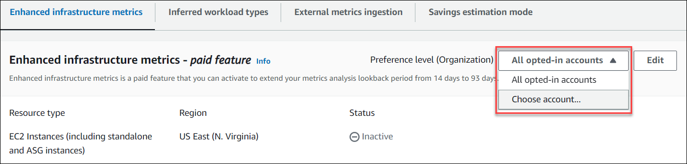

# Activating enhanced infrastructure metrics

at the organization or account level

This section provides you with instructions on how to activate or deactivate enhanced infrastructure metrics
for member accounts of an AWS Organization or an individual AWS account holder.

## Prerequisites

Make sure that you have the appropriate permissions to activate and deactivate enhanced
infrastructure metrics. For more information, see [Policies to grant access
to manage Compute Optimizer recommendation preferences](security-iam.md#enhanced-infrastructure-metrics-permissions "security-iam.md#enhanced-infrastructure-metrics-permissions").

## Procedure

###### To activate or deactivate enhanced infrastructure metrics at the organization or account level

1. Open the Compute Optimizer console at [https://console.aws.amazon.com/compute-optimizer/](https://console.aws.amazon.com/compute-optimizer/ "https://console.aws.amazon.com/compute-optimizer/").
2. Choose **General** in the navigation pane. Then, choose the
   **Enhanced infrastructure metrics** tab.
3. If you’re an individual AWS account holder, skip to step 4.

If you’re the account manager or delegated administrator of your organization, you can manage all
member accounts or an individual member account for enhanced infrastructure metrics.

    * To opt in all member accounts, choose **All opted-in accounts** from the
     Preference level dropdown.
    * To opt in an individual member account, choose **Choose account** from
     the Preference level dropdown. In the prompt that appears, select the account you want
     to opt in for rightsizing preferences. Then, choose **Set account level**.

 4. Choose **Edit**. 5. In the prompt that appears, choose **Add a preference**. 6. Select a **Resource type**, **Region**, and the **Activate** checkbox. Then, choose **Save**. 7. (Optional) If you want to deactivate enhanced infrastructure metrics, unselect the
**Activate** checkbox. Then, choose **Save**.

Compute Optimizer considers updated preferences the next time that it generates recommendations.
Until then, a **pending** status is affixed to your update preference
(for example, **Active-pending** or
**Inactive-pending**). To confirm that your resource recommendations are
taking enhanced infrastructure metrics into consideration, see [Confirming the status of enhanced infrastructure
metrics](enhanced-infrastructure-metrics.md#confirm-eim-status "enhanced-infrastructure-metrics.md#confirm-eim-status").

## Additional resources

- Troubleshooting — [Failed to get or update enhanced
  infrastructure metrics recommendation preferences](troubleshooting-account-opt-in.md#accounts-eim-missing-permissions "troubleshooting-account-opt-in.md#accounts-eim-missing-permissions")
- [Activating enhanced infrastructure metrics
  at the resource level](activating-eim-resource-level.md "activating-eim-resource-level.md")
