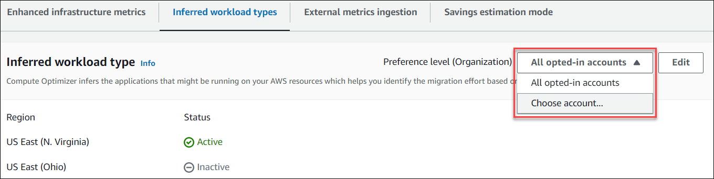

# Activating inferred workload type

This section provides you with instructions on how to activate the inferred workload type feature for member accounts
of an AWS Organization or an individual AWS account holder.

## Prerequisites

Make sure that you have the appropriate permissions to activate the inferred workload type feature. For more
information, see [Policies to grant access
to manage Compute Optimizer recommendation preferences](security-iam.md#enhanced-infrastructure-metrics-permissions "security-iam.md#enhanced-infrastructure-metrics-permissions").

## Procedure

###### To activate the inferred workload type feature for member accounts

of an AWS Organization or an individual AWS account holder

1. Open the Compute Optimizer console at [https://console.aws.amazon.com/compute-optimizer/](https://console.aws.amazon.com/compute-optimizer/ "https://console.aws.amazon.com/compute-optimizer/").
2. Choose **General** in the navigation pane. Then, choose the **Inferred
   workload type** tab.
3. If you’re an individual AWS account holder, skip to step 4.

If you’re the account manager or delegated administrator of your organization, you can manage all
member accounts or an individual member account for inferred workload type.

    * To opt in all member accounts, choose **All opted-in accounts** from the
     Preference level dropdown.
    * To opt in an individual member account, choose **Choose account** from
     the Preference level dropdown. In the prompt that appears, select the account you want
     to opt in for rightsizing preferences. Then, choose **Set account level**.

 4. Choose **Edit**. 5. To deactivate the inferred workload type preference in an AWS Region, unselect the
**Activate** checkbox. Then, choose **Save**. 6. (Optional) If you want to activate the inferred workload type preference in an AWS Region
select the **Activate** checkbox. Then, choose **Save**.. 7. (Optional) To add a new inferred workload type preference in an AWS Region, choose
**Add a preference**. Then, select a **Region** and the
**Activate** checkbox. Finally, choose **Save**.

## Additional resources

- [Opting out of external metrics
  ingestion](deactivate-external-metrics-ingestion.md "deactivate-external-metrics-ingestion.md")
- [External metrics ingestion](external-metrics-ingestion.md "external-metrics-ingestion.md")
