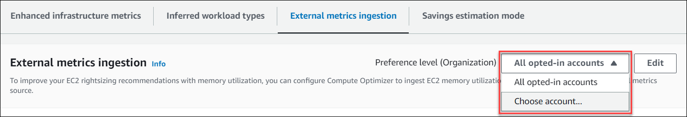
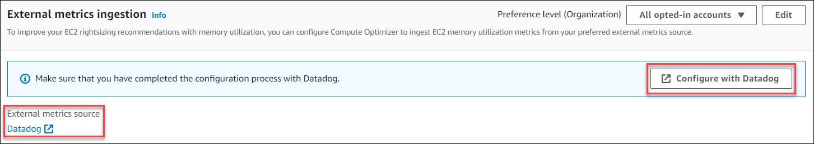

# Configuring external metrics

ingestion

This section provides you with instructions on how to configure external metric ingestion. You can
configure external metric ingestion using the Compute Optimizer console or the AWS CLI.

## Prerequisites

Make sure that you understand the metric requirments in order for Compute Optimizer to generate EC2 rightsizing recommendations
with external memory utilization. For more information, see [Metric requirements](external-metrics-ingestion.md#external-metrics-ingestion-metrics "external-metrics-ingestion.md#external-metrics-ingestion-metrics").

## Procedure

Console

###### To configure external metrics ingestion

1. Open the Compute Optimizer console at [https://console.aws.amazon.com/compute-optimizer/](https://console.aws.amazon.com/compute-optimizer/ "https://console.aws.amazon.com/compute-optimizer/").
2. Choose **General** in the navigation pane.
   Then, choose the **External metrics ingestion** tab.
3. If you’re an individual AWS account holder, skip to step 4.

If you’re the account manager or delegated administrator of your organization,
you can opt-in all member accounts or an individual member account for external
metrics ingestion.

    * To opt-in all member accounts, choose **All opted-in accounts** from the
     Preference level dropdown.
    * To opt-in an individual member account, choose **Choose account** from the
     Preference level dropdown. In the prompt that appears, select the account you want to opt-in.
     Then, choose **Set account level**.

 4. Choose **Edit**. 5. In the prompt that appears, select your external metrics provider for EC2 instances.
Then, choose **Enable**. 6. Navigate to your external metrics provider's website. To do this, choose **Configure with
provider** or the external metrics source link.

 7. Complete the configuration process on your external metrics provider’s website.

###### Important

If you don't complete the configuration process with your external metrics provider,
Compute Optimizer can't receive your external metrics.

CLI

###### To configure external metrics ingestion

1. Open a terminal or command prompt window.
2. Call the following API operation.
   - Replace `myRegion` with the source
     AWS Region.
   - Replace `123456789012` with your account ID.
   - Replace `ExternalMetricsProvider` with your external
     metrics provider.

```
`aws compute-optimizer put-recommendation-preferences --region `myRegion` --resource-type=Ec2Instance --scope='{"name":"AccountId", "value":"`123456789012`"}' --external-metrics-preference='{"source":"`ExternalMetricsProvider`"}'`
```

3. Open the Compute Optimizer console at [https://console.aws.amazon.com/compute-optimizer/](https://console.aws.amazon.com/compute-optimizer/ "https://console.aws.amazon.com/compute-optimizer/").
4. Choose **Accounts** in the navigation pane.
5. In the **Organization-level preferences for external metrics ingestion** or
   the **Account-level preferences for external metrics ingestion** section, navigate
   to your external metrics provider's website. To do this, choose **Configure with
   provider** or the external metrics source link.

 6. Complete the configuration process on your external metrics provider’s website.

###### Important

If you don't complete the configuration process with your external metrics provider,
Compute Optimizer can't receive your external metrics.

## Additional resources

- [Opting out of external metrics
  ingestion](deactivate-external-metrics-ingestion.md "deactivate-external-metrics-ingestion.md")
- [External metrics ingestion](external-metrics-ingestion.md "external-metrics-ingestion.md")
