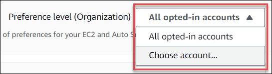
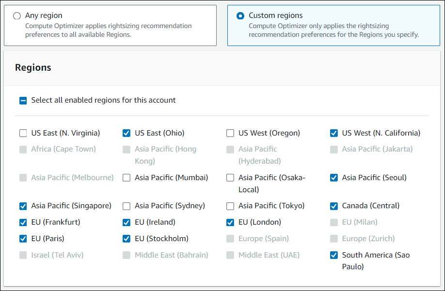
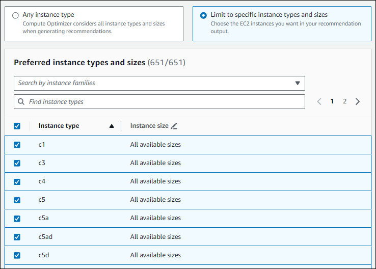
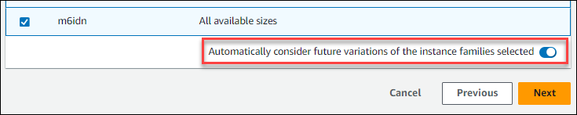
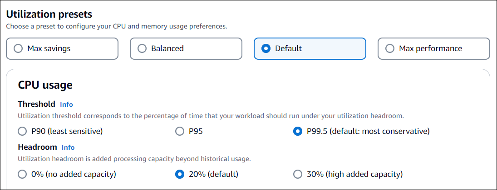

# Setting your rightsizing recommendation preferences

This section provides you with instructions on how to set your rightsizing recommendation preferences in AWS Compute Optimizer.

## Procedure

###### Steps

- [Step 1: Set preference level (Organizations only)](#rightsizing-preference-level "#rightsizing-preference-level")
- [Step 2: Set regional scope](#rightsizing-preferences-regions "#rightsizing-preferences-regions")
- [Step 3: Specify preferred EC2 instances](#rightsizing-preferences-preferred-resources-process "#rightsizing-preferences-preferred-resources-process")
- [Step 4: Specify lookback period and metrics](#rightsizing-preferences-lookback-metrics-process "#rightsizing-preferences-lookback-metrics-process")

### Step 1: Set preference level (Organizations only)

If you're the account manager or the delegated administrator of your organization, you can choose all the accounts in an organization or specific
accounts to which you want to apply rightsizing recommendation preferences.

###### Note

If you’re an individual AWS account holder, skip to [Step2: Regional scope](rightsizing-preferences.md#rightsizing-preferences-regions "rightsizing-preferences.md#rightsizing-preferences-regions").

###### To set the preference level for your rightsizing recommendation preferences

1. Open the Compute Optimizer console at [https://console.aws.amazon.com/compute-optimizer/](https://console.aws.amazon.com/compute-optimizer/ "https://console.aws.amazon.com/compute-optimizer/").
2. Choose **Rightsizing** in the navigation pane.
3. Choose the resource type you want from the **Resource type** dropdown menu.
4. In your chosen resource section, choose the **All opted-in accounts** dropdown menu.
   - To opt in all member accounts, choose **All opted-in accounts** from the
     Preference level dropdown.
   - To opt in an individual member account, choose **Choose account** from
     the Preference level dropdown. In the prompt that appears, select the account you want
     to opt in for rightsizing preferences. Then, choose **Set account level**.

### Step 2: Set regional scope

In this step you can specify the AWS Regions where you want Compute Optimizer to apply your rightsizing
recommendation preferences. For example, if you select the US East (N. Virginia) Region and US East (Ohio) Region, we
only apply the preferences to those Regions.

###### To set the regional scope of your rightsizing recommendation preferences

1. Open the Compute Optimizer console at [https://console.aws.amazon.com/compute-optimizer/](https://console.aws.amazon.com/compute-optimizer/ "https://console.aws.amazon.com/compute-optimizer/").
2. Choose **Rightsizing** in the navigation pane.
3. Choose the resource type you want from the **Resource type** dropdown menu.
4. On the **Rightsizing preferences** page, choose **Edit**.
5. Choose either **Any Region** or **Custom Regions** based on
   your requirements.
6. If you choose **Custom Regions**, select the AWS Regions where you want Compute Optimizer to
   apply your preferences. Then, choose **Next**.

### Step 3: Specify preferred EC2 instances

Use the following procedure to specify your preferred instance types and sizes for member accounts of an
organization or an individual AWS account holder.

###### To set the instances you want in your recommendation output

1. Follow the steps outlined in [Step2: Regional scope](rightsizing-preferences.md#rightsizing-preferences-regions "rightsizing-preferences.md#rightsizing-preferences-regions").
2. On the **Preferred EC2 instances** page, choose either **Any instance
   type** (default) or **Limit to specific instance types and sizes** based
   on your requirements.
3. If you choose **Limit to specific instance types and sizes**, select the instance
   types you want in your recommendation output.
   - Use the **Search by instance families** dropdown menu. When you select
     any of the instance families, the list only displays the available instance types within
     those families that you selected.
   - Use the **Find instance types** search bar to enter the specific instance
     types you want.

 4. (Optional) To specify the sizes of each instance type, do the following:

    1. Choose the edit icon on the instance type you want.
    2. Select **X** on the instance sizes that you don’t want.
    3. Select **✔** to confirm your selections.

5. (Optional) If you don't want Compute Optimizer to automatically consider future variations of your chosen
   instance families, turn off **Automatically consider future variations of the instance
   families selected**.

 6. Choose **Next**.

### Step 4: Specify lookback period and metrics

Use the following procedure to specify the lookback period, and the CPU and memory utilization preferences you want Compute Optimizer to
use when generating your custom recommendations.

###### To set the lookback period, and CPU and memory preferences

1. Follow the steps outlined in [Step 4: Preferred EC2 instances](rightsizing-preferences.md#preferred-resources-steps "rightsizing-preferences.md#preferred-resources-steps").
2. On the **Lookback period and metrics** page, choose a lookback period option based
   on your requirements.
   - If you want to use the 93-day lookback period (paid feature), you need to enable the enhanced infrastructure
     metrics preference. To do this, choose **Enable enhanced infrastructure metrics**.
     Then, in the prompt that appears, choose **Enable enhanced infrastructure metrics**.
   - If the enhanced infrastructure metrics preference is already enabled and you want to choose a
     14-day or 32-day lookback period, you need to disable the enhanced infrastructure metrics
     preference. To do this, choose **Disable enhanced infrastructure metrics**.
     Then, in the prompt that appears, choose **Disable enhanced infrastructure metrics**.

3. Choose a utilization preset:
   **Max savings**, **Balanced**,
   **Default**, or **Max performance**.

Alternatively, you can customize your own specific CPU and memory utilization preferences.

 4. Choose **Next**. 5. On the **Review and save** page, review all the preferences you have set.
Then, choose **Save preferences**.

Within 24 hours your new recommendations start to appear with the rightsizing preferences that you set.
