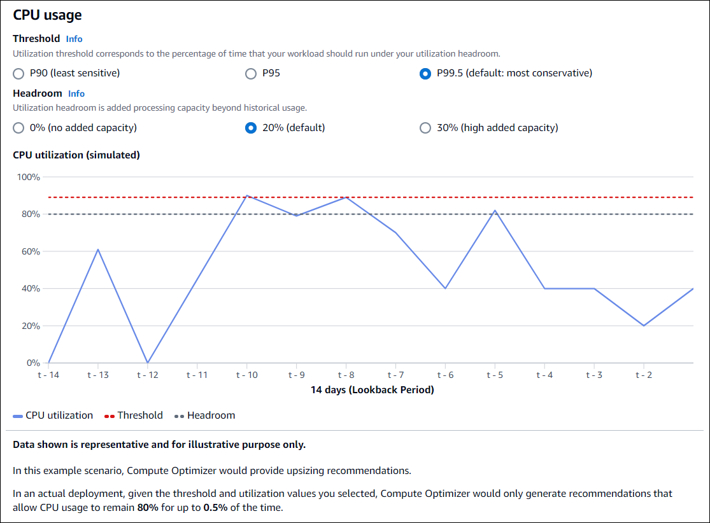

# Rightsizing recommendation preferences

The rightsizing recommendation preferences feature allows you to customize the settings you want Compute Optimizer to consider
when generating your Amazon EC2, EC2 Auto Scaling group, and Aurora and RDS database recommendations. This feature allows you to do the following:

- Adjust both the headroom and threshold of your CPU utilization
- Adjust the headroom of your memory utilization
- Configure a specific lookback period option
- Set instance family preferences at the organization, account, or regional level
  This provides you with greater transparency on how your recommendations are generated, and the ability for you
  to configure resource rightsizing recommendations for higher savings and performance sensitivity. For instructions
  on how to set your rightsizing recommendation preferences in AWS Compute Optimizer, see [Setting your rightsizing recommendation preferences](rightsizing-preferences-process.md "rightsizing-preferences-process.md").

If you’re the account manager or the delegated administrator of an AWS Organization, you can choose the account
or organization you want the rightsizing recommendation preferences to be applied to. If you’re an individual AWS
account holder (not within an organization), the rightsizing recommendation preferences you set only apply to your
recommendations.

###### Note

- The rightsizing preferences for CPU and memory utilization are only available for Amazon EC2 instances.
- For RDS DB instances, you can only specify lookback period preferences.

## Preferred EC2 instances

Rightsizing recommendation preferences allows you to specify the EC2 instances you want in your
recommendation output. You can define a custom instance consideration set which controls the instance
types and families recommended by Compute Optimizer for migration. This preference ensures that Compute Optimizer
only recommends instances that are aligned with your specific requirements. This doesn’t prevent Compute Optimizer
from generating recommendations for any of your workloads.

You can customize your instance type selection based on your organizational guidelines or requirements.
For example, if you have purchased Savings Plans and Reserved Instances, you can specify
instances only covered by those pricing models. Or, if you only want to use instances equipped with certain processors
or non-burstable instances due to your application design, you can specify those instances for your
recommendation output.

This feature also gives you the option to automatically consider future variations of your chosen
instance families. This ensures that your preferences are using the latest version of your preferred instance
families which can provide the best price-to-performance ratio. For instructions on how to specify your
preferred EC2 instances, see [Step 3: Specify preferred EC2 instances](rightsizing-preferences-process.md#rightsizing-preferences-preferred-resources-process "rightsizing-preferences-process.md#rightsizing-preferences-preferred-resources-process") in the next section of this user guide.

###### Note

We recommend that you avoid limiting instance candidates too much. This can reduce
your potential savings and rightsizing opportunities.

## Lookback period and metrics

Rightsizing recommendation preferences allows you to specify the lookback period, and the CPU and memory utilization preferences you
want Compute Optimizer to use when generating your custom recommendations. For instructions on how to set
your lookback period and metrics utilization, see [Step 4: Specify lookback period and metrics](rightsizing-preferences-process.md#rightsizing-preferences-lookback-metrics-process "rightsizing-preferences-process.md#rightsizing-preferences-lookback-metrics-process") in the next section of this user guide.

###### Topics

- [Lookback period](#rightsizing-preferences-lookback "#rightsizing-preferences-lookback")
- [CPU and memory utilization](#rightsizing-preferences-metrics "#rightsizing-preferences-metrics")

### Lookback period

Choose a metric analysis lookback period for your rightsizing recommendation preferences. Compute Optimizer analyzes your
utilization preference settings for the number of days that you specify. We recommend that you set a lookback
period that captures critical signals from your workload utilization history which can allow Compute Optimizer to identify
rightsizing opportunities with higher savings and lower performance risk.

In Compute Optimizer, you can choose from the following lookback period options: 14 days (default), 32 days, or
93 days. The 14-day and 32-day lookback periods require no additional payments. If you have monthly cycles, the
32-day lookback period can capture monthly workload patterns. The 93-day lookback period requires additional payment.
To use the 93-day option, you need to enable the enhanced infrastructure metrics preference. For more
information, see [Enhanced infrastructure metrics](enhanced-infrastructure-metrics.md "enhanced-infrastructure-metrics.md").

###### Note

For RDS DB instances, you can only specify lookback period preferences.

### CPU and memory utilization

The rightsizing recommendation preferences feature allows you to customize your utilization settings: CPU threshold,
CPU headroom, and memory headroom so your instance recommendations meet your specific workload requirements. Depending
on the utilization settings you choose, your recommendations can be tailored to increased savings opportunities, more
performance headroom, or have a higher tolerance for performance risks.

#### CPU utilization threshold

Threshold is the percentile value that Compute Optimizer uses to process utilization data before generating
recommendations. If you set a CPU threshold preference, Compute Optimizer removes the peak usage data points
above this threshold. A lower percentile value removes more peak usage from the data.

Compute Optimizer offers three options for CPU utilization threshold: P90, P95, and P99.5. By default, Compute Optimizer
uses a P99.5 threshold for its rightsizing recommendations. This means that Compute Optimizer only ignores the
top 0.5% of the highest utilization data points from your utilization history. The P99.5 threshold might be more
suited for highly sensitive production workloads where peak utilization significantly affects application performance.
If you set the utilization threshold to P90, Compute Optimizer ignores the top 10% of your highest data points from
your utilization history. P90 might be a suitable threshold for workloads less sensitive to peak utilization, such
as non-production environments.

#### CPU utilization headroom

Utilization headroom is added CPU capacity within Compute Optimizer’s recommendation to account for any future
increases in CPU usage requirements. It represents the gap between the instance's current usage and its maximum
capabilities.

Compute Optimizer provides three options for CPU utilization headroom: 30%, 20%, and 0%. By default, Compute Optimizer
uses a 20% headroom for its rightsizing recommendations. If you need additional capacity to account for any unexpected
future increases in CPU utilization, you can set the headroom to 30%. Or, suppose that your utilization is expected to remain
constant with a low chance of future increases, then you can reduce the headroom. This generates recommendations with
less added CPU capacity and increased cost savings.

#### Memory utilization headroom

Memory utilization headroom is added memory capacity within Compute Optimizer’s recommendation to account for any future increases
in memory usage. It represents the gap between the instance's current usage and its maximum capabilities.
Compute Optimizer provides three options for memory utilization headroom: 30%, 20%, and 10%. By default, Compute Optimizer uses a 20% headroom
for its rightsizing recommendations. If you need additional capacity to account for any unexpected future increases in
memory utilization, you can set the headroom to 30%. Or, suppose that your usage is expected to remain constant with a
low chance of future increases, then you can reduce the headroom. This generates recommendations with less added
memory capacity and increased cost savings.

###### Note

To receive EC2 instance recommendations that consider the memory utilization metric, you need to enable memory
utilization with the CloudWatch agent. You can also configure Compute Optimizer to ingest EC2 memory utilization metrics
from your preferred observability product. For more information, see [Enabling memory utilization with the CloudWatch agent](metrics.md#cw-agent "metrics.md#cw-agent") and
[Configure external metrics ingestion](external-metrics-ingestion.md#configure-external-metrics-ingestion "external-metrics-ingestion.md#configure-external-metrics-ingestion").

#### Utilization presets

Compute Optimizer provides four preset options for CPU and memory utilization:

- **Maximum savings** - CPU threshold is set to **P90**, CPU headroom is set to
  **0%**, and memory headroom is set to **10%**. This provides recommendations
  with no added CPU capacity and reserves the lowest added memory capacity for future usage growth. It also removes
  the top 10% of the highest data points from your CPU utilization history. As a result, this preset might
  generate recommendations with a higher latency or greater degradation risk.
- **Balanced** - CPU threshold is set to **P95**, CPU headroom is set to
  **30%**, and memory headroom is set to **30%**. The recommendations
  target CPU utilization to remain below 70% for more than 95% of the time, and target memory utilization
  to remain below 70%. This is suitable for most workloads and can identify more savings
  opportunities than the default settings. If your workloads aren't particularly
  sensitive to CPU or memory utilization spikes, this is a good alternative to the default settings.
- **Default** - Compute Optimizer uses a **P99.5** CPU threshold, a **20%**
  CPU headroom, and a **20%** memory headroom to generate recommendations for all EC2 instances.
  These settings aim to ensure that CPU utilization remains below 80% for more than 99.5% of the time, and target
  memory utilization to remain below 80%. This provides a very low risk of performance
  issues but potentially limits savings opportunities.
- **Maximum performance** - CPU threshold is set to **P99.5**, CPU headroom is set to
  **30%**, and memory headroom is set to **30%**. This provides recommendations with high
  performance sensitivity and added capacity for future increases in CPU and memory usage.

###### Note

Compute Optimizer might update these threshold and headroom values to reflect the latest technological updates
and maintain recommendation quality. Compute Optimizer might adjust your chosen parameters based on your workload
characteristics to ensure suitable instance recommendations for you.

You can use the simulated graphs in the console to get a representation of how your CPU and memory usage interacts with the threshold and headroom
settings across the lookback period. The graph displays how the threshold and headroom values you set are applied to utilization
data of the example workload before Compute Optimizer uses the data to generate recommendations. As you adjust the headroom and
threshold, the graph updates to show how Compute Optimizer generates recommendations based on your custom preferences.

###### Important

The data shown in the simulated graph is representative and for illustrative purposes only. The graph isn’t based
on your utilization data.

## Next steps

For instructions on how to set your rightsizing recommendation preferences in AWS Compute Optimizer, see [Setting your rightsizing recommendation preferences](rightsizing-preferences-process.md "rightsizing-preferences-process.md").
