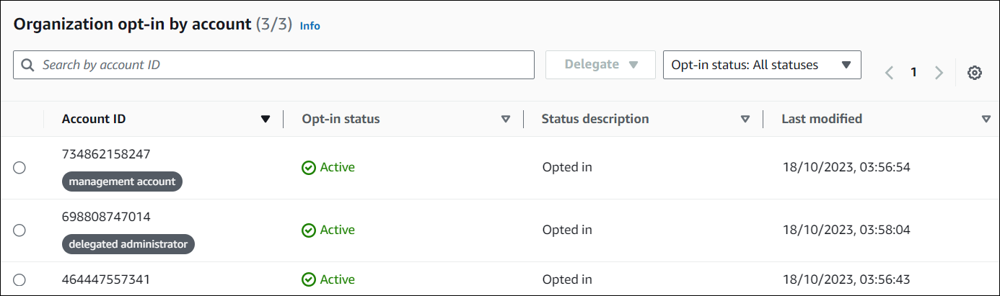

# Viewing the status of an organization's member accounts

This section provides you with instructions on how to view member accounts of an organization that are opted in to Compute Optimizer.

###### Note

This option is only available to the account manager or delegated administrator of an organization who opted in member
accounts to Compute Optimizer.

## Prerequisites

The following procedure assumes that you have already completed the [Opting in to AWS Compute Optimizer](account-opt-in.md "account-opt-in.md") procedure.

## Procedure

1. Open the Compute Optimizer console at [https://console.aws.amazon.com/compute-optimizer/](https://console.aws.amazon.com/compute-optimizer/ "https://console.aws.amazon.com/compute-optimizer/").
2. Choose **Account management** in the navigation pane.

The **Account management** page lists the member accounts of the
organization and their current Compute Optimizer opt-in status. The **Opt-in
status** and **Status description** columns describe
the status of each account ID that are listed. To delegate an administrator account,
see [Delegating an administrator account](delegate-administrator-account.md "delegate-administrator-account.md").

## Additional resources

- [Delegating an administrator account](delegate-administrator-account.md "delegate-administrator-account.md")
- [Opting in to AWS Compute Optimizer](account-opt-in.md "account-opt-in.md")
