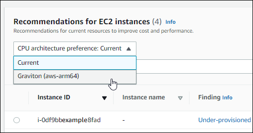

# Viewing EC2 instance recommendations

AWS Compute Optimizer generates instance type recommendations for Amazon Elastic Compute Cloud (Amazon EC2) instances.
Recommendations for your Amazon EC2 instances are displayed on the following pages of the Compute Optimizer
console:

- The **EC2 instances recommendations** page lists each of your current
  instances, their [finding classifications](#ec2-recommendations-findings "#ec2-recommendations-findings"),
  [finding reasons](#ec2-finding-reasons "#ec2-finding-reasons"), [platform differences](#ec2-platform-differences "#ec2-platform-differences"), current instance type, and
  current hourly price for the selected purchasing
  option. The top recommendation from Compute Optimizer is listed next to each of your instances. This
  recommendation includes the recommended instance type, the hourly price for the selected
  purchasing option, and the price difference between your current instance. Use the
  recommendations page to compare your current instances with their top recommendation. Doing this
  can help you to decide if you want to up-size or down-size your instances.
- The **EC2 instance details** page lists up to three optimization
  recommendations for a specific instance. You can access this page from the EC2 instances
  recommendations page. The page specifically lists the specifications for each recommendation,
  their [performance risk](#ec2-performance-risk "#ec2-performance-risk"), and their hourly prices for
  the selected purchasing option. The details page also displays utilization metric graphs for the
  current instance, overlaid with the projected utilization metrics for the recommendation
  options.
  The recommendations are refreshed daily. These recommendations are generated by analyzing the
  specifications and utilization metrics of the current instance over a period of the last 14 days.
  Or, if you activate the [enhanced infrastructure
  metrics paid feature](enhanced-infrastructure-metrics.md "enhanced-infrastructure-metrics.md"), the recommendations are generated by analyzing a longer period of
  time. For more information, see [Metrics analyzed by AWS Compute Optimizer](metrics.md "metrics.md").

Keep in mind that Compute Optimizer generates recommendations for EC2 instances that meet a specific set
of requirements. Recommendations can take up to 24 hours to be generated. Moreover, sufficient
metric data must be accumulated for recommendations to be generated. For more information, see
[Resource requirements](requirements.md "requirements.md").

###### Contents

- [Finding classifications](#ec2-recommendations-findings "#ec2-recommendations-findings")
- [Finding reasons](#ec2-finding-reasons "#ec2-finding-reasons")
- [AWS Graviton-based instance
  recommendations](#ec2-graviton-recommendations "#ec2-graviton-recommendations")
- [Inferred workload types](#ec2-inferred-workload-types "#ec2-inferred-workload-types")
- [Migration effort](#ec2-migration-effort "#ec2-migration-effort")
- [Platform differences](#ec2-platform-differences "#ec2-platform-differences")
- [Estimated monthly savings and savings
  opportunity](#ec2-savings-calculation "#ec2-savings-calculation")
- [Performance risk](#ec2-performance-risk "#ec2-performance-risk")
- [Utilization graphs](#ec2-utilization-graphs "#ec2-utilization-graphs")
- [Accessing EC2 instance recommendations and details](ec2-view-recommendations.md "ec2-view-recommendations.md")

## Finding classifications

The **Finding** column on the **EC2 instances
recommendations** page provides a summary of how each of your instances performed
during the analyzed period.

The following findings classifications apply to EC2 instances.

| Classification                      | Description                                                                                                                                                                                                                                                                                                                                                                                                                                                                                                                                                                                                                                                                                                                                                                                                                                                                                                                                                                                                                                                                                                                                                                                                                                                                                                                                                                                |
| ----------------------------------- | ------------------------------------------------------------------------------------------------------------------------------------------------------------------------------------------------------------------------------------------------------------------------------------------------------------------------------------------------------------------------------------------------------------------------------------------------------------------------------------------------------------------------------------------------------------------------------------------------------------------------------------------------------------------------------------------------------------------------------------------------------------------------------------------------------------------------------------------------------------------------------------------------------------------------------------------------------------------------------------------------------------------------------------------------------------------------------------------------------------------------------------------------------------------------------------------------------------------------------------------------------------------------------------------------------------------------------------------------------------------------------------------ | ------------------------------------------------------------------------------------------------------------------------------------------------------------------------------------------------------------------------------------------------------------------------------------------------------------------------------------------------------------------------------------------------------------------------------------------------------------------------------------------------------------------------------------------------------------------------------------------------------------------------------------------------------------------------------------------------------------------------------------------------------------------------------------------------------------------------------------------------------------------------------------------------------------------------------------------------------------------------------------------------------------------------------------------------------------------------------------------------------------------------------------------------------------------------------------------------------------------------------------------------------------------------------------------------------------------------------------------------------------------------------------------------------------------------------------------------------------------------------------------------------------------------------------------------------------------------------------------------------------------------------------------------------------------------------------------------------------------------------------------------------------------------------------------------------------------------------------------------------------------------------------------------------------------------------------------------------------------------------------------------------------------------------------------------------------------------------------------------------------------------------------------------------------------------------------------------------------------------------------------------------------------------------------------------------------------------------------------------------------------------------------------------------------------------------------------------------------------------------------------------------------------------------------------------------------------------------------------------------------------------------------------------------------------------------------------------------------------------------------------------------------------------------------------------------------------------------------------------------------------------------------------------------------------------------------------------------------------------------------------------------------------------------------------------------------------------------------------------------------------------------------------------------------------------------------------------------------------------------------------------------------------------------------------------------------------------------------------------------------------------------------------------------------------------------------------------------------------------------------------------------------------------------------------------------------------------------------------------------------------------------------------------------------------------------------------------------------------------------------------------------------------------------------------------------------------------------------------------------------------------------------------------------------------------------------------------------------------------------------------------------------------------------------------------------------------------------------------------------------------------------------------------------------------------------------------------------------------------------------------------------------------------------------------------------------------------------------------------------------------------------------------------------------------------------------------------------------------------------------------------------------------------------------------------------------------------------------------------------------------------------------------------------------------------------------------------------------------------------------------------------------------------------------------------------------------------------------------------------------------------------------------------------------------------------------------------------------------------------------------------------------------------------------------------------------------------------------------------------------------------------------------------------------------------------------------------------------------------------------------------------------------------------------------------------------------------------------------------------- |
| Under-provisioned                   | An EC2 instance is considered under-provisioned when at least one specification of your instance, such as CPU, memory, or network, does not meet the performance requirements of your workload. Under-provisioned EC2 instances might lead to poor application performance.                                                                                                                                                                                                                                                                                                                                                                                                                                                                                                                                                                                                                                                                                                                                                                                                                                                                                                                                                                                                                                                                                                                |
| Over-provisioned                    | An EC2 instance is considered over-provisioned when at least one specification of your instance, such as CPU, memory, or network, can be sized down while still meeting the performance requirements of your workload, and when no specification is under-provisioned. Over-provisioned EC2 instances might lead to unnecessary infrastructure cost.                                                                                                                                                                                                                                                                                                                                                                                                                                                                                                                                                                                                                                                                                                                                                                                                                                                                                                                                                                                                                                       |
| Optimized                           | An EC2 instance is considered optimized when all specifications of your instance, such as CPU, memory, and network, meet the performance requirements of your workload, and the instance is not over-provisioned. For optimized instances, Compute Optimizer might sometimes recommend a new generation instance type.                                                                                                                                                                                                                                                                                                                                                                                                                                                                                                                                                                                                                                                                                                                                                                                                                                                                                                                                                                                                                                                                     | ## Finding reasons The **Finding reasons** column on the **EC2 instances recommendations** and **EC2 instance details** pages shows which specification of an instance is under-provisioned or over-provisioned. The following finding reasons apply to instances:                                                                                                                                                                                                                                                                                                                                                                                                                                                                                                                                                                                                                                                                                                                                                                                                                                                                                                                                                                                                                                                                                                                                                                                                                                                                                                                                                                                                                                                                                                                                                                                                                                                                                                                                                                                                                                                                                                                                                                                                                                                                                                                                                                                                                                                                                                                                                                                                                                                                                                                                                                                                                                                                                                                                                                                                                                                                                                                                                                                                                                                                                                                                                                                                                                                                                                                                                                                                                                                                                                                                                                                                                                                                                                                                                                                                                                                                                                                                                                                                                                                                                                                                                                                                                                                                                                                                                                                                                                                                                                                                                                                                                                                                                                                                                                                                                                                                                                                                                                                                                                                                                      |
| Finding reason                      | Description                                                                                                                                                                                                                                                                                                                                                                                                                                                                                                                                                                                                                                                                                                                                                                                                                                                                                                                                                                                                                                                                                                                                                                                                                                                                                                                                                                                |
| ---                                 | ---                                                                                                                                                                                                                                                                                                                                                                                                                                                                                                                                                                                                                                                                                                                                                                                                                                                                                                                                                                                                                                                                                                                                                                                                                                                                                                                                                                                        |
| CPU over-provisioned                | The instance’s CPU configuration can be sized down and also meet the performance requirements of your workload. This is identified by analyzing the `CPUUtilization` metric of the current instance during the look-back period.                                                                                                                                                                                                                                                                                                                                                                                                                                                                                                                                                                                                                                                                                                                                                                                                                                                                                                                                                                                                                                                                                                                                                           |
| CPU under-provisioned               | The instance’s CPU configuration doesn't meet the performance requirements of your workload and there's an alternative instance type that provides better CPU performance. This is identified by analyzing the `CPUUtilization` metric of the current instance during the look-back period.                                                                                                                                                                                                                                                                                                                                                                                                                                                                                                                                                                                                                                                                                                                                                                                                                                                                                                                                                                                                                                                                                                |
| Memory over-provisioned             | The instance’s memory configuration can be sized down while still meeting the performance requirements of your workload. This is identified by analyzing the memory utilization metric of the current instance during the look-back period. NoteMemory utilization is analyzed only for resources with the unified CloudWatch agent installed. For more information, see [Enabling memory utilization with the Amazon CloudWatch Agent](metrics.md#cw-agent "metrics.md#cw-agent").                                                                                                                                                                                                                                                                                                                                                                                                                                                                                                                                                                                                                                                                                                                                                                                                                                                                                                        |
| Memory under-provisioned            | The instance’s memory configuration doesn't meet the performance requirements of your workload and there's an alternative instance type that provides better memory performance. This is identified by analyzing the memory utilization metric of the current instance during the look-back period.                                                                                                                                                                                                                                                                                                                                                                                                                                                                                                                                                                                                                                                                                                                                                                                                                                                                                                                                                                                                                                                                                        |
| GPU over-provisioned                | The instance’s GPU and GPU memory configurations can be sized down while still meeting the performance requirements of your workload. This is identified by analyzing the `GPUUtilization` and `GPUMemoryUtilization` metrics of the current instance during the look-back period. NoteThe GPU utilization and GPU memory utilization metrics are analyzed only for resources with the unified CloudWatch agent installed. For more information, see [Enabling NVIDIA GPU utilization with the CloudWatch agent](ec2-metrics-analyzed.md#nvidia-cw-agent "ec2-metrics-analyzed.md#nvidia-cw-agent").                                                                                                                                                                                                                                                                                                                                                                                                                                                                                                                                                                                                                                                                                                                                                                                       |
| GPU under-provisioned               | The instance’s GPU and GPU memory configurations don't meet the performance requirements of your workload and there's an alternative instance type that provides better memory performance. This is identified by analyzing the `GPUUtilization` and `GPUMemoryUtilization` metrics of the current instance during the look-back period.                                                                                                                                                                                                                                                                                                                                                                                                                                                                                                                                                                                                                                                                                                                                                                                                                                                                                                                                                                                                                                                   |
| EBS throughput over-provisioned     | The instance’s EBS throughput configuration can be sized down and also meet the performance requirements of your workload. This is identified by analyzing the `VolumeReadBytes` and `VolumeWriteBytes` metric of EBS volumes attached to the current instance during the look-back period.                                                                                                                                                                                                                                                                                                                                                                                                                                                                                                                                                                                                                                                                                                                                                                                                                                                                                                                                                                                                                                                                                                |
| EBS throughput under-provisioned    | The instance’s EBS throughput configuration doesn't meet the performance requirements of your workload. And, there's an alternative instance type that provides better EBS throughput performance. This is identified by analyzing the `VolumeReadBytes` and `VolumeWriteBytes` metric of EBS volumes that are attached to the current instance during the look-back period.                                                                                                                                                                                                                                                                                                                                                                                                                                                                                                                                                                                                                                                                                                                                                                                                                                                                                                                                                                                                               |
| EBS IOPS over-provisioned           | The instance’s EBS IOPS configuration can be sized down and also meet the performance requirements of your workload. This is identified by analyzing the `VolumeReadOps` and `VolumeWriteOps` metrics of EBS volumes attached to the current instance during the look-back period.                                                                                                                                                                                                                                                                                                                                                                                                                                                                                                                                                                                                                                                                                                                                                                                                                                                                                                                                                                                                                                                                                                         |
| EBS IOPS under-provisioned          | The instance’s EBS IOPS configuration doesn't meet the performance requirements of your workload. And, there's an alternative instance type that provides better EBS IOPS performance. This is identified by analyzing the `VolumeReadOps` and `VolumeWriteOps` metrics of EBS volumes attached to the current instance during the look-back period.                                                                                                                                                                                                                                                                                                                                                                                                                                                                                                                                                                                                                                                                                                                                                                                                                                                                                                                                                                                                                                       |
| Network bandwidth over-provisioned  | The instance’s network bandwidth configuration can be sized down while still meeting the performance requirements of your workload. This is identified by analyzing the `NetworkIn` and `NetworkOut` metrics of the current instance during the look-back period.                                                                                                                                                                                                                                                                                                                                                                                                                                                                                                                                                                                                                                                                                                                                                                                                                                                                                                                                                                                                                                                                                                                          |
| Network bandwidth under-provisioned | The instance’s network bandwidth configuration doesn't meet the performance requirements of your workload. And, there's an alternative instance type that provides better network bandwidth performance. This is identified by analyzing the `NetworkIn` and `NetworkOut` metrics of the current instance during the look-back period. This finding reason happens when the `NetworkIn` or `NetworkOut` performance of an instance is impacted.                                                                                                                                                                                                                                                                                                                                                                                                                                                                                                                                                                                                                                                                                                                                                                                                                                                                                                                                            |
| Network PPS over-provisioned        | The instance’s network PPS (packets per second) configuration can be sized down and also meet the performance requirements of your workload. This is identified by analyzing the `NetworkPacketsIn` and `NetworkPacketsOut` metrics of the current instance during the look-back period.                                                                                                                                                                                                                                                                                                                                                                                                                                                                                                                                                                                                                                                                                                                                                                                                                                                                                                                                                                                                                                                                                                   |
| Network PPS under-provisioned       | The instance’s network PPS (packets per second) configuration doesn't meet the performance requirements of your workload. And, there's an alternative instance type that provides better network PPS performance. This is identified by analyzing the `NetworkPacketsIn` and `NetworkPacketsOut` metrics of the current instance during the look-back period.                                                                                                                                                                                                                                                                                                                                                                                                                                                                                                                                                                                                                                                                                                                                                                                                                                                                                                                                                                                                                              |
| Disk IOPS over-provisioned          | The instance’s disk IOPS configuration can be sized down and also meet the performance requirements of your workload. This is identified by analyzing the `DiskReadOps` and `DiskWriteOps` metrics of the current instance during the look-back period.                                                                                                                                                                                                                                                                                                                                                                                                                                                                                                                                                                                                                                                                                                                                                                                                                                                                                                                                                                                                                                                                                                                                    |
| Disk IOPS under-provisioned         | The instance’s disk IOPS configuration doesn't meet the performance requirements of your workload. And, there's an alternative instance type that provides better disk IOPS performance. This is identified by analyzing the `DiskReadOps` and `DiskWriteOps` metrics of the current instance during the look-back period.                                                                                                                                                                                                                                                                                                                                                                                                                                                                                                                                                                                                                                                                                                                                                                                                                                                                                                                                                                                                                                                                 |
| Disk throughput over-provisioned    | The instance’s disk throughput configuration can be sized down while still meeting the performance requirements of your workload. This is identified by analyzing the `DiskReadBytes` and `DiskWriteBytes` metrics of the current instance during the look-back period.                                                                                                                                                                                                                                                                                                                                                                                                                                                                                                                                                                                                                                                                                                                                                                                                                                                                                                                                                                                                                                                                                                                    |
| Disk throughput under-provisioned   | The instance’s disk throughput configuration doesn't meet the performance requirements of your workload. And, there's an alternative instance type that provides better disk throughput performance. This is identified by analyzing the `DiskReadBytes` and `DiskWriteBytes` metrics of the current instance during the look-back period.                                                                                                                                                                                                                                                                                                                                                                                                                                                                                                                                                                                                                                                                                                                                                                                                                                                                                                                                                                                                                                                 | ###### Note For more information about instance metrics, see [List the available CloudWatch metrics for your instances](../../../AWSEC2/latest/UserGuide/viewing_metrics_with_cloudwatch.md "../../../AWSEC2/latest/UserGuide/viewing_metrics_with_cloudwatch.md") in the _Amazon Elastic Compute Cloud User Guide_. For more information about EBS volume metrics, see [Amazon CloudWatch metrics for Amazon EBS](../../../AWSEC2/latest/UserGuide/using_cloudwatch_ebs.md "../../../AWSEC2/latest/UserGuide/using_cloudwatch_ebs.md") in the _Amazon Elastic Compute Cloud User Guide_. You can change an instance's CPU, local disk, memory, or network specifications by changing the type of the instance. For example, you can change the instance type from C5 to C5n to help improve network performance. For more information, see [Change the instance type guide for Linux](../../../AWSEC2/latest/UserGuide/ec2-instance-resize.md "../../../AWSEC2/latest/UserGuide/ec2-instance-resize.md") and [Change the instance type guide for Windows](../../../AWSEC2/latest/WindowsGuide/ec2-instance-resize.md "../../../AWSEC2/latest/WindowsGuide/ec2-instance-resize.md") in the _EC2 User Guides_. You can change an EBS volume's IOPS or throughput specifications by using Amazon EBS Elastic Volumes. For more information, see [Amazon EBS Elastic Volumes](../../../AWSEC2/latest/UserGuide/ebs-modify-volume.md "../../../AWSEC2/latest/UserGuide/ebs-modify-volume.md") in the _Amazon Elastic Compute Cloud User Guide_. ## AWS Graviton-based instance recommendations When viewing Amazon EC2 instance recommendations, you can view the price and performance impact of running your workload on AWS Graviton-based instances. To do so, choose **Graviton (aws-arm64)** in the **CPU architecture preference** dropdown. Otherwise, choose **Current** to view recommendations that are based on the same CPU vendor and architecture as the current instance.  ###### Note The **Current price**, **Recommended price**, **Price difference**, **Price difference (%)**, and **Estimated monthly savings** columns are updated to provide a price comparison between the current instance type and the instance type of the selected CPU architecture preference. For example, if you choose **Graviton (aws-arm64)**, prices are compared between the current instance type and the recommended Graviton-based instance type. ## Inferred workload types The **Inferred workload types** column on the **EC2 instances recommendations** page lists the applications that might be running on the instance as inferred by Compute Optimizer. This column does this by analyzing the attributes of your instances. These attributes include the instance name, tags, and configuration. Compute Optimizer can currently infer if your instances are running Amazon EMR, Apache Cassandra, Apache Hadoop, Memcached, NGINX, PostgreSQL, Redis, Kafka, or SQLServer. By inferring the applications that run on your instances, Compute Optimizer can identify the effort to migrate your workloads from x86-based instance types to Arm-based AWS Graviton instances types. For more information, see [Migration effort](#ec2-migration-effort "#ec2-migration-effort") in the next section of this guide. ###### Note You can't infer the SQLServer application in the Middle East (Bahrain), Africa (Cape Town), Asia Pacific (Hong Kong), Europe (Milan), and Asia Pacific (Jakarta) Regions. ## Migration effort The **Migration effort** column on the **EC2 Auto Scaling groups recommendations** and **EC2 Auto Scaling groups details** pages lists the level of effort that might be required to migrate from the current instance type to the recommended instance type. The following shows examples of the different levels of migration effort.  • **Very low** — The recommended instance type has the same CPU architecture as the current instance type.  • **Low** — Amazon EMR is the inferred workload type and an AWS Graviton instance type is recommended  • **Medium** — A workload type can't be inferred but an AWS Graviton instance type is recommended.  • **High** — The recommended instance type has different CPU architecture from the current instance type, and the workload has no known compatible version on the recommended CPU architecture. For more information about migrating from x86-based instance types to Arm-based AWS Graviton instances type, see [Considerations when transitioning workloads to AWS Graviton2 based Amazon EC2 instances](https://github.com/aws/aws-graviton-getting-started/blob/main/transition-guide.md "https://github.com/aws/aws-graviton-getting-started/blob/main/transition-guide.md") in the _AWS Graviton Getting Starged GitHub_. ## Platform differences The **Platform differences** column on the **EC2 instance details** page describes the differences between the current instance and the recommended instance type. Consider the configuration differences before migrating your workloads from the current instance to the recommended instance type. The following platform differences apply to EC2 instances:                |
| Platform difference                 | Description                                                                                                                                                                                                                                                                                                                                                                                                                                                                                                                                                                                                                                                                                                                                                                                                                                                                                                                                                                                                                                                                                                                                                                                                                                                                                                                                                                                |
| ---                                 | ---                                                                                                                                                                                                                                                                                                                                                                                                                                                                                                                                                                                                                                                                                                                                                                                                                                                                                                                                                                                                                                                                                                                                                                                                                                                                                                                                                                                        |
| Architecture                        | The CPU architecture of the recommended instance type is different than that of the current instance type. For example, the recommended instance type might use an Arm CPU architecture and the current instance type might use a different one, such as x86. Before migrating, consider recompiling the software on your instance for the new architecture. Alternatively, you might switch to an Amazon Machine Image (AMI) that supports the new architecture. For more information about the CPU architecture for each instance type, see [Amazon EC2 Instance Types](https://aws.amazon.com/ec2/instance-types/ "https://aws.amazon.com/ec2/instance-types/").                                                                                                                                                                                                                                                                                                                                                                                                                                                                                                                                                                                                                                                                                                                        |
| Hypervisor                          | The hypervisor of the recommended instance type is different than that of the current instance. For example, the recommended instance type might use a Nitro hypervisor and the current instance might use a Xen hypervisor. For information about the differences that you can consider between these hypervisors, see [Nitro Hypervisor](https://aws.amazon.com/ec2/faqs/#Nitro_Hypervisor "https://aws.amazon.com/ec2/faqs/#Nitro_Hypervisor") section of the Amazon EC2 FAQs. For more information, see [Instances built on the Nitro System](../../../AWSEC2/latest/UserGuide/instance-types.md#ec2-nitro-instances "../../../AWSEC2/latest/UserGuide/instance-types.md#ec2-nitro-instances") in the _Amazon EC2 User Guide for Linux_, or [Instances built on the Nitro System](../../../AWSEC2/latest/WindowsGuide/instance-types.md#ec2-nitro-instances "../../../AWSEC2/latest/WindowsGuide/instance-types.md#ec2-nitro-instances") in the _Amazon EC2 User Guide for Windows_.                                                                                                                                                                                                                                                                                                                                                                                                   |
| Instance store availability         | The recommended instance type doesn't support instance store volumes, but the current instance does. Before migrating, you might need to back up the data on your instance store volumes if you want to preserve them. For more information, see [How do I back up an instance store volume on my Amazon EC2 instance to Amazon EBS?](https://aws.amazon.com/premiumsupport/knowledge-center/back-up-instance-store-ebs/ "https://aws.amazon.com/premiumsupport/knowledge-center/back-up-instance-store-ebs/") in the _AWS Premium Support Knowledge Base_. For more information, see [Networking and storage features](../../../AWSEC2/latest/UserGuide/instance-types.md#instance-networking-storage "../../../AWSEC2/latest/UserGuide/instance-types.md#instance-networking-storage") and [Amazon EC2 instance store](../../../AWSEC2/latest/UserGuide/InstanceStorage.md "../../../AWSEC2/latest/UserGuide/InstanceStorage.md") in the _Amazon EC2 User Guide for Linux_, or see [Networking and storage features](../../../AWSEC2/latest/WindowsGuide/instance-types.md#instance-networking-storage "../../../AWSEC2/latest/WindowsGuide/instance-types.md#instance-networking-storage") and [Amazon EC2 instance store](../../../AWSEC2/latest/WindowsGuide/InstanceStorage.md "../../../AWSEC2/latest/WindowsGuide/InstanceStorage.md") in the _Amazon EC2 User Guide for Windows_. |
| Network interface                   | The network interface of the recommended instance type is different than that of the current instance. For example, the recommended instance type might use enhanced networking and the current instance might not. To enable enhanced networking for the recommended instance type, install the Elastic Network Adapter (ENA) driver or the Intel 82599 Virtual Function driver. For more information, see [Networking and storage features](../../../AWSEC2/latest/UserGuide/instance-types.md#instance-networking-storage "../../../AWSEC2/latest/UserGuide/instance-types.md#instance-networking-storage") and [Enhanced networking on Linux](../../../AWSEC2/latest/UserGuide/enhanced-networking.md "../../../AWSEC2/latest/UserGuide/enhanced-networking.md") in the _Amazon EC2 User Guide for Linux_, or [Networking and storage features](../../../AWSEC2/latest/WindowsGuide/instance-types.md#instance-networking-storage "../../../AWSEC2/latest/WindowsGuide/instance-types.md#instance-networking-storage") and [Enhanced networking on Windows](../../../AWSEC2/latest/WindowsGuide/enhanced-networking.md "../../../AWSEC2/latest/WindowsGuide/enhanced-networking.md") in the _Amazon EC2 User Guide for Windows_.                                                                                                                                                       |
| Storage interface                   | The storage interface of the recommended instance type is different than that of the current instance. For example, the recommended instance type uses an NVMe storage interface and the current instance doesn't such this interface. To access NVMe volumes for the recommended instance type, install or upgrade the NVMe driver. For more information, see [Networking and storage features](../../../AWSEC2/latest/UserGuide/instance-types.md#instance-networking-storage "../../../AWSEC2/latest/UserGuide/instance-types.md#instance-networking-storage") and [Amazon EBS and NVMe on Linux instances](../../../AWSEC2/latest/UserGuide/nvme-ebs-volumes.md "../../../AWSEC2/latest/UserGuide/nvme-ebs-volumes.md") in the _Amazon EC2 User Guide for Linux_, or [Networking and storage features](../../../AWSEC2/latest/WindowsGuide/instance-types.md#instance-networking-storage "../../../AWSEC2/latest/WindowsGuide/instance-types.md#instance-networking-storage") and [Amazon EBS and NVMe on Windows instances](../../../AWSEC2/latest/WindowsGuide/nvme-ebs-volumes.md "../../../AWSEC2/latest/WindowsGuide/nvme-ebs-volumes.md") in the _Amazon EC2 User Guide for Windows_.                                                                                                                                                                                            |
| Virtualization type                 | The recommended instance type uses the hardware virtual machine (HVM) virtualization type and the current instance uses the paravirtual (PV) virtualization type. For more information about the differences between these virtualization types, see [Linux AMI virtualization types](../../../AWSEC2/latest/UserGuide/virtualization_types.md "../../../AWSEC2/latest/UserGuide/virtualization_types.md") in the _Amazon EC2 User Guide for Linux_, or [Windows AMI virtualization types](../../../AWSEC2/latest/WindowsGuide/windows-ami-version-history.md#virtualization-types "../../../AWSEC2/latest/WindowsGuide/windows-ami-version-history.md#virtualization-types") in the _Amazon EC2 User Guide for Windows_.                                                                                                                                                                                                                                                                                                                                                                                                                                                                                                                                                                                                                                                                  | ## Estimated monthly savings and savings opportunity **Estimated monthly savings (after discounts)** This column lists the approximate monthly cost savings that you experience by migrating your workloads from the current instance type to the recommended instance type under the Savings Plans and Reserved Instances pricing models. To receive recommendations with Savings Plans and Reserved Instances discounts, the savings estimation mode preference needs to be activated. For more information, see [Savings estimation mode](savings-estimation-mode.md "savings-estimation-mode.md"). ###### Note If you don't activate the savings estimation mode preference, this column displays the default On-Demand pricing discount information. **Estimated monthly savings (On-Demand)** This column lists the approximate monthly cost savings that you experience by migrating your workloads from the current instance type to the recommended instance type under the On-Demand pricing model. **Savings opportunity (%)** This column lists the percentage difference between the price of the current instance and the price of the recommended instance type. If savings estimation mode is activated, Compute Optimizer analyzes the Savings Plans and Reserved Instances pricing discounts to generate the savings opportunity percentage. If savings estimation mode isn’t activated, Compute Optimizer only uses On-Demand pricing information. For more information, see [Savings estimation mode](savings-estimation-mode.md "savings-estimation-mode.md"). ###### Important If you enable Cost Optimization Hub in AWS Cost Explorer, Compute Optimizer uses Cost Optimization Hub data, which includes your specific pricing discounts, to generate your recommendations. If Cost Optimization Hub isn't enabled, Compute Optimizer uses Cost Explorer data and On-Demand pricing information to generate your recommendations. For more information, see [Enabling Cost Explorer](../../../cost-management/latest/userguide/ce-enable.md "../../../cost-management/latest/userguide/ce-enable.md") and [Cost Optimization Hub](../../../cost-management/latest/userguide/cost-optimization-hub.md "../../../cost-management/latest/userguide/cost-optimization-hub.md") in the in the _AWS Cost Management User Guide_. ### Estimated monthly savings calculation For each recommendation, the cost to operate a new instance using the recommended instance type is calculated. Estimated monthly savings are calculated based on the number of running hours for the current instance and the difference in rates between the current instance type and the recommended instance type. The estimated monthly savings for instances that are displayed on the Compute Optimizer dashboard is a sum of the estimated monthly savings for all over-provisioned instances in the account. ## Performance risk The performance risk columns on the **EC2 instance details** page and the **EC2 instance recommendations** page define the likelihood of the current and recommended instance type not meeting your workload requirements. Compute Optimizer calculates an individual performance risk score for each specification of the current and recommended instance. This includes specifications such as CPU, memory, EBS throughput, EBS IOPS, disk throughput, disk IOPS, network throughput, and network PPS. The performance risk of the current and recommended instance is calculated as the maximum performance risk score across the analyzed resource specifications. The values range from very low, low, medium, high, and very high. A very low performance risk means that the instance type is predicted to always provide enough capability. The higher the performance risk means that you should validate whether the instance type meets the performance requirements of your workload before migrating your resource. Decide whether to optimize for performance improvement, for cost reduction, or for a combination of these two. For more information, see [Changing the Instance Type](../../../AWSEC2/latest/UserGuide/ec2-instance-resize.md "../../../AWSEC2/latest/UserGuide/ec2-instance-resize.md") in the _Amazon Elastic Compute Cloud User Guide_. ###### Note In the Compute Optimizer API, the AWS Command Line Interface (AWS CLI), and the AWS SDKs, performance risk is measured on a scale of `0` (very low) to `4` (very high). ## Utilization graphs The **EC2 instance details** page displays utilization metric graphs for your current instance. The graphs display data for the analyzed period. Compute Optimizer uses the maximum utilization point within each 5 minute time interval to generate EC2 instance recommendations. You can change the graphs to display data for the last 24 hours, 3 days, 1 week, or 2 weeks. If you activate the [enhanced infrastructure metrics paidfeature](enhanced-infrastructure-metrics.md "enhanced-infrastructure-metrics.md"), you can view 3 months. You can also change the statistic of the graphs between average and maximum. ###### Note For periods of time when your instances are in a stopped state, the utilization graphs show a value of 0. The following utilization graphs are displayed on the details page: |
| Graph name                          | Description                                                                                                                                                                                                                                                                                                                                                                                                                                                                                                                                                                                                                                                                                                                                                                                                                                                                                                                                                                                                                                                                                                                                                                                                                                                                                                                                                                                |
| ---                                 | ---                                                                                                                                                                                                                                                                                                                                                                                                                                                                                                                                                                                                                                                                                                                                                                                                                                                                                                                                                                                                                                                                                                                                                                                                                                                                                                                                                                                        |
| CPU utilization (percent)           | The percentage of allocated EC2 compute units used by the instance. The CPU utilization graph includes a comparison of the CPU utilization data of your current instance type against that of the selected recommended instance type. The comparison shows you what the CPU utilization is if you use the selected recommended instance type during the analyzed period. This comparison can help you to identify if the recommended instance type is within your workload's performance threshold. NoteThe **Burstable baseline** only displays for T-instances. You can use this baseline performance to learn how your CPU utilization relates to the baseline utilization of the specific T-instance. For more information, see [Key concepts and definitions for burstable performance instances](../../../AWSEC2/latest/UserGuide/burstable-credits-baseline-concepts.md "../../../AWSEC2/latest/UserGuide/burstable-credits-baseline-concepts.md") in the _Amazon EC2 User Guide for Linux Instances_.                                                                                                                                                                                                                                                                                                                                                                              |
| Memory utilization (percent)        | The percentage of memory allocated by applications and the operating system as used. The memory utilization graph includes a comparison of the memory utilization data of your current instance type against that of the selected recommended instance type. The comparison shows you what the memory utilization is if you use the selected recommended instance type during the analyzed period. This comparison can help you to identify if the recommended instance type is within your workload's performance threshold. NoteThe memory utilization graph is populated only for instances that have the unified CloudWatch agent installed on them. For more information, see [Collecting Metrics and Logs from Amazon EC2 Instances and On-Premises Servers with the CloudWatch Agent](../../../AmazonCloudWatch/latest/monitoring/Install-CloudWatch-Agent.md "../../../AmazonCloudWatch/latest/monitoring/Install-CloudWatch-Agent.md") in the _Amazon CloudWatch User Guide_.                                                                                                                                                                                                                                                                                                                                                                                                     |
| Network in (MiB/second)             | The number of mebibytes (MiB) per second received on all network interfaces by the instance.                                                                                                                                                                                                                                                                                                                                                                                                                                                                                                                                                                                                                                                                                                                                                                                                                                                                                                                                                                                                                                                                                                                                                                                                                                                                                               |
| Network out (MiB/second)            | The number of mebibytes (MiB) per second sent out on all network interfaces by the instance.                                                                                                                                                                                                                                                                                                                                                                                                                                                                                                                                                                                                                                                                                                                                                                                                                                                                                                                                                                                                                                                                                                                                                                                                                                                                                               |
| Network packets in (per second)     | The number of packets received by the instance on all network interfaces.                                                                                                                                                                                                                                                                                                                                                                                                                                                                                                                                                                                                                                                                                                                                                                                                                                                                                                                                                                                                                                                                                                                                                                                                                                                                                                                  |
| Network packets out (per second)    | The number of packets sent out by the instance on all network interfaces.                                                                                                                                                                                                                                                                                                                                                                                                                                                                                                                                                                                                                                                                                                                                                                                                                                                                                                                                                                                                                                                                                                                                                                                                                                                                                                                  |
| Disk read operations (per second)   | The completed read operations per second from the instance store volumes of the instance.                                                                                                                                                                                                                                                                                                                                                                                                                                                                                                                                                                                                                                                                                                                                                                                                                                                                                                                                                                                                                                                                                                                                                                                                                                                                                                  |
| Disk write operations (per second)  | The completed write operations per second from the instance store volumes of the instance.                                                                                                                                                                                                                                                                                                                                                                                                                                                                                                                                                                                                                                                                                                                                                                                                                                                                                                                                                                                                                                                                                                                                                                                                                                                                                                 |
| Disk read bandwidth (MiB/second)    | The read mebibytes (MiB) per second from the instance store volumes of the instance.                                                                                                                                                                                                                                                                                                                                                                                                                                                                                                                                                                                                                                                                                                                                                                                                                                                                                                                                                                                                                                                                                                                                                                                                                                                                                                       |
| Disk write bandwidth (MiB/second)   | The write mebibytes (MiB) per second from the instance store volumes of the instance.                                                                                                                                                                                                                                                                                                                                                                                                                                                                                                                                                                                                                                                                                                                                                                                                                                                                                                                                                                                                                                                                                                                                                                                                                                                                                                      |
| EBS read operations (per second)    | The completed read operations per second from all EBS volumes attached to the instance. For Xen instances, data is reported only when there is read activity on the volume.                                                                                                                                                                                                                                                                                                                                                                                                                                                                                                                                                                                                                                                                                                                                                                                                                                                                                                                                                                                                                                                                                                                                                                                                                |
| EBS write operations (per second)   | The completed write operations per second to all EBS volumes attached to the instance. For Xen instances, data is reported only when there is write activity on the volume.                                                                                                                                                                                                                                                                                                                                                                                                                                                                                                                                                                                                                                                                                                                                                                                                                                                                                                                                                                                                                                                                                                                                                                                                                |
| EBS read bandwidth (MiB/second)     | The read mebibytes (MiB) per second from all EBS volumes attached to the instance.                                                                                                                                                                                                                                                                                                                                                                                                                                                                                                                                                                                                                                                                                                                                                                                                                                                                                                                                                                                                                                                                                                                                                                                                                                                                                                         |
| EBS write bandwidth (MiB/second)    | The written mebibytes (MiB) per second to all EBS volumes attached to the instance.                                                                                                                                                                                                                                                                                                                                                                                                                                                                                                                                                                                                                                                                                                                                                                                                                                                                                                                                                                                                                                                                                                                                                                                                                                                                                                        |
