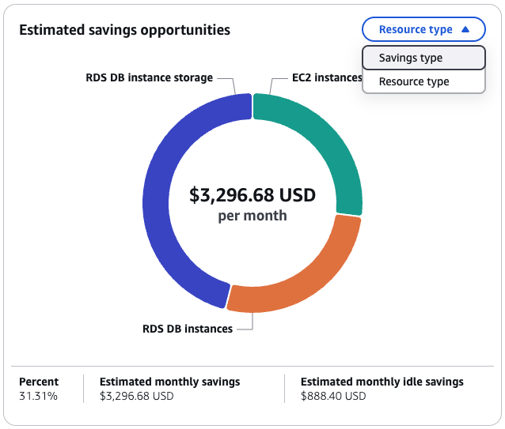
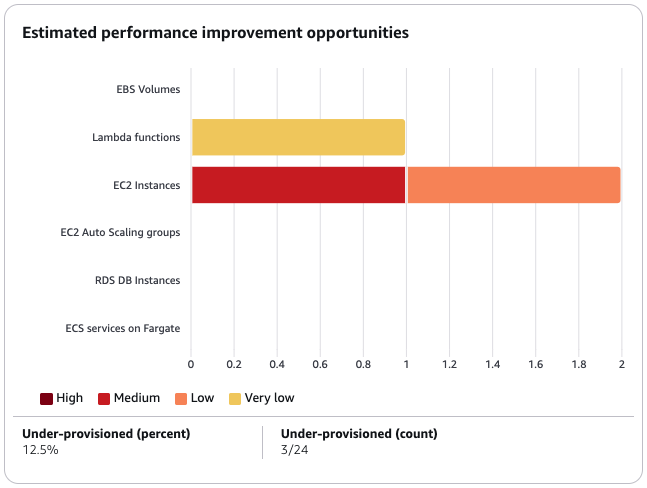

# Using the AWS Compute Optimizer dashboard

Use the dashboard in the Compute Optimizer console to evaluate and prioritize the optimization
opportunities for the supported resource types in your account. The dashboard displays the
following information, which is refreshed daily and generated by analyzing the specifications and
utilization metrics of your resources.

###### Topics

- [Savings opportunity](#dashboard-savings-opportunities "#dashboard-savings-opportunities")
- [Performance improvement
  opportunity](#dashboard-performance-improvement-opportunities "#dashboard-performance-improvement-opportunities")
- [Optimization options per resource](#dashboard-optimization-options "#dashboard-optimization-options")
- [Viewing the dashboard](#viewing-the-dashboard "#viewing-the-dashboard")

## Savings opportunity

The savings opportunity section displays the total estimated monthly USD amount and
percentage that you could save if you implement the Compute Optimizer recommendations for resources in
your account. You can choose to display the estimated monthly savings by resource type or
savings type. If you prefer to evaluate your resources for cost savings, then prioritize
the resource type that has the greatest savings opportunity.

Using EC2 as an example, the estimated monthly savings and savings opportunity for individual EC2 instances are
listed in the EC2 instances recommendations page under the **Estimated monthly savings (after
discounts)**, **Estimated monthly savings
(On-Demand)**, and **Savings opportunity (%)** columns. For more information, including how
estimated monthly savings is calculated, see [Estimated monthly savings and savings
opportunity](view-ec2-recommendations.md#ec2-savings-calculation "view-ec2-recommendations.md#ec2-savings-calculation").

###### Important

If you enable Cost Optimization Hub in AWS Cost Explorer, Compute Optimizer uses Cost Optimization Hub data, which includes
your specific pricing discounts, to generate your recommendations. If Cost Optimization Hub isn't enabled, Compute Optimizer
uses Cost Explorer data and On-Demand pricing information to generate your recommendations. For more
information, see [Enabling
Cost Explorer](../../../cost-management/latest/userguide/ce-enable.md "../../../cost-management/latest/userguide/ce-enable.md") and [Cost Optimization Hub](../../../cost-management/latest/userguide/cost-optimization-hub.md "../../../cost-management/latest/userguide/cost-optimization-hub.md") in the in the _AWS Cost Management User Guide_.

## Performance improvement

opportunity

The performance improvement opportunity section displays a count and percentage of the
resources in your account that Compute Optimizer found to be at risk of not meeting your workload performance
needs. It also displays the performance risk classifications per resource type. Resources can
have a performance risk of high, medium, and very low. If you prefer to evaluate your
resources for performance improvements, then prioritize the resource types that have a high
performance risk.

## Optimization options per resource

This table in the dashboard provides a breakdown of optimization opportunities across your
different resource types. It outlines the potential savings that you can achieve by identifying
and addressing resources that are not optimized, idle, or inefficiently sized.

- The **Savings opportunity** column displays the potential cost savings that
  you can achieve through optimization. Note that the saving opportunity might not be equal to the
  sum of the idle, rightsize, and license savings figures.
- The **Optimized**, **Not optimized**, and **Idle**
  columns indicate the current state of your resources utilization, helping to identify areas for improvement.
- The **Idle savings**, **Rightsizing savings**, and
  **License savings** columns quantify the potential cost savings that you
  can achieve by addressing your idle clean-up opportunities, rightsizing your resources, and
  using our recommended license configurations.

You can use this table as a comprehensive guide to identify optimization opportunities,
prioritize areas for improvement, and estimate the financial impact of various optimization
strategies for your AWS resources.

## Viewing the dashboard

Use the following procedure to view the dashboard and the optimization findings for your
resources.

1. Open the Compute Optimizer console at [https://console.aws.amazon.com/compute-optimizer/](https://console.aws.amazon.com/compute-optimizer/ "https://console.aws.amazon.com/compute-optimizer/").
2. Choose **Dashboard** in the navigation pane.

By default, the dashboard displays an overview of optimization findings for AWS
resources across all AWS Regions in the account that you're currently signed in to. 3. You can perform the following actions on the dashboard:

    * To view the optimization findings for resources in another account, choose
     **Account**, and then select a different account ID.

    ###### Note

    The ability to view optimization findings for resources in other accounts is available
     only if you're signed in to a management account of an organization, you opted in all member
     accounts of the organization, and trusted access with Compute Optimizer is enabled. For more information,
     see [Accounts supported by Compute Optimizer](getting-started.md#supported-accounts "getting-started.md#supported-accounts") and [Trusted access for AWS Organizations](security-iam.md#trusted-service-access "security-iam.md#trusted-service-access").
    * To show or hide the savings opportunity and performance improvement opportunity sections
     of the dashboard, choose the gear icon, choose the sections that you want to show or hide,
     and choose **Apply**.
    * To filter findings on the dashboard to one or more AWS Regions, enter the name of the
     Region in the **Filter by one or more Regions** text box, or choose one or
     more Regions in the drop-down list that appears.
    * To clear the selected filters, choose **Clear filters** next to the
     filter.
    * To view optimization recommendations, choose the **View
     recommendations** link for one of the resource types displayed, or choose the
     number of resources listed next to a findings classification to view the resources for that
     classification. For more information, see [Viewing resource recommendations](viewing-recommendations.md "viewing-recommendations.md").
