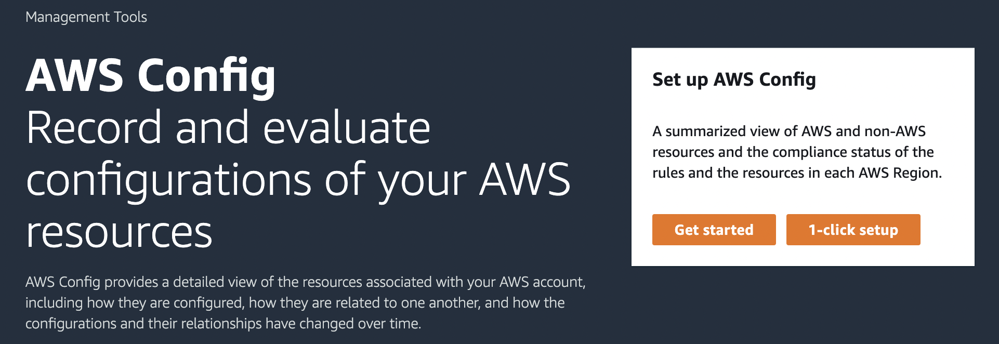

# Setting Up AWS Config with the Console

The AWS Management Console provides a quick and streamlined process for setting up AWS Config.

## Setting up

###### To set up AWS Config with the console

1. Sign in to the AWS Management Console and open the AWS Config console at
   [https://console.aws.amazon.com/config/home](https://console.aws.amazon.com/config/home "https://console.aws.amazon.com/config/home").
2. If this is the first time you are opening the AWS Config console or you are setting up AWS Config in
   a new region, the AWS Config console page looks like the following:

 3. Choose **1-click setup** to launch AWS Config based on AWS best practices.
You can also choose **Get started** to go through a more detailed setup
process.

###### Topics

- [1-click setup](1-click-setup.md "1-click-setup.md")
- [Manual setup](manual-setup.md "manual-setup.md")
