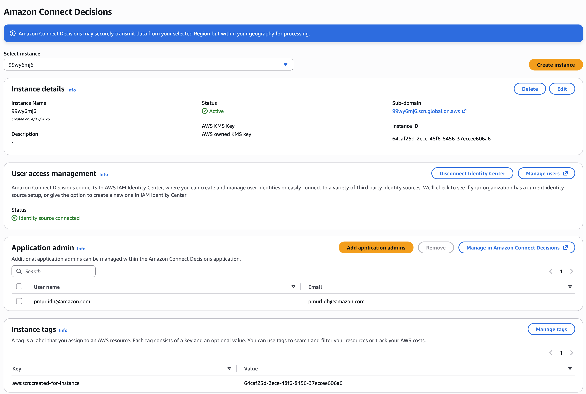
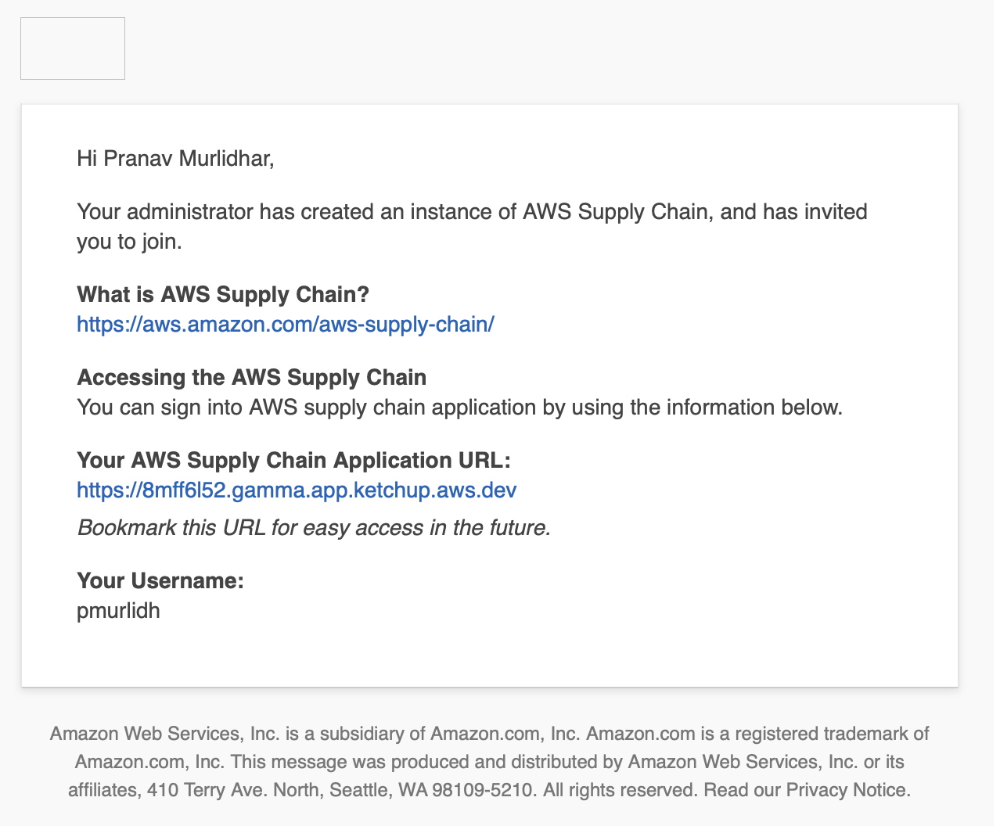

# Choose an application admin

As an AWS console administrator, you choose an Amazon Connect Decisions application
admin to manage the Amazon Connect Decisions web application access. The
Amazon Connect Decisions application admin can add or remove user permission roles to the
Amazon Connect Decisions web application.

After the instance is created and an identity source is connected, follow these steps
to choose an Amazon Connect Decisions application admin.

1. Open the Amazon Connect Decisions console dashboard.
2. Go to **Select application admin** and select a
   user to be an Amazon Connect Decisions application admin. Search results only show
   users matching the search criteria.

 3. (Optional) Choose **Go to IAM Identity Center**
to add more users. For more information on adding users, see
[Manage your identity source](../../../singlesignon/latest/userguide/manage-your-identity-source.md "../../../singlesignon/latest/userguide/manage-your-identity-source.md")
in _AWS IAM Identity Center User Guide_ and for more
information on user permission roles, see
[User permission roles](../../../aws-supply-chain/latest/adminguide/adding-users-groups.md "../../../aws-supply-chain/latest/adminguide/adding-users-groups.md").

###### Note

You can only add one user at a time from the Amazon Connect Decisions
Console. You cannot add a group as an application admin in
Amazon Connect Decisions. 4. Choose **Send Invite**. An email is sent to the
web application administrator. Once the web application administrator receives
the invite email, they will be able to select the application URL and log into
the Amazon Connect Decisions.

In the Amazon Connect Decisions webapp, you will see the user listed under
**Application admin**.
