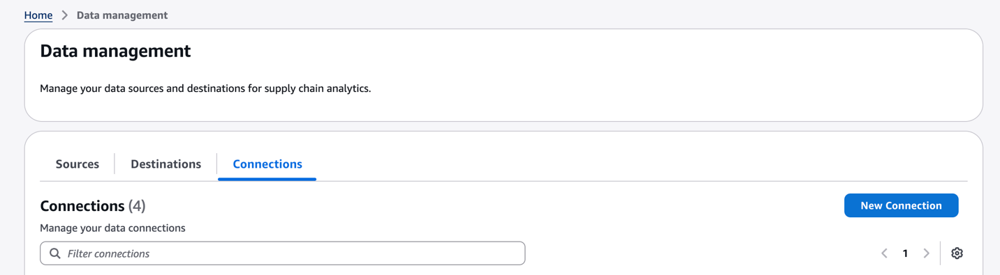
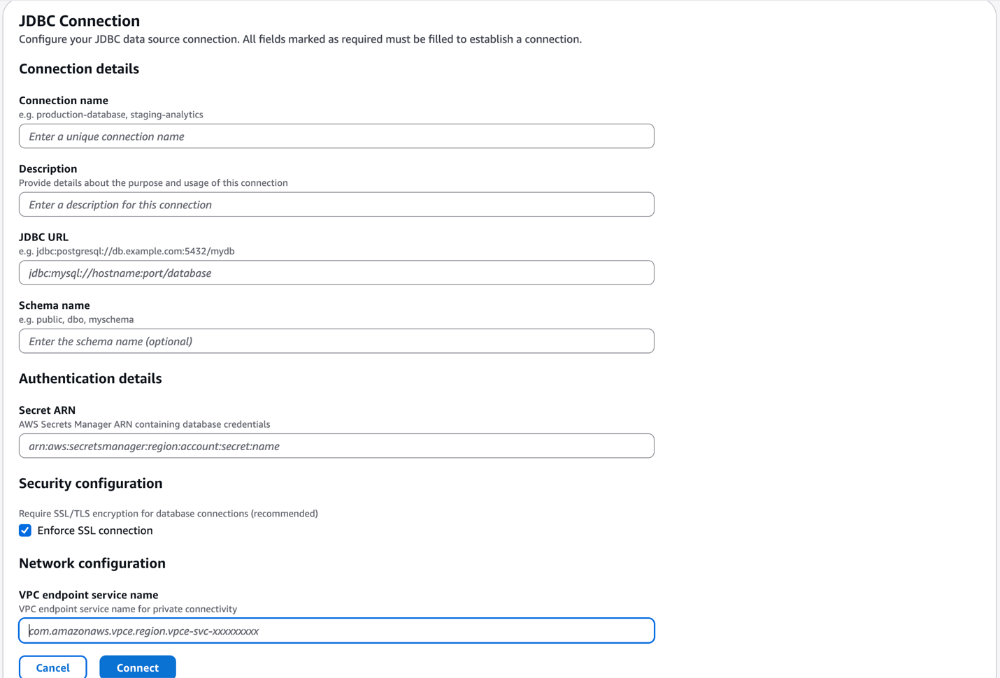
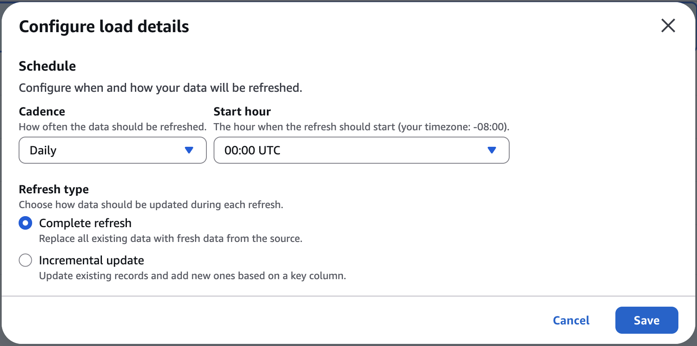

# Connecting to Your Database with JDBC

This guide walks you through connecting your database to CodeDeploy using Java Database Connectivity (JDBC). You'll set up secure encryption for your database credentials and establish a secure connection to read data directly from your existing database.

## What is JDBC Connection and When Should You Use It?

JDBC connection allows CodeDeploy to connect directly to your existing database to read data, rather than requiring you to export and upload CSV files or set up your own Extraction, Transform, and Load (ETL) pipeline.

Use JDBC connection when:

- Your data is already stored in an AWS Glue-compatible relational database. Refer to [this guide](../../../glue/latest/dg/aws-glue-programming-etl-connect-jdbc-home.md "../../../glue/latest/dg/aws-glue-programming-etl-connect-jdbc-home.md") for compatible databases and versions.
- You want real-time or near-real-time data access without manual file exports
- Your data volume is large and frequently updated
- You prefer to keep your data in its current location rather than duplicating it

If you're working with smaller datasets or prefer file-based uploads, the standard CSV upload process may be simpler for your needs. Refer to the Data Onboarding User Guide for more details on this process.

## Prerequisites

Before you begin, ensure you have:

- An AWS account with permissions to create AWS KMS keys and SageMaker AI resources
- Your AWS account ID and the region where CodeDeploy will operate
- Database connection details: hostname, port, database name, and credentials
- Administrative access to your database to verify connectivity
- Your database configured to accept connections from AWS services

## Create a Customer-Managed KMS Key

Before connecting your database to CodeDeploy, you'll need to set up encryption for your database credentials. (AWS KMS) provides this security layer, ensuring your database passwords are never stored in plain text.

### Create Your KMS Key

1. **Navigate to AWS KMS Console**
   1. Open the AWS Management Console in your browser
   2. In the search bar at the top, type "KMS" and select "Key Management Service" from the results
   3. This opens the AWS KMS dashboard where you'll manage encryption keys

2. **Initiate key creation**
   1. On the AWS KMS dashboard, locate and click the **Create key** button in the upper right
   2. This starts the key creation wizard that will guide you through the setup process

3. **Configure key type and usage**
   1. On the "Configure key" page, select **Symmetric** as the key type (this is the default and recommended option)
   2. Keep "Encrypt and decrypt" selected under key usage

4. **Set key identification details**
   1. In the "Alias" field, enter a descriptive name for your key, such as `aws-supply-chain-database-key`
   2. In the "Description" field, add context like "Encryption key for CodeDeploy database credentials"
   3. Optionally, add tags to help organize and track your AWS resources (e.g., Key: "Project", Value: "CodeDeploy")

5. **Define key administrative permissions**
   1. Select the IAM users or roles who should be able to manage this key (create, delete, modify policies)
   2. At minimum, include your own Admin role to ensure you can modify the key later if needed
   3. These administrators can manage the key but won't automatically have permission to use it for encryption/decryption
   4. On the "Key Deletion" section, allow key administrators to delete this key (this is the default and recommended option)

6. **Define key usage permissions**
   1. On this page, you'll see options to select IAM users and roles that can use the key
   2. Skip selecting specific users here, you'll configure service permissions in the next step

7. **Configure the key policy for CodeDeploy services**
   1. You'll see a policy editor with default JSON
   2. In the AWS KMS key policy editor, append the following statement to your existing "Statement" array
   3. This policy grants your account full control and allows CodeDeploy's services (SageMaker AI and AWS Glue) to decrypt your database credentials

```
{
  "Sid": "Allow GDIS service to decrypt",
  "Effect": "Allow",
  "Principal": {
    "Service": "scn.amazonaws.com"
  },
  "Action": [
    "kms:Decrypt",
    "kms:DescribeKey",
    "kms:CreateGrant",
    "kms:GenerateDataKeyWithoutPlaintext"
  ],
  "Resource": "*"
}
```

8. **Review and finalize**
   1. Review all your configuration settings on the summary page
   2. Verify that your alias, description, and policy are correct
   3. Click **Finish** to create the key
   4. Once created, you'll be returned to the AWS KMS dashboard where your new key will appear in the list

### What to Expect

Key creation is immediate. Once created, you'll see your new key listed in the AWS KMS console with a status of "Enabled." The key is now ready to encrypt your database credentials in SageMaker AI.

## Configure

Now that you have a AWS KMS key, you'll create a secret in to securely store your database credentials, then configure a resource policy that allows CodeDeploy to access them.

### Create Your Secret

1. **Navigate to**
   1. In the AWS Management Console search bar, type "Secrets Manager"
   2. Select "Secrets Manager" from the results to open the service dashboard

2. **Start creating a new secret**
   1. Click the **Store a new secret** button
   2. On the "Choose secret type" page, select **Other type of secret** (this gives you flexibility to structure your credentials)

3. **Enter your database credentials**

In the key-value pairs section, add your database connection details as strings:

```
Key: username, Value: your database username
Key: password, Value: your database password
Key: host, Value: your database hostname (e.g., database.example.com)
Key: port, Value: your database port (e.g., 3306 for MySQL)
Key: database, Value: your database name
```

4. **Select your encryption key**
   1. Under "Encryption key," select **Choose an AWS KMS key**
   2. From the dropdown, select the AWS KMS key you created in the previous step (e.g., `aws-supply-chain-database-key`)
   3. This ensures your credentials are encrypted with your customer-managed key

5. **Name your secret**
   1. Enter a descriptive name for your secret, such as `aws-supply-chain-production-database`
   2. Optionally, add a description like "Database credentials for CodeDeploy production environment"
   3. Add tags if desired for organization (e.g., Key: "Environment", Value: "Production")

6. **Add Resource Permissions**
   1. Click "Edit Permissions". In the policy editor, paste the following policy. This policy allows CodeDeploy's services to read your secret.

```
{
  "Version" : "2012-10-17",
  "Statement" : [ {
    "Effect" : "Allow",
    "Principal" : {
      "Service" : "scn.amazonaws.com"
    },
    "Action" : [ "secretsmanager:GetSecretValue", "secretsmanager:DescribeSecret" ],
    "Resource" : "<COPY-THE-SECRET-ARN-HERE-AFTER-CREATING>"
  } ]
}
```

7. **Save the policy**
   1. Click **Save** to apply the resource policy
   2. The policy is now active and allows CodeDeploy to retrieve your database credentials

8. **Configure rotation (optional)**
   1. For this setup, you can skip automatic rotation by selecting **Disable automatic rotation**
   2. You can enable rotation later if your security policies require it

9. **Review and create**
   1. Review all your secret details
   2. Click **Store** to create the secret
   3. You'll be returned to the SageMaker AI dashboard

10. **Save your Secret ARN**
    1. Find your newly created secret in the secrets list
    2. Click on the secret name to open its details page
    3. At the top, you'll see the Secret ARN
    4. Copy and save this ARN. The ARN format looks like: `arn:aws:secretsmanager:us-east-1:123456789012:secret:aws-supply-chain-production-database-AbCdEf`

11. **Edit Resource Permissions**
    1. Click "Edit permissions"
    2. Paste the copied Secret ARN and replace `<COPY-THE-SECRET-ARN-HERE-AFTER-CREATING>` with your copied ARN
    3. Click **Save** to attach the policy

### What to Expect

Your secret is now securely stored and encrypted with your AWS KMS key. CodeDeploy's services have permission to retrieve the credentials when establishing a database connection, but the credentials remain encrypted at rest.

## Connect Your Database to CodeDeploy

With your AWS KMS key and secret configured, you're ready to establish the JDBC connection in CodeDeploy.

### Configure Your JDBC Connection

1. **Navigate to CodeDeploy > Data Management**
   1. Log into your CodeDeploy instance
   2. From the main navigation, select "Data Management"
   3. Within the tab navigation, navigate to "Connections"
   4. Select "New Connection" to create a new connection

 2. **Enter your connection details**

    * **Connection name (required):** Enter a unique identifier for this connection (e.g., "production-database")
    * **Description (optional):** Add details about the purpose and usage of this connection to help your team understand what data it accesses
    * **JDBC URL (required):** Enter your full JDBC connection string in the format: `jdbc:<database-type>://<hostname>:<port>/<database>` (e.g., `jdbc:postgresql://db.example.com:5432/mydb`)
    * **Schema name (optional):** Specify the database schema if needed (e.g., "public", "dbo", "myschema"). Leave blank to use your database's default schema
    * **Secret ARN (required):** Paste the Secret ARN you saved from the previous step. This allows CodeDeploy to securely retrieve your database credentials from SageMaker AI.
    * **Enforce SSL connection:** Keep this checkbox selected (recommended) to require SSL/TLS encryption for your database connection
    * **VPC endpoint service name (required):** Enter your VPC endpoint service name for private connectivity via (format: `com.amazonaws.vpce.<region>.vpce-svc-xxxxxxxxx`)

 3. **Connect to your database**

    1. Click "Connect" to test and establish the connection. CodeDeploy will verify that it can successfully connect to your database using the provided credentials. This step can take up to 2 minutes.
    2. If the connection succeeds, you'll be automatically navigated to table selection
    3. If the connection fails, review your connection details to ensure all fields are accurate:


    	* Verify your Secret ARN is correct
    	* Confirm your database credentials are accurate
    	* Check that your JDBC URL format is correct
    	* Ensure your database is configured to accept connections from AWS services
    	* Verify your AWS KMS key and SageMaker AI policies are correctly configured
    4. You can also use the chat experience to help troubleshoot connection issues by asking questions like "Why is my database connection failing?" or "Help me debug my JDBC connection"

4. **Select tables to ingest**
   1. Once connected, you'll see the Select Tables screen showing all available tables from your database
   2. Select the checkbox next to each table you want to ingest

5. **Configure table refresh schedule**
   1. For each selected table, click the three-dot menu in the Action column and select "Schedule refresh"
   2. In the Configure load details dialog, set:
      - **Cadence:** How often to refresh (Hourly, Daily, Weekly, or Custom)
      - **Start hour:** The time for refresh to begin (displayed in UTC with your timezone offset)
      - **Refresh type:** Choose Complete refresh (replace all data) or Incremental update (add new data to existing; requires selecting a Record timestamp column)

   3. Repeat for each table as needed
   4. Click **Start mapping** when all tables are configured

 6. **Continue with data mapping**

    1. From this point forward, the experience is identical to the Data Onboarding flow
    2. Follow the Data Mapping section of the Data Onboarding User Guide to complete your setup

### What to Expect

Once your connection is established and tables are selected, CodeDeploy can read data from your database. The connection remains active and secure, with credentials encrypted and managed through SageMaker AI.

## Best Practices

### Security and Access Management

- **Store credentials securely:** Always use to store database credentials, never hardcode credentials in connection strings or configuration files
- **Enable SSL/TLS encryption:** Keep the "Enforce SSL connection" option enabled to ensure data is encrypted in transit
- **Review AWS KMS and SageMaker AI policies regularly:** Ensure only authorized services and accounts have access to your encryption keys and secrets
- **Use least-privilege access:** Grant only the minimum necessary permissions to database users that CodeDeploy will use for connections

### Connection Configuration

- **Use descriptive connection names:** Choose clear, meaningful names that indicate the environment and purpose (e.g., "production-inventory-db" rather than "db1")
- **Document your connections:** Use the Description field to note what data the connection accesses, who owns it, and any special considerations
- **Test connections before proceeding:** Always verify your connection works before selecting tables and configuring refresh schedules
- **Validate JDBC URL format:** Double-check your JDBC URL syntax matches your database type to avoid connection errors

### Data Refresh Strategy

- **Choose appropriate refresh cadence:** Select refresh frequency based on how often your source data changes and your business needs
- **Schedule refreshes during low-activity periods:** Configure refresh times when your database has lower load to minimize performance impact
- **Use incremental updates when possible:** For large datasets with frequent changes, incremental updates are more efficient than complete refreshes
- **Select meaningful timestamp columns:** When using incremental updates, choose columns that accurately reflect when records were created or modified

### Working with the Chat for Troubleshooting

- **Be specific in your requests:** Provide clear context when asking for help troubleshooting connection or mapping issues
- **Ask for explanations:** If you don't understand the recommendations or generated SQL queries, ask for clarification
- **Test all SQL changes before accepting:** Use the preview feature to verify transformations work as expected with your actual data
- **Leverage the chat for troubleshooting:** When connections fail or refreshes encounter errors, ask diagnostic questions like "Why is my connection failing?" or "Help me understand this refresh error"

### Ongoing Maintenance

- **Monitor refresh execution regularly:** Check the Destinations and Sources tabs in Data Management to ensure refreshes are completing successfully
- **Address errors promptly:** When CodeDeploy alerts you to refresh failures, investigate and resolve issues quickly to avoid data gaps
- **Update credentials securely:** When database passwords change, update them in , CodeDeploy will automatically use the new credentials
- **Document custom configurations:** Keep notes about any special refresh schedules, transformation logic, or connection requirements for your team's reference
- **Review table selections periodically:** As your data needs evolve, revisit which tables you're ingesting and whether refresh schedules still align with business requirements
