# Connecting your data

## Prerequisites

Before starting data onboarding, ensure you have:

- Amazon Connect Decisions Instance

  - Your instance should already be created with an associated S3 bucket

- Data Prepared

  - Work with your Amazon Customer Success counterpart to determine which data you need based on how you plan to use Amazon Connect Decisions. Base data requirements include:

    - Sales/Order History: 12+ months of transaction records
    - Product Details: Complete product catalog with specifications
    - Site/Location Information: Warehouses, distribution centers, retail locations
    - Current Inventory Holdings: On-hand inventory at each location

  - All source data in CSV format with UTF-8 encoding

## First Time Login: Onboarding Questionnaire

When you log in to Amazon Connect Decisions for the first time, the system presents a guided Onboarding Questionnaire. This personalization wizard helps the Decisions teammates contextualize the capabilities most relevant to your business. The questionnaire collects information about your industry, primary business challenges, and preferred approach for planning. Your responses will help optimize the onboarding steps based on your selection, allowing the system to streamline subsequent setup workflows and surface the most relevant configuration paths for your business. You must complete all steps before accessing the full application. The Decisions Teammate is available throughout the onboarding process via the right sidebar to answer questions in real time.

###### Note

This is a onetime selection on first login only. Your responses provide additional context to optimize subsequent onboarding steps and help agents understand your business environment. All capabilities remain fully accessible regardless of your selections.

### Step 1: Select Industry

**What you see:** A welcome message and a set of radio buttons prompting you to select the industry that best describes your business.

1. Select the radio button that best represents your business.
2. If none of the predefined options apply, select **Other**.

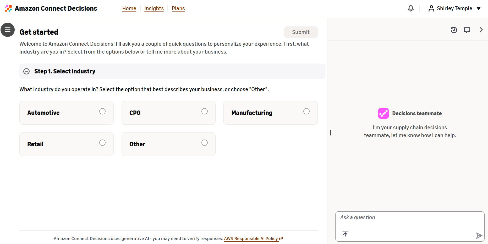

### Step 2: Define Your Biggest Challenge

**What you see:** Your Step 1 response is displayed with an edit option. Below it, you are asked to identify your primary business challenge from three options. A feature comparison table is displayed to help you understand which capabilities are associated with each selection.

1. Review the options. See the following table for the available options and what they mean.
2. Select the radio button that represents your most pressing challenge.
3. Optionally, review the feature comparison table below the options to understand what is included with each selection.

Business challenge options| Option | Description | Key Features Enabled |
| --- | --- | --- |
| **Maintain optimal inventory levels** | Choose this if your primary challenge is avoiding stockouts while minimizing excess inventory. | Inventory optimization; Stockout prevention; Excess inventory reduction; Supply planning; Vendor lead time tracking |
| **Improve demand forecast accuracy** | Choose this if your primary challenge is creating more accurate forecasts for better planning decisions. | Baseline forecasting; Consensus planning; Forecast accuracy tracking |
| **Both** | Choose this if you need to address both inventory optimization and demand forecast accuracy simultaneously. | All supply specific and demand specific features are enabled |

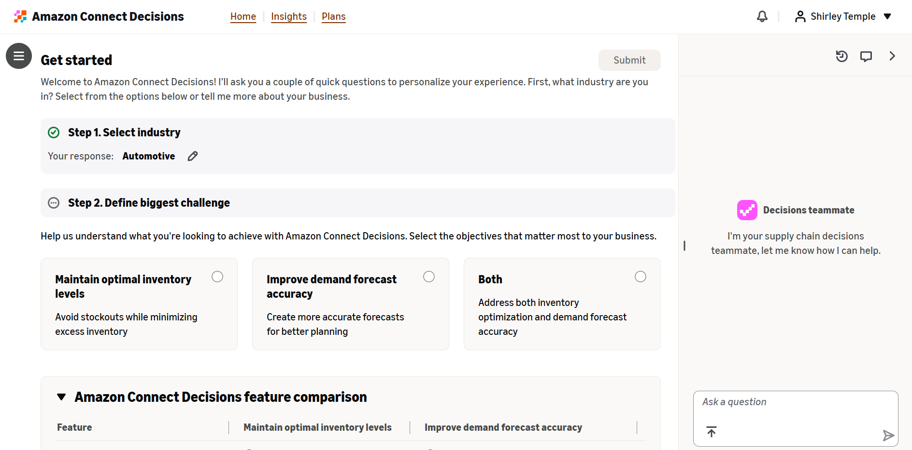

### Step 3: Choose Your Inventory Planning Approach

**What you see:** Steps 1 and 2 are displayed as completed (indicated by green checkmarks) with your responses shown and editable. Step 3 asks how you would like to approach inventory planning, with two options highlighted.

1. Review the two inventory planning options. See the following table for the available options and what they mean.
2. Select the radio button for the approach that matches your current state.

Inventory planning approach options| Option | Description | Best For |
| --- | --- | --- |
| **Generate inventory plans with Amazon Connect Decisions** | The system uses your historical sales and inventory data to create plans tailored to your business. | Organizations that do not have an existing planning solution or want to leverage AI generated plans from their historical data. |
| **Bring in existing inventory projections or plans** | Upload your existing inventory plans or projections so you can use decisioning capabilities immediately. The system will help you upload and map your data. | Organizations that already have established planning processes and want to leverage monitoring, insight generation, and recommendation capabilities without changing their plan source. |

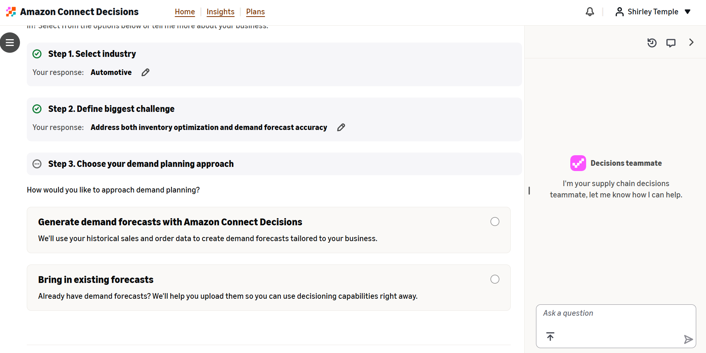

### Step 4: Choose Your Demand Planning Approach

**What you see:** Steps 1 through 3 are displayed as completed. Step 4 asks how you would like to approach demand planning.

1. Review the two demand planning options. See the following table for the Available Options and What They Mean.
2. Select the radio button for the approach that matches your current state.
3. Click **Submit** to finalize the onboarding questionnaire.

**Remember:** This onboarding questionnaire is a onetime contextual input that helps optimize the onboarding steps based on your selections. It does not alter agent behavior or restrict access to any capabilities. All features of Amazon Connect Decisions remain fully available to you.

Demand planning approach options| Option | Description | Best For |
| --- | --- | --- |
| **Generate demand forecasts with Amazon Connect Decisions** | The system uses your historical sales and order data to create demand forecasts tailored to your business. Amazon Connect Decisions orchestrates 18+ forecasting tools to produce accurate baseline forecasts. | Organizations that do not have an existing forecasting solution or want to replace their current approach with AI generated forecasts. |
| **Bring in existing forecasts** | Upload your existing demand forecasts so you can use decisioning capabilities immediately. The system will help you map and import your forecast data. | Organizations that already have established forecasting processes and want to leverage the monitoring, insight generation, and recommendation capabilities without changing their forecast source. |

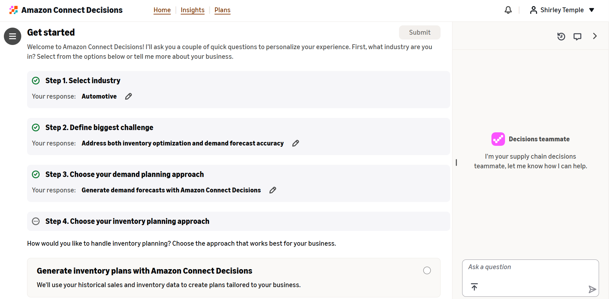

### After Completing the Questionnaire

Click **Submit** after completing all four steps:

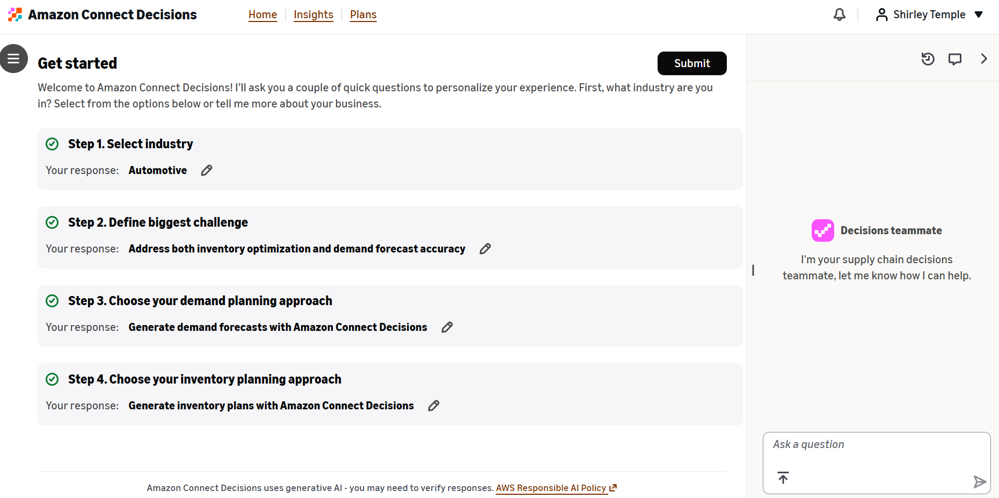

- You will be **redirected to the Homepage** with dashboard and topic cards designed to guide you through the remaining onboarding steps.
- The system will **auto create metrics and rules** within the application based on your selections. These are created in **Draft status** and are not immediately active.
- You can review the auto created metrics and rules, then **activate them** if they meet your needs, or **create your own** metrics and rules tailored to your specific business requirements.

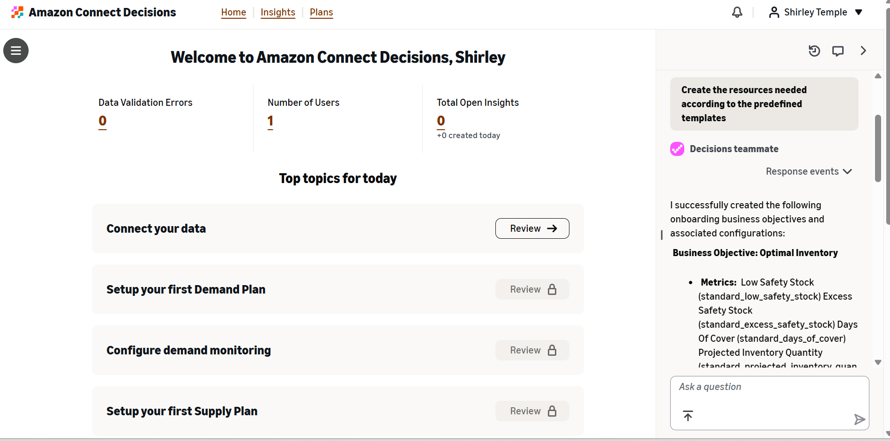

## Creating Your First Source Flow

To start onboarding your data, click on **Review** for the **Connect your data** topic card or navigate to the **Data Management** tab in the 'Hamburger Menu' in Amazon Connect Decisions. Here you can see all of your existing source flows. If you have not set one up yet, click **"Connect New Source"** to begin.

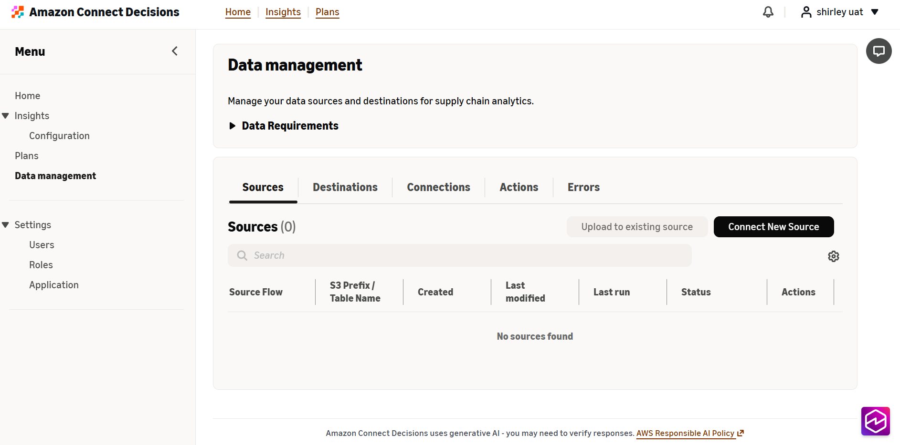

## Upload Your Source Data

Upload your CSV files containing source data based on the required CDM tables for your use case. You can choose how you want to handle data updates:

- **Append**: Add new data to existing data
- **Replace**: Replace existing data with new data

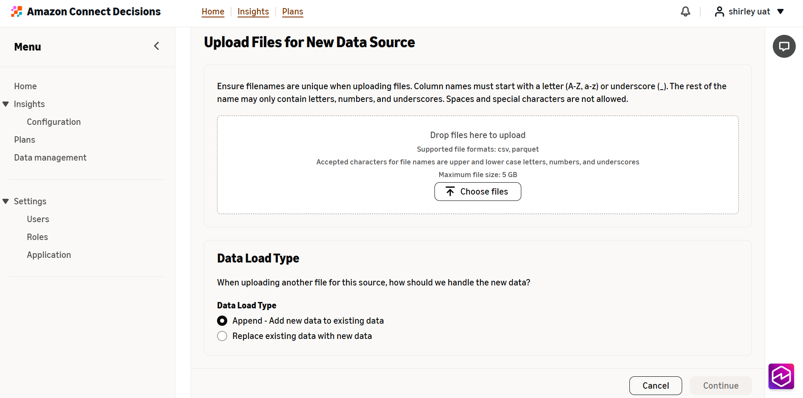

When you upload files, Amazon Connect Decisions automatically creates a folder structure in S3 for that data including:

- A parent folder named after your selected source system
- A subfolder named after your selected source table name
- All files under a subfolder are saved against the same source table
- This file structure is also used to create the Amazon S3 folder path

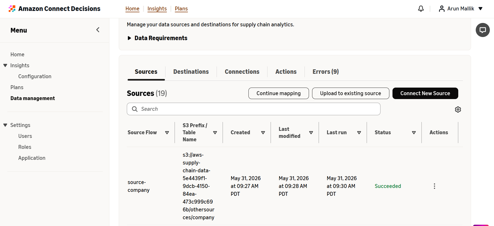

## Source-to-CDM Destination Mapping

Once your files are uploaded, Amazon Connect Decisions begins analyzing your data and map it automatically to one or many of Amazon Connect Decisions's CDM destination tables.

### What to Expect

- This step can take between 10-15 minutes depending on the amount of data uploaded
- The Data Agent works in the background to identify the best CDM destination datasets for your source data.
- _Navigating away from this page will cause automated mappings to fail._ While waiting, please keep the Amazon Connect Decisions and Data Management tab open to ensure automated mapping completes.

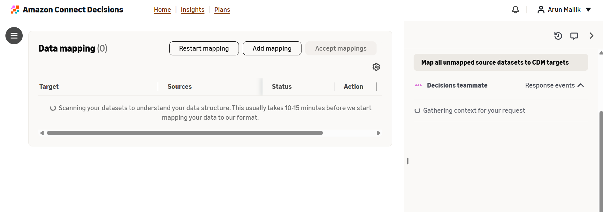

Once complete, the Data Agent provides rationale on source-to-destination mappings based on overlapping data which you can review and ask questions to the agent on any mapping results.

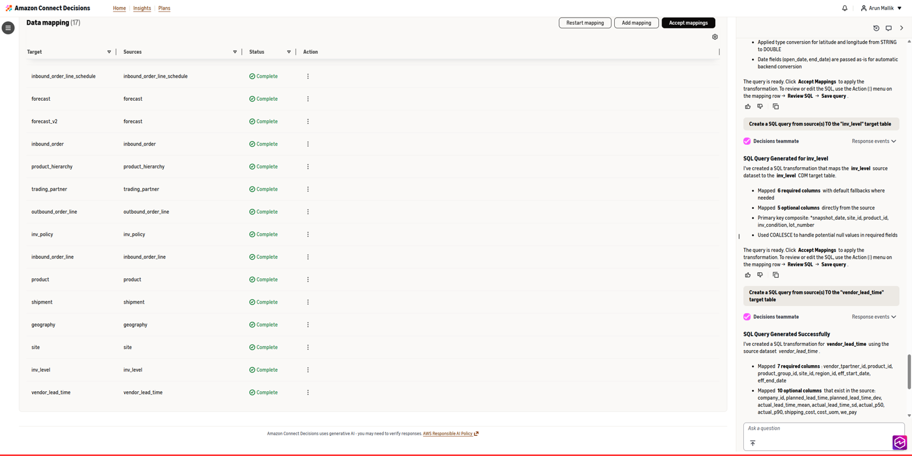

To review and edit source mappings, you can:

- Interact directly with the Data Agent using natural language to update source-destination mappings.
- Click on the **Actions** and select **"Edit Sources"**.

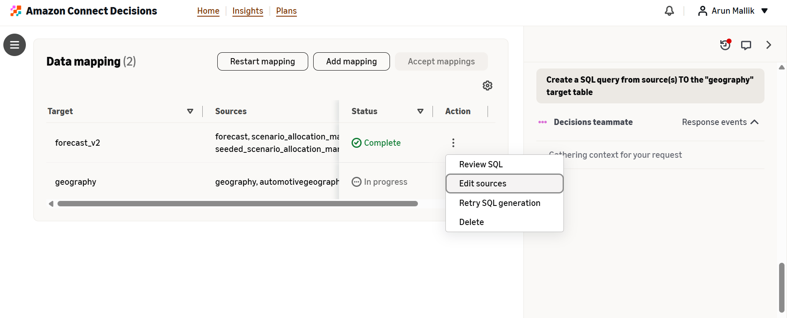

### Editing Mappings

From here, you can:

- Update source and destination mapping manually if needed
- Ask questions using the Data Agent on the right-hand side of the screen to confirm the mappings
- Reference [user guides](../../legacy/userguide/data-model-asc.md "../../legacy/userguide/data-model-asc.md") to learn more about specific datasets

## Column/Data Mapping

After source-to-destination mapping is complete, Amazon Connect Decisions will automatically create SQL transformation queries from your source dataset to CDM destination. After any of your mappings complete, you will receive a notification from the Data Agent detailing the result of the mapping.

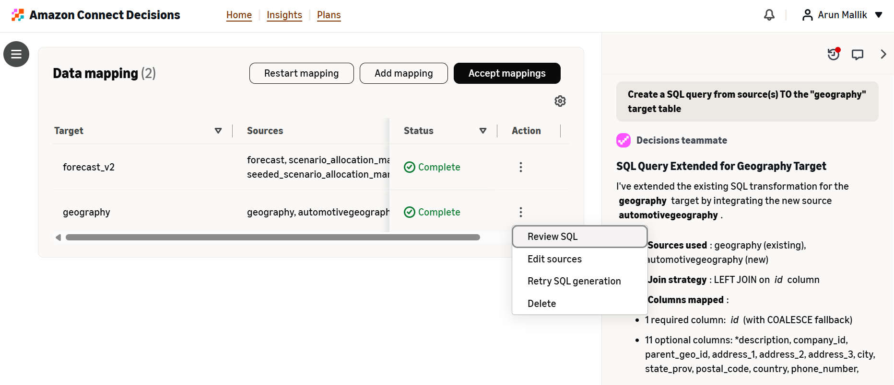

From here, you should review the SQL generated for mappings by selecting **"Review SQL"** from the Action menu.

Reviewing the mapping (SQL), you'll see:

- Source dataset columns you've added
- Destination CDM table columns for reference
- The transformation SQL connecting them
- Rationale for mapping provided by the Data Agent

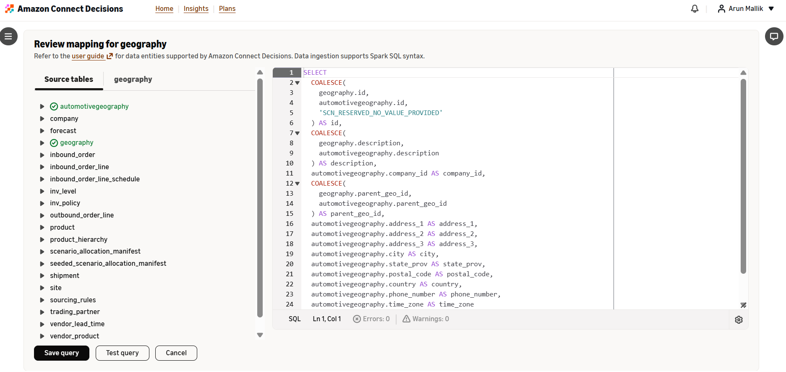

### Editing Mappings

You have two options for editing any mappings:

- **Work with Data Agent**: Use natural language to ask questions, manage, and update the mappings
- **Edit SQL Directly**: If you're familiar with SQL, you can modify the query directly

### Testing Your Changes

As you edit the mapping query, continue to test it using the **"Test Query"** functionality which will give you a scrollable preview of how a sample of how your data is being transformed into destination CDM. Use this to ensure your transformation runs properly and to validate any appropriate updates from your source-to-destination CDM.

Once you are satisfied with the mapping output, select "**Save Query**" to save the transformation query for that source-destination pair.

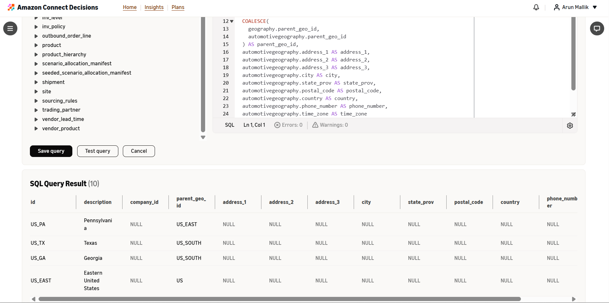

## Review and Accept Mappings

Review the remaining mappings for each of your source datasets. The Data Agent remains persistent on the right-hand side of the screen for questions or troubleshooting help.

Once you're satisfied with all mappings, accept them to complete data onboarding by clicking on **Accept mappings.**

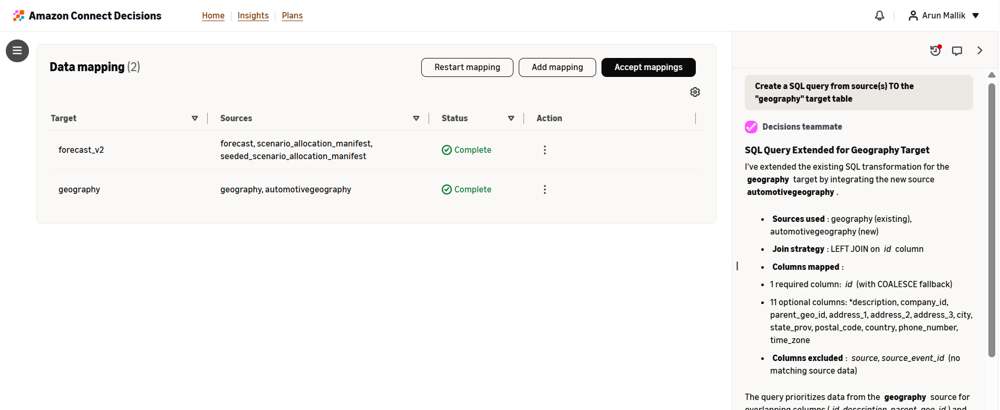

### Handle Failed Mappings

If any mappings failed, you can select **"Restart mapping"** to restart all mappings, or manually retry a single mapping from the Actions menu via **"Retry SQL generation"**. The Data Agent can also retry mappings using natural language and will continue to help you identify and resolve issues if errors continue to persist.

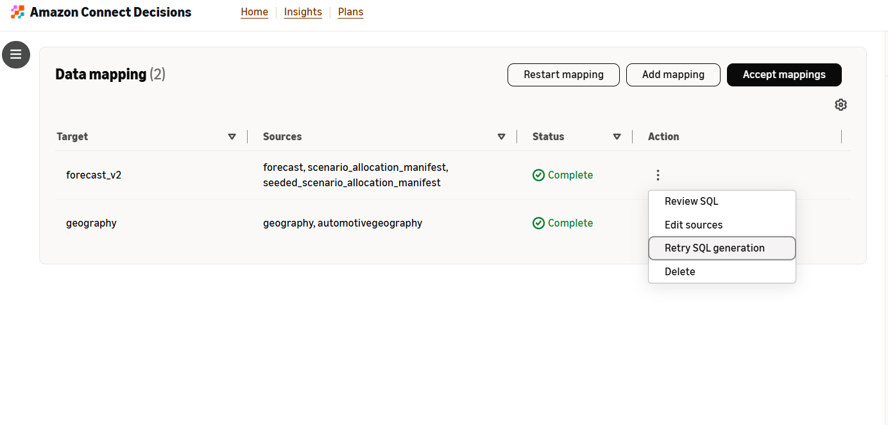

## Monitor Your Flows

### Destinations Tab

Upon accepting mappings, you'll be navigated to the **Destinations** tab within **Data Management** where you can:

- Review destination flows
- Manage and edit mappings ("Manage Flow")
- Delete obsolete flows
- Review execution status for these flows

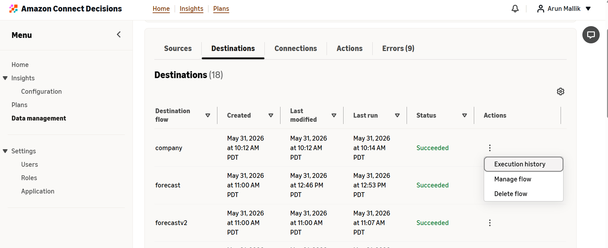

Selecting **"Manage Flow"** will bring you back to the Data Mapping experience where you can continue to work with the Data Agent to refine mappings over time.

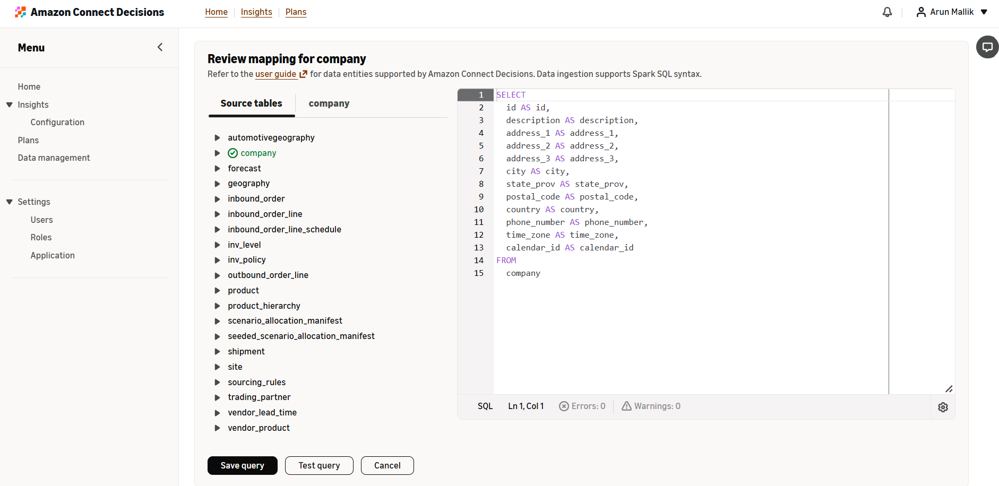

### Sources Tab

Navigating back to the **Sources** tab you can find:

- The source dataset that has been created
- Its associated S3 bucket
- Options to:

  - Append more source data via another file upload
  - Manage the flow
  - Delete the flow
  - Review executions

Selecting **"Manage Flow"** will bring you back to the Data Mapping experience where you can continue to work with the Data Agent to refine mappings over time.

You also have access to **Create a New Source** as needed to restart the Data Onboarding process for any new data sources.

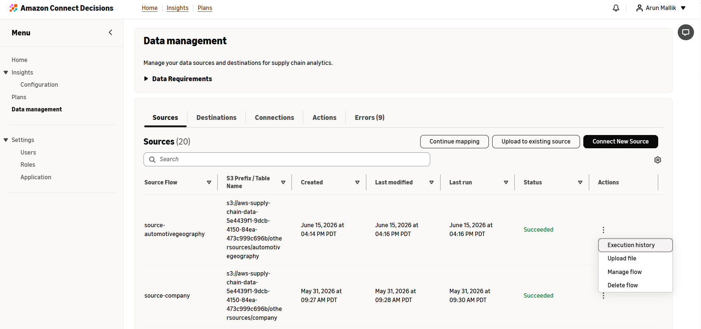

## Best Practices

### Data Preparation

- Follow steps in the Prerequisites section
- Use UTF-8 encoding for all CSV files
- Ensure filenames are unique
- Validate data quality before uploading

### Working with Data Agent

- Be specific in your requests
- Ask for explanations when you don't understand any of its decisions
- Test all SQL changes before accepting
- Use the Preview feature to verify transformations

### Ongoing Maintenance

- Keep your source data updated
- Monitor flow execution regularly
- Address data errors promptly when notified
- Document custom transformations for your team
