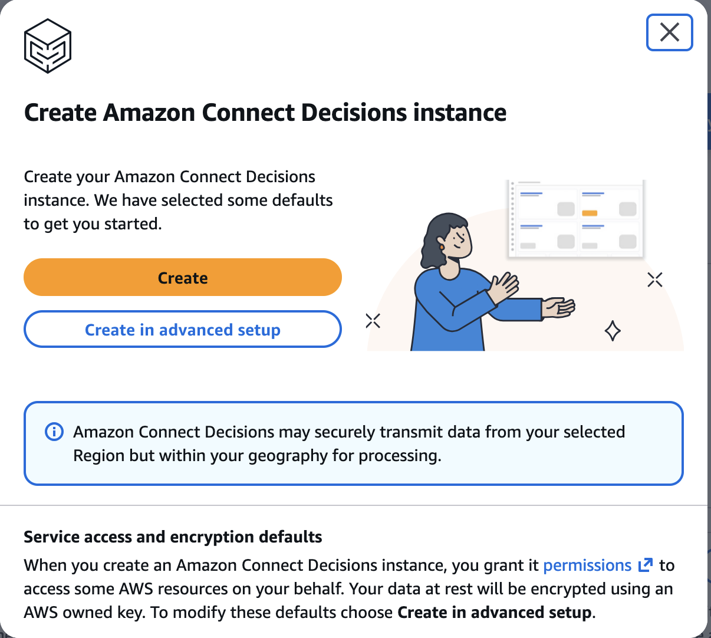
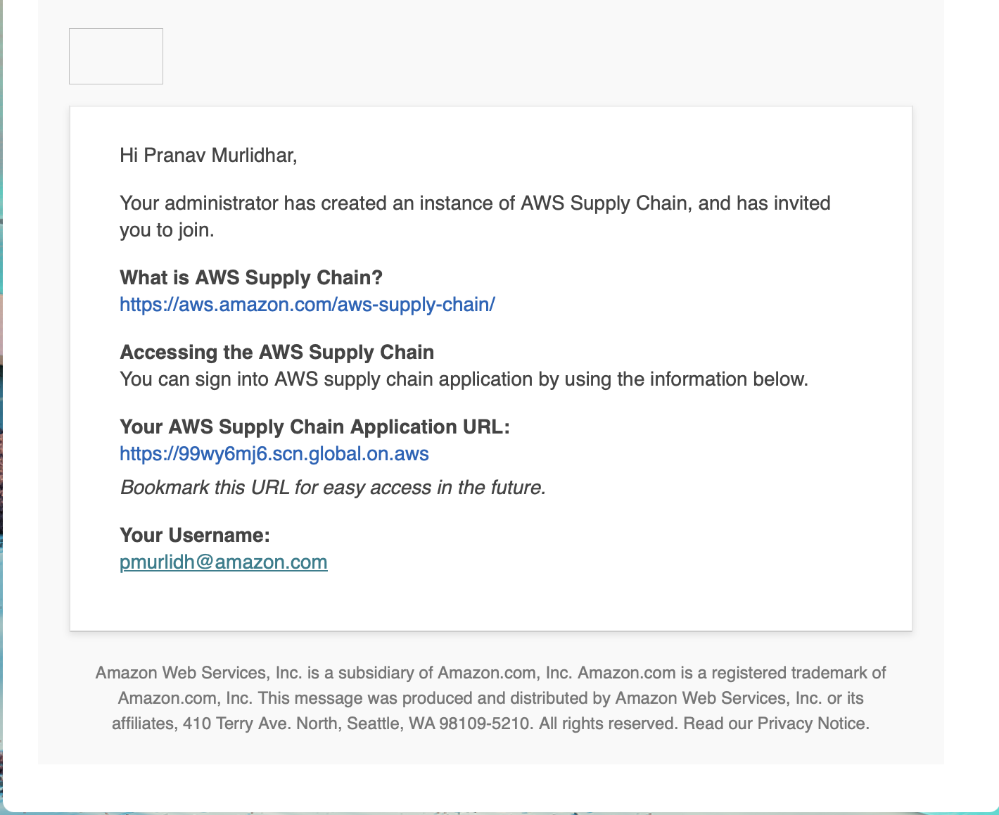
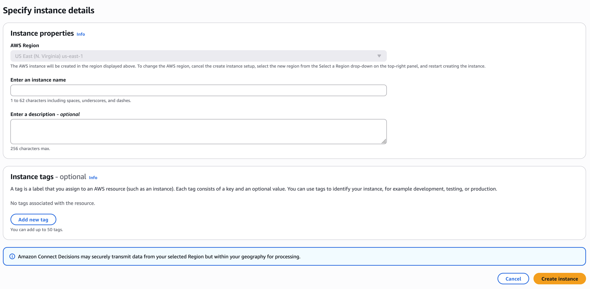
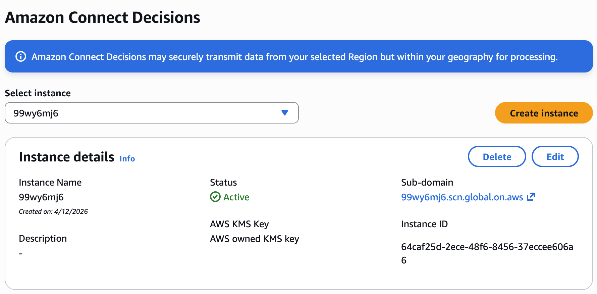

# Creating Your Instance

You create an instance using one of two methods, Standard configuration or Advanced
configuration. Standard configuration uses an automated process that creates your instance
quickly using preset parameters. Advanced configuration allows you to customize your instance
by setting your own parameters.

## Using standard configuration

Standard configuration creates your Amazon Connect Decisions instance using default
security and encryption settings. Instances operate in AWS geographic regions. For more
information about regions, see [Regions and
endpoints](../../../general/latest/gr/rande.md "../../../general/latest/gr/rande.md") in the _IAM User Guide_ and [Regional endpoints](../../../general/latest/gr/rande.md#regional-endpoints "../../../general/latest/gr/rande.md#regional-endpoints") in the _AWS General
Reference_.

To create an Amazon Connect Decisions instance using a standard configuration of preset
parameters, follow these steps.

1. Select **Create**.

 2. Check your email for the following:

    * An email from the IdC team.
    * An email from Identity Management team.

 3. Once you receive the invite email, log on to Amazon Connect Decisions. See
[Log on to Amazon Connect Decisions web application](accessing-your-instance.md "accessing-your-instance.md") .

## Using advanced configuration

Advanced configuration allows you to customize your instance by setting your own
parameters. To create an Amazon Connect Decisions instance using an advanced configuration
of preset parameters, follow these steps.

1. Select **Create in advanced setup**.
2. The **Instance properties** page will
   appear.

 3. Enter the following on the **Instance
properties** page:

    * **Name** – Enter an instance
     name.
    * **Description** – Enter a
     description of your Amazon Connect Decisions instance (e.g., production
     instance, test instance, etc.).
    * **Instance tags** – You can add
     tags to your instance that can be used for identification. For example,
     you can add a tag to define the type of instance you are creating (e.g.,
     production, test, UAT, etc.).

4. Select **Create instance**.

## Deleting an instance

To delete an instance, follow these steps.

###### Note

When you delete an instance, information from the Amazon S3 bucket is not automatically
deleted.

1. Open the Amazon Connect Decisions console at [https://console.aws.amazon.com/scn/home](https://console.aws.amazon.com/scn/home "https://console.aws.amazon.com/scn/home").
2. On the Amazon Connect Decisions console dashboard, from the dropdown, select the
   instance that you want to delete.

 3. Choose **Delete**. 4. On the **Delete Amazon Connect Decisions Instance**
page, under **Confirmation**, type
`delete` to confirm that you want to delete the instance. 5. Choose **Delete**. The instance deletion starts
and once the instance is deleted, you will see a confirmation message.
