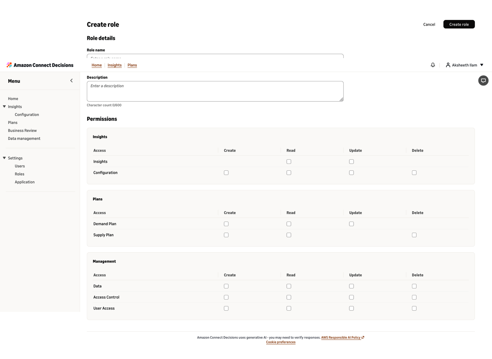

# Overview of roles and permissions

As an Amazon Connect Decisions administrator, you control what users can access by assigning them a
role. Each role defines a set of permissions that determine what the user can view and do
across the application. Each user can hold one role at a time.

Amazon Connect Decisions includes three default roles (Admin, Manager, Planner) and supports up to 100
custom roles per instance.

## Default roles

Default roles come preconfigured with Amazon Connect Decisions. You cannot edit or delete them.

- **Admin** — Full access to all features, data, and user management.
- **Manager** — Access to create, view, and manage insights, plans, and data. No access to role or user management.
- **Planner** — Access to view and work with insights and plans. No access to data integration or user management.

For the full permission breakdown of each default role, see the permission matrix below.

## Custom roles

Custom roles let you define your own permission sets to match how your organization
works. For example, you might create a "Demand Analyst" role with read-only access to
insights and demand plans, or a "Data Steward" role that can only manage data integration.

Constraints:

- Maximum 100 custom roles per instance
- Role names must be unique (case-insensitive), alphanumeric characters and spaces only, up to 128 characters
- Description is optional, up to 255 characters
- Each user can hold only one role at a time
- You cannot reassign your own role

## Understanding the permission matrix

The permission matrix is the grid you use to configure what a role can do. It is
organized into three sections, each containing one or more permission rows. Each row
supports a specific combination of Create, Read, Update, and Delete operations. Not every
row supports all four operations.

### Insights

Insights permissions| Permission row | Create | Read | Update | Delete | What it controls |
| --- | --- | --- | --- | --- | --- |
| **Insights** | — | ✓ | ✓ | — | AI-generated anomaly alerts, exceptions, and recommendations. Read to view them. Update to resolve, dismiss, or accept/reject them. Insights are system-generated, so Create and Delete do not apply. |
| **Configuration** | ✓ | ✓ | ✓ | ✓ | Metrics, business rules, exception rules, and outcomes that drive insight generation. |

### Plans

Plans permissions| Permission row | Create | Read | Update | Delete | What it controls |
| --- | --- | --- | --- | --- | --- |
| **Demand Plan** | ✓ | ✓ | ✓ | — | Demand planning workflows including forecasting, overrides, and planning cycles. Delete does not apply because demand plans are versioned and archived. |
| **Supply Plan** | ✓ | ✓ | — | ✓ | Supply planning workflows including plan generation, orders, and configurations. Modifications are handled by creating new orders or configurations, so Update does not apply. |

### Management

Management permissions| Permission row | Create | Read | Update | Delete | What it controls |
| --- | --- | --- | --- | --- | --- |
| **Data** | ✓ | ✓ | ✓ | ✓ | Data integration including connections, datasets, integration flows, and ingestion. |
| **Access Control** | ✓ | ✓ | ✓ | ✓ | Role definitions. Create, view, edit, and delete custom roles. This does not control user-to-role assignment. |
| **User Access** | ✓ | ✓ | ✓ | ✓ | User-to-role assignments and user invitations. Assign, reassign, and unassign users. Invite new users and revoke invitations. |

## Create a custom role

1. Navigate to the Roles page.
2. Choose Create role.
3. Enter a role name (required) and an optional description.
4. In the permission matrix, select the checkboxes for the operations you want this role to have across each permission row.
5. Choose Create role to save.

## Edit a custom role

1. Navigate to the Roles page.
2. Select the custom role you want to edit.
3. Update the role name, description, or permission checkboxes.
4. Save your changes.

Permission changes take effect on the user's next action. Users do not need to refresh or log back in.

## Delete a custom role

1. Navigate to the Roles page.
2. Select the custom role you want to delete.
3. Confirm the deletion.

When you delete a custom role, all users assigned to that role are automatically unassigned and lose access to Amazon Connect Decisions.

## Assign or change a user's role

1. Navigate to the Users page.
2. Select the user you want to update.
3. Choose the role you want to assign from the list of default and custom roles.
4. Save the assignment.

To remove a user's role, select the user and unassign their current role. The user will lose access until a new role is assigned.

## Important considerations

- Default roles (Admin, Manager, Planner) cannot be edited or deleted.
- You cannot reassign your own role. Another admin must make the change.
- Permission changes from editing a role apply to all users under that role and take effect immediately.
- Deleting a custom role unassigns all users from it. Those users lose access until reassigned.
- Each user can hold only one role. Assigning a new role replaces the previous one.
- Adding groups is not supported in Amazon Connect Decisions.
