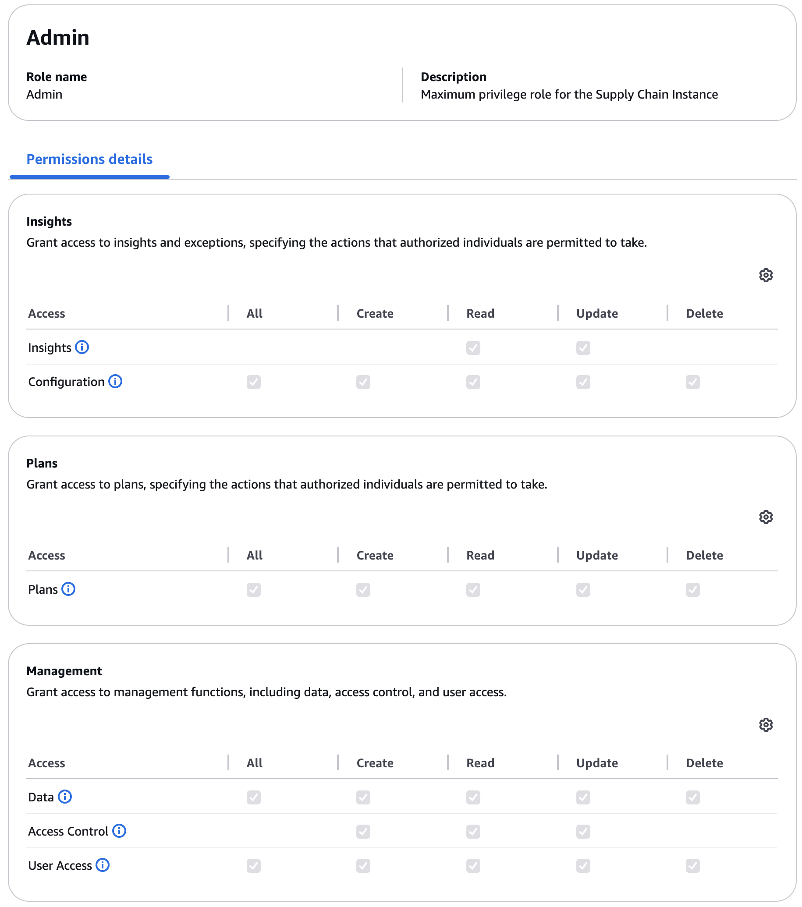
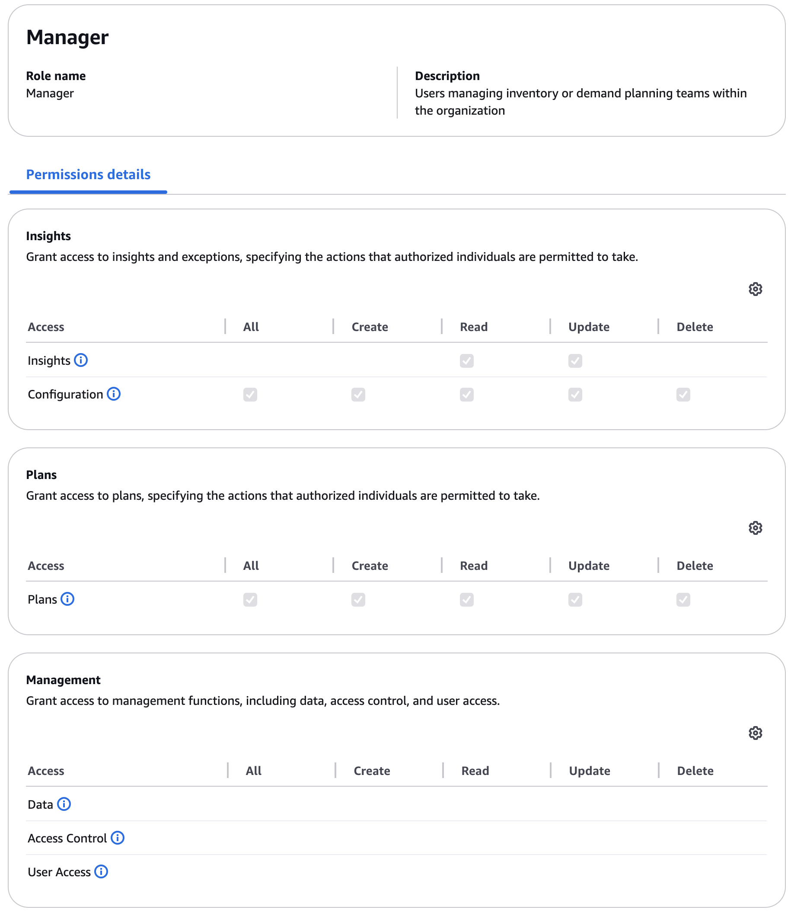
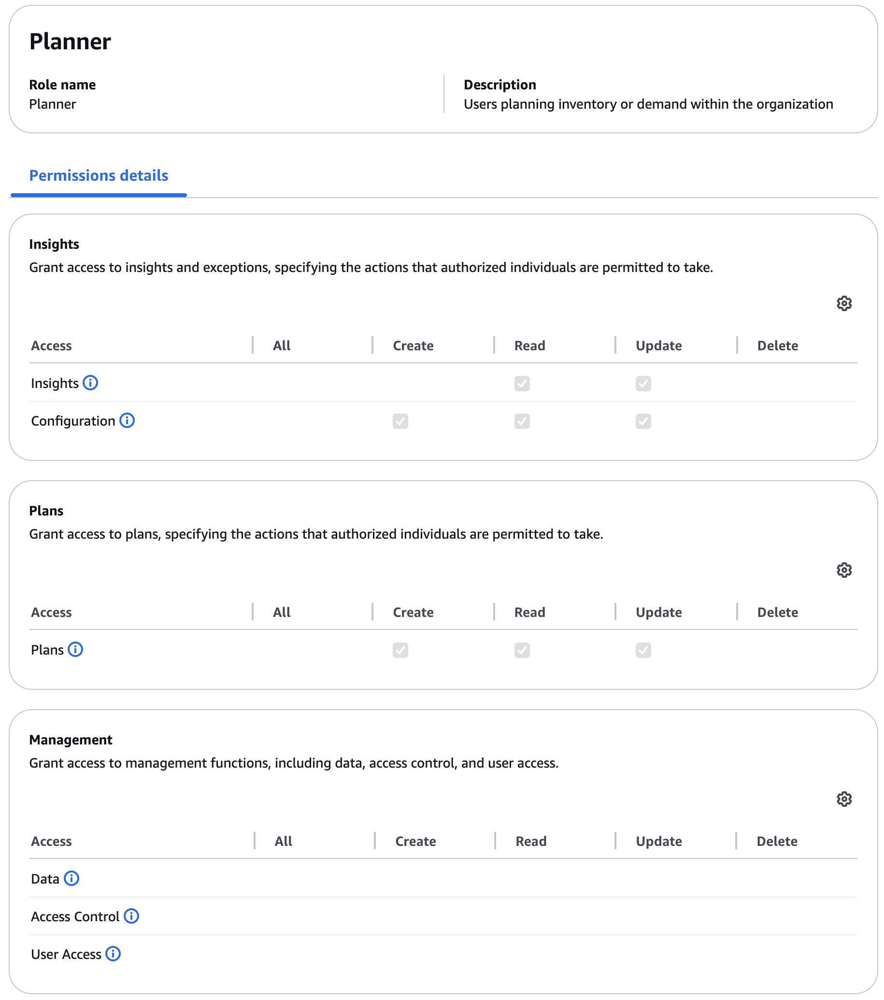

# Overview of roles and permissions

As an Amazon Connect Decisions administrator, you can either use the default user
permission roles or create custom permission roles. Amazon Connect Decisions has the
following default user permission roles:

- **Administrator** – Access to create, view,
  and manage all data and user permissions.

- **Manager** – Access to create, view, and
  manage the following.

- **Planner** – Access to create, view and
  manage the following.

###### Note

As an Amazon Connect Decisions administrator, before you add users, note the
following:

- Each default user permission role is defined with a set of permissions. You
  can add users to default user permission roles or create custom permission
  roles.
- A user can only be assigned to one user permission role.
- You cannot edit or delete default user permission roles.
- When you edit a custom permission role you created, the permissions for all
  the users under the custom permission role are updated.
- When you delete a custom permission role you created, all the users under
  the custom permission role will lose access to
  Amazon Connect Decisions.
- Adding groups is not supported in Amazon Connect Decisions.
