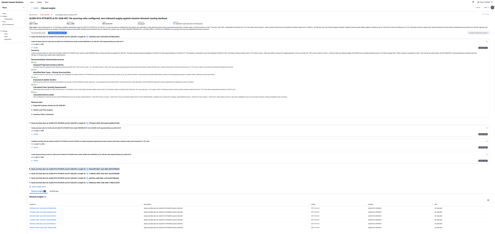
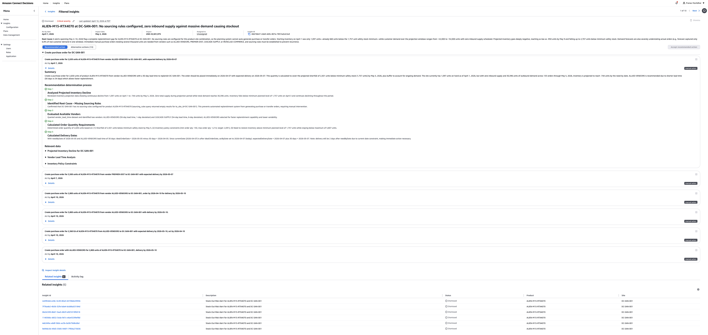

# Insights Details

## Understanding Insights Details

The Insights Details page provides comprehensive information about a specific insight, including
root cause analysis, key metrics, recommendations, and related insights. This page helps you
understand the issue, assess its impact, and determine the appropriate actions to resolve it.

## Accessing Insight Details

To view detailed information about an insight:

1. Navigate to the Insights page
2. Locate the insight you want to review in the Insights table
3. Select the **Insight ID** (displayed as a blue hyperlink)
4. The Insights Details page opens

## Page Header and Navigation

At the top of the page:

**Breadcrumb navigation**: Shows your current location
(Home > Insights > Filtered Insights) and allows you to return to the Insights listing page

**Status and severity indicators**: Display the current insight
status (for example, "Dismissed") and severity level (for example, "Critical")

**Last updated timestamp**: Shows when the insight was last
modified (for example, "Last updated April 16, 2025 03:07 UTC")

## Insight Overview

The main header displays key information about the insight:

**Insight Title**: A descriptive summary of the issue (for example,
"ACDN-M15-RPA-0070 at DC-SAN-001: No sourcing rules configured, zero inbound supply against
massive demand causing stockout")

**Key Metrics** (displayed on the right):

- **Impact Date**: When the issue is expected to occur
- **Impact**: Financial impact amount (for example, "USD 3,561,955")
- **Insight ID**: Unique identifier with copy functionality
- **Created**: Date when the insight was generated

**Summary**: A brief paragraph explaining the core issue,
business context, and why the insight was generated

## Root Cause Analysis Section

Below the overview, the Root Cause Analysis section provides detailed investigation of
what caused the issue.

**Section Structure**: The root cause analysis appears as
expandable sections with descriptive titles

**To view root cause details:**

1. Locate the Root Cause Analysis section
2. Select the arrow icon next to any section to expand it
3. The expanded section displays:

   - Detailed explanation of contributing factors
   - Quantitative evidence and data points
   - Timeline of events or conditions
   - Related business context

**Common root cause categories include:**

- Forecasted Inventory Decline
- Identified Root Cause (for example, Missing Sourcing Rules)
- Evaluated Available Inventory
- Calculated Order Quantity Requirements
- Calculated Delivery Dates

## Relevant Data Section

The Relevant Data section provides links to supporting information:

- **Data visualizations**: Links to charts and graphs
  showing inventory trends, demand patterns, or other relevant metrics
- **Analytical resources**: References to vendor lead
  time analysis, inventory policy constraints, or other supporting data
- **Related metrics**: Connections to performance
  indicators that informed the insight

Select any link to drill into the underlying data that supports the root cause analysis.

## Recommendations Section

The Recommendations section presents system-generated suggestions for resolving the insight.

**Recommendation Cards**: Each recommendation appears as a card containing:

**Recommendation title**: A clear description of the suggested
action (for example, "Create purchase order for 3,205 units of ACDN-M15-RPA-0070")

**Recommendation details**: Specific parameters including:

- Quantities and units
- Locations (sites, warehouses)
- Dates and timelines
- Product or supplier identifiers

**Timestamp**: When the recommendation was generated

**Details link**: Select "Details" to view complete recommendation
information including rationale and expected outcomes

**Action status**: Current state of the recommendation
(for example, "Actions available")

**To expand a recommendation:**

1. Select the arrow icon next to the recommendation title
2. The card expands to show:

   - Complete action parameters
   - Supporting rationale and analysis
   - Expected outcomes and benefits
   - Related data and calculations

## Activity Log

The Activity Log section tracks all actions and updates related to the insight.

**Log Entry Structure**: Each entry includes:

- **Action description**: What occurred (for example,
  "Stock Out Risk item for ACDN-M15-RPA-0070 and DC-SAN-001")
- **Insight ID reference**: Links to related insights
- **System information**: API calls or system processes involved
- **Timestamp**: When the action occurred
- **Details link**: Select to view additional information
- **Actions available button**: When applicable,
  shows available next steps

**To view activity details:**

1. Locate the Activity Log section at the bottom of the page
2. Select "Details" on any log entry to expand it
3. Review the detailed information about that activity

The Activity Log displays entries in reverse chronological order, with the most recent
actions at the top.

## Related Insights Section

At the bottom of the page, the Related Insights section displays other insights connected
to the current issue.

**Section Header**: Shows the count of related insights
(for example, "Related Insights (6)")

**Related Insights Table** displays:

**Columns:**

- **Insight ID**: Task identifier as a clickable link
- **Description**: Brief summary of the related insight
- **Status**: Current workflow state with icon
  (for example, "Dismissed")
- **Product**: Product identifier
- **Site**: Site identifier

**To view a related insight:**

1. Select any **Insight ID** in the Related Insights table
2. The system navigates to that insight's Details page

Related insights help you understand whether the current issue is part of a broader pattern
or connected to other supply chain challenges.

## Understanding Visual Indicators

Throughout the Insights Details page, visual elements help you quickly interpret information:

**Status badges**: Color-coded indicators show the current insight state

- Dismissed: Gray indicator for discarded insights
- In progress: Blue indicator for active work
- Not started: Default state for new insights

**Severity indicators**: Color and icon communicate priority

- **Critical**: Red indicator for highest priority
- **High**: Orange indicator for significant issues
- **Medium**: Yellow indicator for moderate concerns
- **Low**: Gray indicator for minor issues

**Expandable sections**: Arrow icons indicate collapsible sections
with additional details

**Clickable elements**: Blue hyperlinks indicate interactive elements
like Insight IDs and details links

**Action buttons**: Gray "Actions available" buttons indicate where
you can take action on recommendations

## Navigating the Insights Details Page

From the Insights Details page, you can:

**Return to the Insights listing**: Select "Insights" or
"Filtered Insights" in the breadcrumb navigation

**View related insights**: Select any Insight ID in the
Related Insights section to investigate connected issues

**Access supporting data**: Select links in the Relevant Data
section to open related dashboards and analysis views

**Take action on recommendations**: Use the action buttons
to accept or mark recommendations as complete

## Page Updates

The Insights Details page updates automatically when:

- New data becomes available
- Recommendations are generated or updated
- Actions are taken on the insight
- Related insights change status

The "Last updated" timestamp at the top of the page shows when the most recent update occurred.
