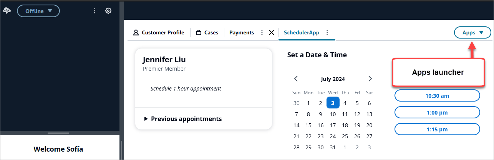
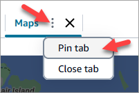
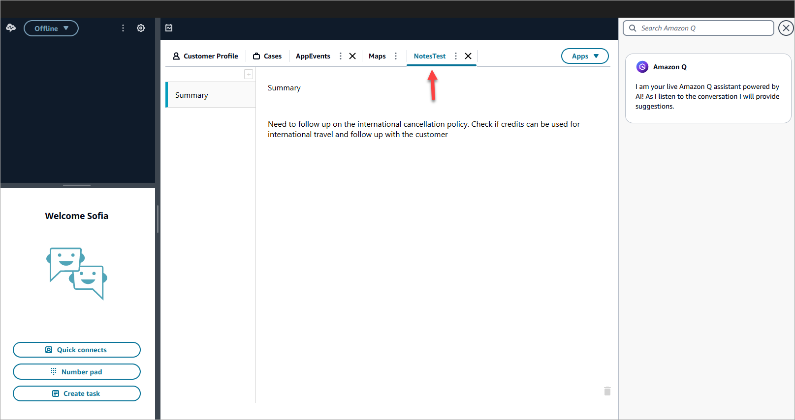
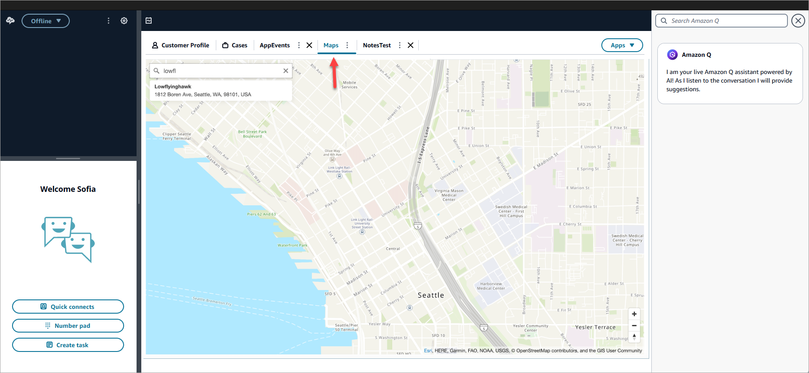

# Access third-party applications in the

Amazon Connect agent workspace

## Important things to know

- On Jul 22, 2024, Google [announced](https://privacysandbox.com/news/privacy-sandbox-update/ "https://privacysandbox.com/news/privacy-sandbox-update/") that they no longer plan to deprecate third-party
  cookies and instead provide an opt-in mechanism for deprecating
  third-party cookies. Opting into third-party cookie deprecation may
  impact the third-party applications experience. If you are using
  third-party apps in the Amazon Connect Agent workspace on the Chrome browser, we
  recommend that you:
  - **Temporary solution**: Update
    [Enterprise Chrome policies](https://support.google.com/chrome/a/answer/7679408?sjid=16745203858910744446-EU#upChromeBrsrBB117 "https://support.google.com/chrome/a/answer/7679408?sjid=16745203858910744446-EU#upChromeBrsrBB117")). You can set
    `BlockThirdPartyCookies` Policy to false and
    safeguard your agent experience from immediate impact due to 3P
    Cookie Deprecation.
  - **Permanent solution**: We
    recommend that app developers follow [best practices](https://developers.google.com/privacy-sandbox/3pcd "https://developers.google.com/privacy-sandbox/3pcd") that will continue to pass
    third-party cookies.

- You must have [integrated the
  application](3p-apps.md "3p-apps.md") and the agent must have [access to the application](assign-security-profile-3p-apps.md "assign-security-profile-3p-apps.md") by using security profiles. The
  agent must also have access to the CCP in order for the application
  launcher to appear.

## Use the app launcher to access

third-party applications

Agents can access third-party applications in the agent workspace by using the
apps launcher, shown in the following image. The apps launcher appears on the
agent workspace after you have successfully [onboarded](3p-apps.md "3p-apps.md") your third-party app.

The app launcher shows a list of applications that the agent has access to.

The agent can launch applications when they don't have any contacts (they are
in the idle state) or when they are on a contact (call, chat, or task). After an
app is opened for a given contact, it stays open until that contact is
closed.

## Required security profile

permissions to access third-party applications

Agents need the following security profiles permissions to access third-party
apps:

- **Contact Control Panel (CCP) - Access the
  CCP**
- Access to at least one third-party application - it appears in the
  security profile page after you have successfully [onboarded](3p-apps.md "3p-apps.md") your third-party app.

## Pin apps on the agent workspace

Agents can pin an app as open. On the apps tab, choose the More icon and then
select **Pin tab**, as shown in the following image.

After an app is pinned, it stays open in the idle state and pops open for any
contacts that come in. The app stays pinned for that user and browser until the
user clears the cookies on the browser.

An agent can unpin the tab if they no longer want this app to always be open;
they will still be able to open and close the app as needed.

### Examples of apps pinned on the agent

workspace

The following image shows an example of a third-party app named NoteTest
that is pinned to the agent workspace.

The following image shows an example of a third-party app named Maps that
is pinned to the agent workspace.

