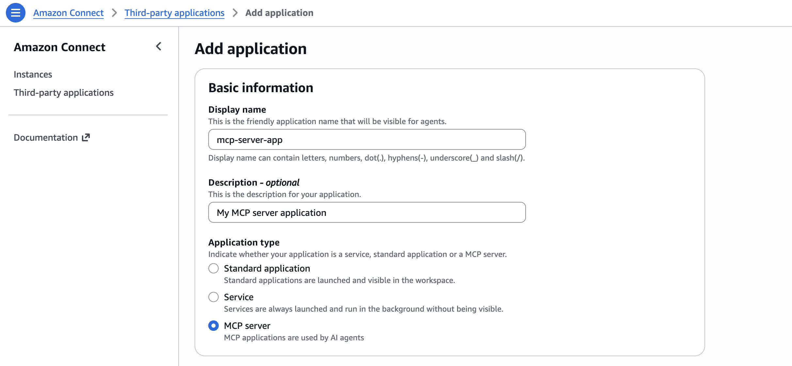
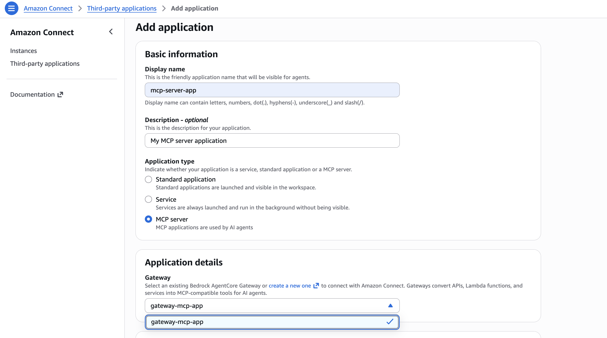
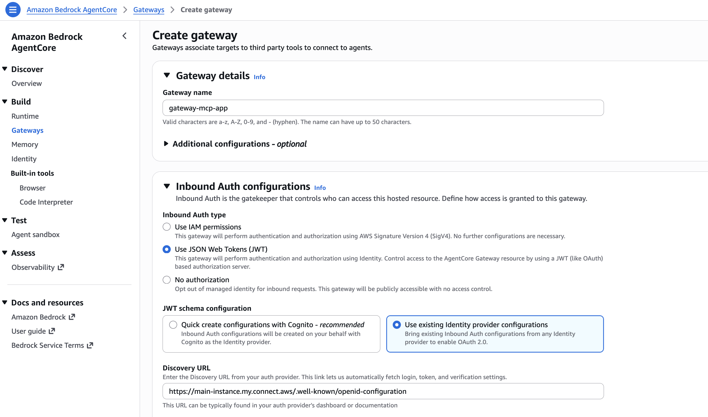
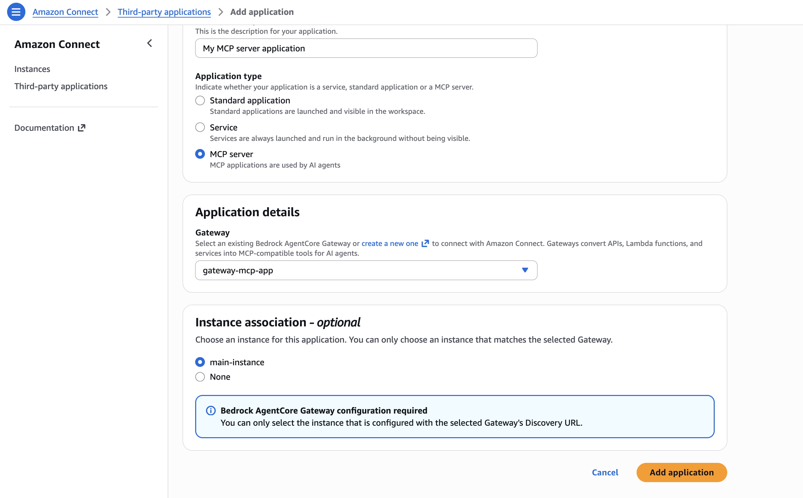
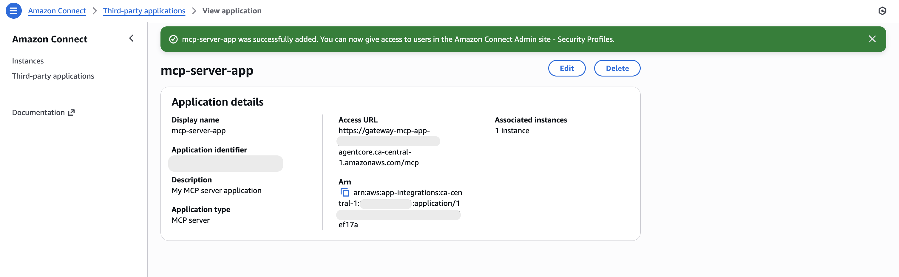

# Integrate MCP server applications with Amazon Connect

To integrate an MCP server application with Amazon Connect, you must configure a Bedrock AgentCore gateway. The gateway transforms your APIs, Lambda functions, and services into MCP-compatible tools for AI agents.

###### Note

Only one instance can be associated with a gateway, and that instance must be configured with the gateway's Discovery URL in Bedrock AgentCore. Each gateway can only be used with one MCP server.

## How to integrate an MCP server application

1. On the **Add application** page, enter the following information:
   1. **Basic information**
      - **Display name** – A friendly name for the application. This name is displayed on security profiles and to your agents on the tab in the agent workspace. You can change this name later.
      - **Description (optional)** – You may optionally provide a description for this application.
      - **Application type** – Select **MCP server**.

    2. **Application details**

   Select a Bedrock AgentCore gateway to connect with Amazon Connect. Gateways convert APIs, Lambda functions, and services into MCP-compatible tools for AI agents. If no gateways currently exist, create a new one using Bedrock AgentCore.

   

   A new gateway can be created in Bedrock AgentCore.

   ###### Note

   The Discovery URL must follow this format: `[connect instance URL]/.well-known/openid-configuration`. For example: `https://my-instance.my.connect.aws/.well-known/openid-configuration`.

    3. **Instance association (optional)**

   Select the instance that is configured with the selected gateway's Discovery URL. Defaults to **None**. If you are not ready to select an instance or if no instance has been associated with the selected gateway's Discovery URL, you may still create the MCP application now and associate an instance later.

   

2. Choose **Save**.
3. If the application was successfully created, you will be sent to the **View applications** page where you will see a success banner and the application summary.

