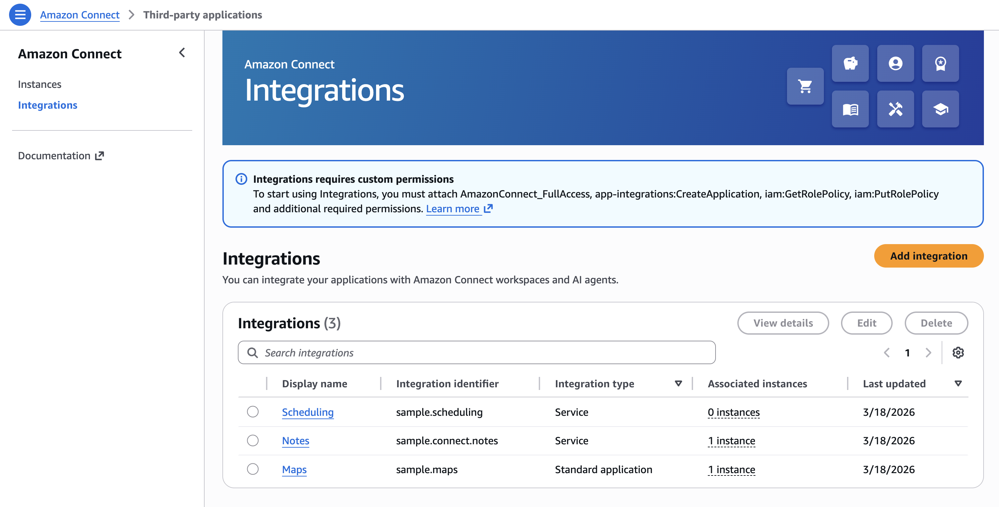
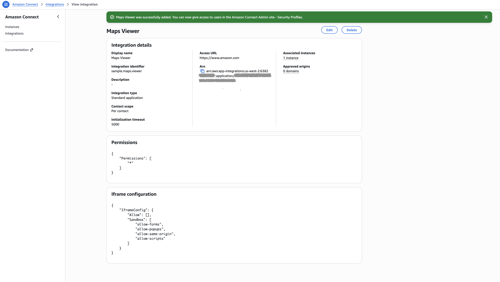
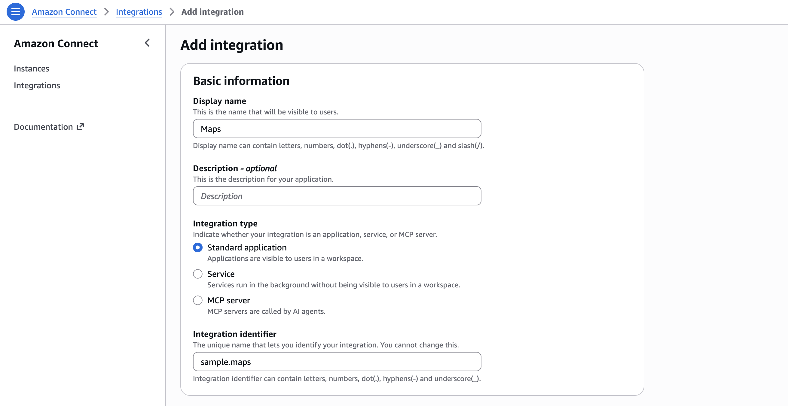
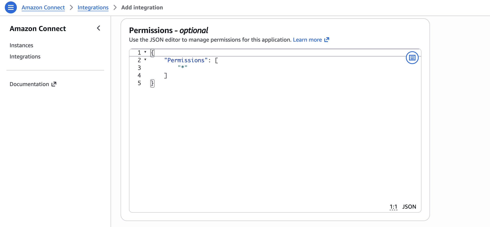
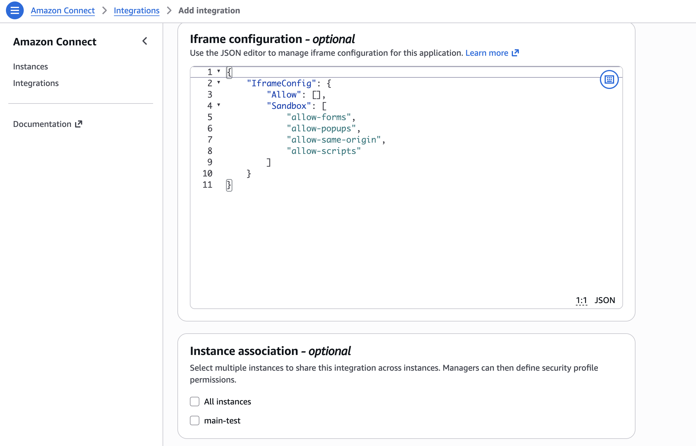
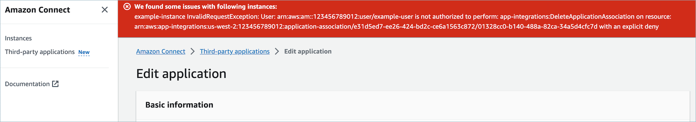

# Integrate third-party applications in the agent workspace

The Connect Customer agent workspace gives your agents the tools and step-by-step guidance to
resolve issues quickly and provide better customer experiences with less training
required. The agent workspace includes native, first-party applications, such as Customer Profiles,
Cases, and agent assist. You can also integrate third-party applications.

###### Note

Third-party applications are supported only in the Connect Customer agent workspace; they are
not supported in custom agent desktops.

For example, you can integrate a proprietary reservation system or a third-party
claims management system dashboard into the agent workspace.

If you are a developer interested in building a third-party application, see the
[Agent Workspace Developer
Guide](../../../agentworkspace/latest/devguide/getting-started.md "../../../agentworkspace/latest/devguide/getting-started.md").

###### Contents

- [Integration types](#3p-apps-integration-types "#3p-apps-integration-types")
- [Required IAM
  permissions](#onboard-3p-apps-requirements "#onboard-3p-apps-requirements")
- [Add a 3P
  app](#onboard-3p-apps-how-to-integrate "#onboard-3p-apps-how-to-integrate")
- [Delete integrations](#delete-3p-apps "#delete-3p-apps")
- [Assign
  permissions](assign-security-profile-3p-apps.md "assign-security-profile-3p-apps.md")
- [Iframe permissions for 3P
  apps](3p-apps-iframe-permissions.md "3p-apps-iframe-permissions.md")
- [Events and requests for 3P
  apps](3p-apps-events-requests.md "3p-apps-events-requests.md")
- [Access 3P apps in the agent
  workspace](3p-apps-agent-workspace.md "3p-apps-agent-workspace.md")
- [Set up SSO federation for 3P
  apps](3p-apps-sso.md "3p-apps-sso.md")

- [Use screen pop functionality of third-party applications in the Connect Customer agent workspace](no-code-ui-builder-app-integration.md "no-code-ui-builder-app-integration.md")
- [Workshop for building a third-party app](https://catalog.workshops.aws/amazon-connect-agent-empowerment/en-US/third-party-applications/test "https://catalog.workshops.aws/amazon-connect-agent-empowerment/en-US/third-party-applications/test")

## Integration types

An integration connects something outside Connect Customer to your instance. You create an
integration once for an AWS account and Region, associate it with one or more
instances, and grant it permissions. You choose an integration type on the
**Add integration** page. The type determines what you
configure and how Connect Customer reaches the integration.

- **Standard application**: A web application that Connect Customer
  renders in an iframe in the agent workspace. Agents open it from the
  **Apps** launcher. You give an access URL, iframe
  permissions, and a contact scope that sets when the application refreshes.
  Use this type for an application your agents work in, such as an order
  lookup tool or a scheduling app.
- **Service**: A headless application that you build and
  that runs in the background of the agent workspace. A service starts when
  the agent workspace loads and stays active for the rest of the session. It
  has no interface for an agent to open. Use this type for work that runs on
  its own, such as reacting to contact events like connect, disconnect, and
  after contact work, opening an application when a condition is met, or
  completing an authentication flow as soon as the session starts. For more
  information, see [Building
  third-party services](../../../agentworkspace/latest/devguide/building-3P-services.md "../../../agentworkspace/latest/devguide/building-3P-services.md") in the _Agent Workspace Developer
  Guide_.
- **MCP server**: A Model Context Protocol server that
  gives the AI agents in Connect Customer a set of tools to call. You connect it through
  a Bedrock AgentCore gateway instead of an access URL, and each gateway serves
  one MCP server. For the full procedure, see [Integrate an MCP server with Connect Customer](3p-apps-mcp-server.md "3p-apps-mcp-server.md").

The steps that follow describe how to add a standard application.

## Required IAM permissions

If you use custom IAM policies to manage access to third-party applications, your
users need extra IAM permissions. In addition to
`AmazonConnect_FullAccess`, users need the following:

JSON

```
`{
 "Version":"2012-10-17",
 "Statement": [
 {
 "Action": [
 "app-integrations:CreateApplication",
 "app-integrations:GetApplication",
 "iam:GetRolePolicy",
 "iam:PutRolePolicy",
 "iam:DeleteRolePolicy"
 ],
 "Resource": "arn:aws:app-integrations:`us-east-1`:`111122223333`:application/*",
 "Effect": "Allow"
 }
 ]
}`

```

## Add a third-party application

###### Note

To add an integration to your instances, make sure that your
instance is using a Service-Linked Role (SLR). If your instance currently does
not use an SLR but you wish to add an integration, you will need
to migrate to an SLR. Integration can only be add to instances that are using an SLR. For more information, see [For instances created before October 2018](connect-slr.md#migrate-slr "connect-slr.md#migrate-slr").

1. Open the Connect Customer
   [console](https://console.aws.amazon.com/connect/ "https://console.aws.amazon.com/connect/")
   (https://console.aws.amazon.com/connect/).
2. In the navigation pane, choose **Integrations**. If you
   don't see this menu, then 3P apps are not available in your AWS Region. To
   check where 3P apps are available, see [Availability of Connect Customer features by Region](regions.md "regions.md").
3. On the **Integrations** page, choose
   **Add integration**.

 4. On the **Add integration** page, complete the
**Integration information** fields:

    * **Display name**: A friendly name for the 3P app.
     The name appears on security profiles and on the tab in the agent
     workspace. You can change it later.
    * **Description (optional)**: A description of the
     3P app. Agents don't see the description.
    * **Integration type**: Indicates whether the
     integration is a standard web application (3P app), service (3P
     service), or MCP server. The type determines how agents interact
     with the integration.
    * **Integration identifier**: A unique name for
     integrations of type standard application or service. If you have
     only one application per access URL, we recommend that you use the
     origin of the access URL. You can't change this name.

Complete the **Integration details** fields:

    * **Contact scope**: Indicates whether the web
     application refreshes for each contact or only for each new browser
     session. This setting affects how frequently the application updates
     its data.
    * **Initialization timeout**: The maximum time, in
     milliseconds, to establish a connection with the workspace. This
     setting helps manage connection issues and ensures timely
     application startup.

Complete the **Access** fields:

    * **Access URL**: The URL where your application is
     hosted. The URL must start with `https`, unless it's a
     local host. Not all URLs can be iframed. For more information, see
     [Check whether a URL can be iframed](#3p-apps-check-url-iframe "#3p-apps-check-url-iframe").
    * **Approved origins (optional)**: Additional URLs
     to allow, if they differ from the access URL. Each URL must start
     with `https`, unless it's a local host.

Add permissions to [events and
requests](3p-apps-events-requests.md "3p-apps-events-requests.md"), and set the **Iframe configuration**.
Both are optional.

Under **Instance association**, choose the instances that
can use the application:

    * You can give any instance in this AWS account and Region access
     to the application.
    * Associating the integration with an instance is optional, but you
     can't use the application until you do.


    ###### Note

    For MCP servers, you can choose only the instance that is
     configured with the selected gateway's discovery URL.

5. Choose **Add integration**. 6. If the integration is created successfully, the **Integration
details** page appears with a success banner.



You can edit some attributes of an existing integration, such as its
display name, access URL, and permissions.

If an error occurs while creating the integration or associating it with
an instance, an error message appears. Follow the message to correct the
issue.

### Check whether a URL can be iframed

Not all URLs can be iframed. There are two ways to check whether a URL can be
iframed:

- Use the third-party tool [Iframe Tester](https://iframetester.com "https://iframetester.com") to check
  whether a URL can be iframed.

  - If a URL can be iframed, the page renders a
    preview.
  - If a URL cannot be iframed, the page displays an error in
    the preview. The website might show an error even though the app
    can still be iframed in the agent workspace. An app developer
    can restrict their app so that it can only be embedded in the
    agent workspace. If you received the app from an app developer,
    still try to integrate it into the agent workspace.

- For technical users: Check the security policy content of the
  application you want to integrate.

  - Firefox: Open the hamburger menu, and then choose
    **More tools**, **Web developer
    tools**, **Network**.
  - Chrome: Open the three-dot menu, and then choose
    **More tools**, **Developer
    tools**, **Network**.
  - Other browsers: Find the network settings in the developer
    tools.
    The `Content-Security-Policy frame-ancestors` directive
    should be
    `https://`your-instance`.my.connect.aws`.
    If the directive is `same origin` or `deny`, then
    Connect Customer can't iframe the URL.

Here's what you can do if the app can't be iframed:

- If you control the app or URL, update the app's content security
  policy. For guidance, see [Recommendations and best practices](../../../agentworkspace/latest/devguide/recommendations-and-best-practices.md "../../../agentworkspace/latest/devguide/recommendations-and-best-practices.md") in the _Agent
  Workspace Developer Guide_.
- If you don't control the app or URL, ask the app developer to update
  the app's content security policy.

### Example: add an application and assign permissions

The following example shows how to onboard a new application and assign
permissions to it in the AWS Management Console. In this example, you assign six permissions
to the application.

**Basic information and access details**



**Permissions for workspace data integration**



**Iframe configuration**



## Delete integrations

If you no longer need an integration, you can delete it. To stop using an
integration temporarily, disassociate it from the instance instead. Disassociating
avoids having to add the integration again. To delete an integration, open the
AWS Management Console, choose the integration, and then choose
**Delete**.

### Troubleshooting

- Deleting fails if the integration is still associated with an instance.
  Disassociate the integration from every instance, and then delete
  it.

###### Tip

If you created an integration before December 15, 2023, you might have
trouble updating its association with instances. You need to update your IAM
policy first.



Update your IAM policy to include the following permissions:

- `app-integrations:CreateApplicationAssociation`
- `app-integrations:DeleteApplicationAssociation`

JSON

```
`{
 "Version":"2012-10-17",
 "Statement": [
 {
 "Action": [
 "app-integrations:CreateApplication",
 "app-integrations:GetApplication"
 ],
 "Resource": "arn:aws:app-integrations:`us-east-1`:`111122223333`:application/*",
 "Effect": "Allow"
 },
 {
 "Action": [
 "app-integrations:CreateApplicationAssociation",
 "app-integrations:DeleteApplicationAssociation"
 ],
 "Resource": "arn:aws:app-integrations:`us-east-1`:`111122223333`:application-association/*",
 "Effect": "Allow"
 },
 {
 "Action": [
 "iam:GetRolePolicy",
 "iam:PutRolePolicy",
 "iam:DeleteRolePolicy"
 ],
 "Resource": "arn:aws:iam::`111122223333`:role/aws-service-role/connect.amazonaws.com/AWSServiceRoleForAmazonConnect_*",
 "Effect": "Allow"
 }
 ]
}`

```
