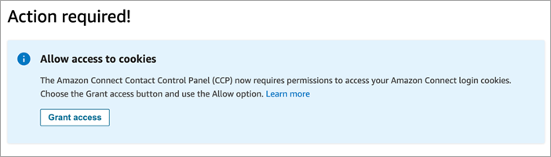
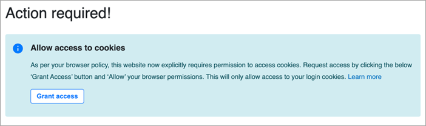
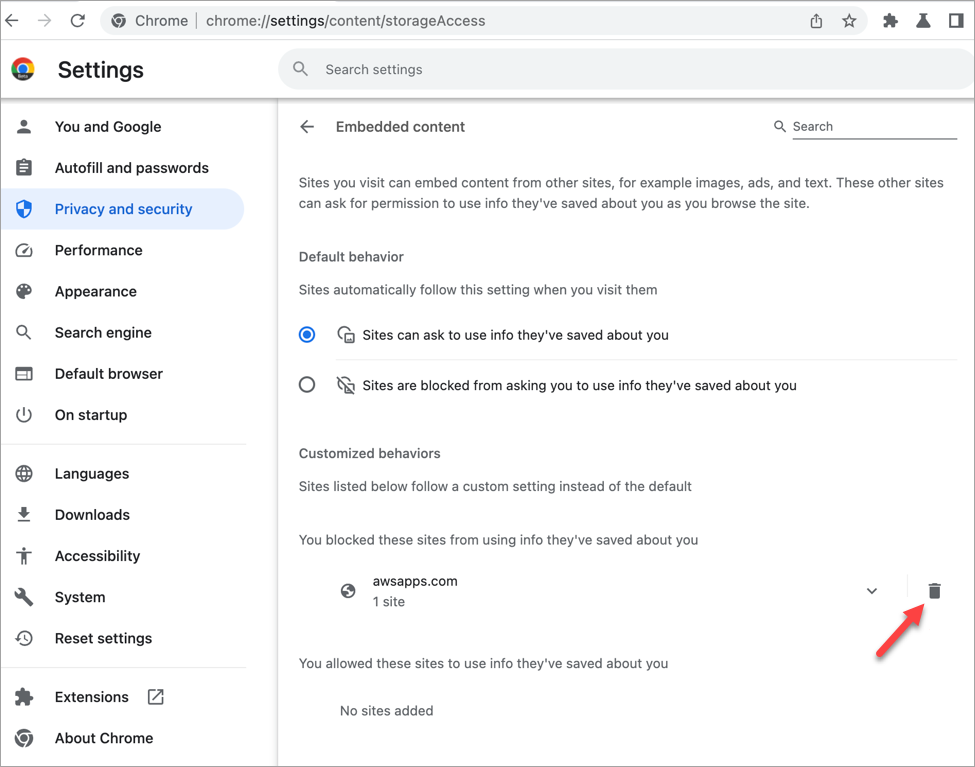

# Allow the Amazon Connect Contact Control Panel (CCP) to access

cookies

When logging into the CCP you may see one of these banners:

OR

Amazon Connect uses cookies for authentication. Google Chrome requires you to authorize the use
of Amazon Connect cookies.

1. When you log in to the CCP, on the **Allow access to
   cookies** banner choose **Grant access**.
2. At the next prompt, choose **Allow**.
   You may need to repeat these steps periodically, for example, if your organization
   requires it every 30 days.

## What happens if you don't choose Grant access when

prompted?

If you don't choose **Grant access** when prompted, you won't be
able to log into the CCP. To enable access outside of the login workflow, perform
the following steps:

1. Navigate to `chrome://settings/content/storageAccess`.
2. In the left navigation menu, choose **Privacy and
   security**.
3. Choose **Third-party cookies**.
4. Under **You blocked these sites from using info they've saved
   about you**, delete any entries associated with
   `awsapps.com` or `connect.aws` as shown in the
   following image.

 5. You can close that instance of your browser. 6. Open your CCP. When prompted, choose **Grant access**,
and then choose **Allow**.
