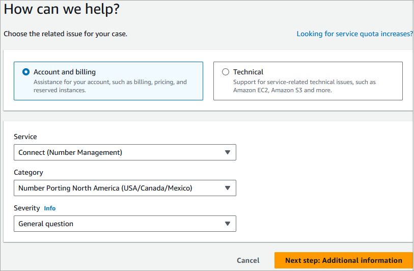

# How to port your numbers to Amazon Connect

The following steps are for a typical porting request. This process requires
timely communication to make progress. If you take longer than 30 days to
respond to requests for information, your porting request may be cancelled,
rescheduled, or restarted from the beginning.

**Documentation requirements**: For a list of
country-specific requirements for porting numbers, see [Region requirements for ordering and porting
phone numbers in Amazon Connect](phone-number-requirements.md "phone-number-requirements.md").

## Step 1: Create an Amazon Connect support case

###### Important

If you are porting multiple numbers from different carriers and
countries, submit separate tickets for each set of phone numbers to be
ported from different carriers and different countries. This streamlines
communications, tracking, and the LOA process.

1. Choose [Account and billing](https://console.aws.amazon.com/support/home#/case/create?issueType=customer-service&serviceCode=service-connect-number-management "https://console.aws.amazon.com/support/home#/case/create?issueType=customer-service&serviceCode=service-connect-number-management") to access a pre-populated form in
   the AWS Support console. You must be signed in to your AWS account to access the form.
2. For **Service**, **Connect (Number
   Management)** should be selected, as shown in the
   following image.

 3. For **Category**, choose **Number Porting
North America (US/Canada/Mexico)** or **Number
Porting Non-North America**. 4. Select the required severity. 5. Choose **Next step: Additional
information** 6. On the **Additional information** page:

    1. Enter the subject.
    2. Under **Description**, include the
     following:

    	* Amazon Connect instance ARN. For instructions about how to
    	 find it, see [Find your Amazon Connect instance ID or ARN](find-instance-arn.md "find-instance-arn.md").

    	If you provide the ARN for a development instance
    	 instead of a production instance, you can self-move
    	 the phone numbers across instances only if the
    	 instances are in the same Region and same AWS
    	 account. For limitations and instructions, see [Move an Amazon Connect phone number
    	 across instances](move-phone-number-across-instances.md "move-phone-number-across-instances.md").
    	* Phone number. Use E.164 format for example:
    	 [+][country code][phone number including area code].

    	If you are porting more than one phone number,
    	 provide at least one of the phone numbers you are
    	 porting.
    	* Exact name of the [flow](connect-contact-flows.md "connect-contact-flows.md") where
    	 the numbers must be [mapped](associate-claimed-ported-phone-number-to-flow.md "associate-claimed-ported-phone-number-to-flow.md") after receiving porting
    	 approval.
    	* Porting Date (yyyy-mm-dd).

    	###### Important

    	Porting requests for USA DID and toll-free
    	 numbers cannot be submitted with more than 30 days
    	 notification.
    	* Porting time (hh:mm AM/PM Timezone - 12 hour
    	 clock)
    	* Your current carrier
    	* The contact information for the person authorized
    	 to make changes to your current phone
    	 service.
    ###### Important

    Do not attach any documents that contain personal
     information. After we review your case, we'll send you a
     link to our secured storage (Amazon S3) so you can submit
     required documents. This is described in [Step 3: Submit the required documents by
     using a link we provide to you](#step3-porting "#step3-porting").

7. Choose **Next step: Solve now or contact
   us**.
8. On the **Solve now or contact us** page:
   1. Choose the **Contact us** tab and select
      your **Preferred contact language** and
      your preferred contact method.

9. Choose **Submit**.
10. The Amazon Connect team will review your ticket and get back
    to you.

## Step 2: Complete Letter of Authorization

(LOA)

If the phone number qualifies for porting, the Amazon Connect team will provide you
a Letter of Authorization (LOA) to be completed by you. Complete all
mandatory fields and sign the LOA.

Along with the LOA, Telecom regulations in many countries require
additional documents to register a number, such as proof of business, proof
of address, and proof of ID. For a list of country-specific requirements for
porting numbers, see [Region requirements for ordering and porting
phone numbers in Amazon Connect](phone-number-requirements.md "phone-number-requirements.md").

All portings require the completion of a Letter of Authorization
(LOA). The LOA authorizes your current carrier to release your
number and allow it to be ported.

- A separate LOA is required for numbers from each losing
  carrier.
  To complete an LOA, provide the following information:

- The numbers to port.
- Information about your current carrier, such as their
  business name and contact information.
- Contact information for the person authorized to make
  changes to your phone service. The name, address, and
  information you provide on the LOA must match the
  information on file with your current carrier exactly. To
  help ensure the porting process goes smoothly, include a
  copy of the Customer Service Record (CSR) or latest phone
  bill from your carrier. This will have your name, address,
  and related telephone numbers on it. Check that the
  information on your LOA matches your CSR **exactly**.
- If you have any questions regarding specific details about
  your current service, consult with your current carrier to
  ensure the data is accurate. This will minimize the risk
  that the LOA is rejected.

###### Important

Your LOA form must meet the following criteria:

- It must be legible: clearly written or typed.
- It must list your company name, the company address,
  and contact name. This information must match what is on
  the current carrier's CSR.
- It must include a traditional handwritten signature: a
  physical paper documented signed with pen and ink, also
  known as a wet signature. Most carriers will reject an
  electronic or printed signature.
- It must be dated within the last 15 days.
- If you also want to port toll-free numbers, it must
  include them as well. Up to 10 toll-free numbers can be
  listed on the LOA. If you are requesting more than 10
  phone numbers be ported, a spreadsheet is required to be
  attached. Specify "See Attached" on the LOA where the
  phone numbers would be listed.
- It must include only those telephony numbers that
  belong to the same current carrier and in the same
  country. If you have multiple current carriers and
  countries, you will need to submit multiple LOAs.
  To further minimize the risk of having your LOA rejected, see
  [Common reasons why carriers
  reject an LOA](porting-documentation-requirements.md#why-port-request-rejected "porting-documentation-requirements.md#why-port-request-rejected").

## Step 3: Submit the required documents by

using a link we provide to you

After the Amazon Connect team says you can port phone numbers, you
need to submit any required documents. The following steps explain
how.

###### Note

AWS Support provides a secure Amazon S3 link for uploading all requested
documents. Do not proceed until you receive the link.

###### To submit required documents

1. Open the Amazon Connect console at
   [https://console.aws.amazon.com/connect/](https://console.aws.amazon.com/connect/ "https://console.aws.amazon.com/connect/").
2. Sign in to your AWS account, then open the Amazon S3 upload link
   generated specifically for your account.

###### Note

The link expires after ten days. It is generated specifically
for the account that created the case. The link requires an
authorized user from the account to perform the upload. 3. Choose **Add Files**, then select the documents
required for your request. 4. Expand the Permissions section, and choose **Specify
individual ACL permissions**. 5. At the end of the **Access control list (ACL)**
section, choose **Add grantee**, then paste the key
provided by AWS Support into the **Grantee**
box. 6. Under **Objects**, choose the
**Read** checkbox, then choose Upload.

After you provide the Letter of Authorization (LOA) and any other required
documents, Amazon Connect team confirms with your existing phone carrier that the
information on the LOA is correct. If the information provided on the LOA
does not match the information that your phone carrier has on file, Amazon Connect
team contacts you to update the information provided on the LOA.

## Step 4: The porting request goes to the

Amazon Connect carrier

After you have submitted all required documentation, the Amazon Connect team
submits the porting request on your behalf to the winning carrier.

- The losing and winning carrier follow an industry standard process
  to validate the contents of the LOA and submitted
  documentation.
- If the LOA contains discrepancies, it will be rejected and you
  will need to fix the discrepancies and submit a new LOA.
- After the carriers successfully validate the LOA, they will either
  confirm your requested date or provide an available date for the
  actual porting. This is known as the "mutually agreed date and
  time."
- You should validate that the "mutually agreed date and time" is
  correct.

###### Important

If your LOA contains multiple phone numbers, some numbers may
be given different "mutually agreed dates." Check the status and
dates/times for each one.

Most carriers require that portings are completed during normal business
hours. For country-specific business hours, see [Region requirements for ordering and porting
phone numbers in Amazon Connect](phone-number-requirements.md "phone-number-requirements.md").

## Step 5: Validate number(s) in the instance,

assign the phone number to the flow, request service quota
increases

About 3-4 days before the mutually agreed date and time, the Amazon Connect support
team loads the phone number that will be ported into the instance ARN you
have provided, and then notifies you. Now it's time for you to perform the
following steps:

1. Log into your Amazon Connect admin website and validate that your phone number(s) are
   listed. For instructions, see [List or export to a CSV the phone
   numbers claimed to your Amazon Connect instance](list-claimed-phone-numbers.md "list-claimed-phone-numbers.md").
2. [Associate the phone number to the desired flow](associate-claimed-ported-phone-number-to-flow.md "associate-claimed-ported-phone-number-to-flow.md") so the
   phone number will be ready to receive phone calls after the porting
   is completed. If you require assistance assigning multiple phone
   numbers to flows, let us know in your support request.

###### Important

    * It is expected that you or your partner associate your
     phone number to the flow.
    * If you want AWS Support to do this on your behalf,
     note this in your support ticket. You must specify the
     flow name/ARN to be matched to each phone number.
    * You or your partner must validate that the correct
     flow has been associated with each phone number.

3. [Submit a service
   quota request](amazon-connect-service-limits.md "amazon-connect-service-limits.md") at least five days in advance of the
   mutually agreed date for any changes to your service quotas required
   to support your use case. For example, you may need to increase the
   number of concurrent calls per instance, or enable countries for
   outbound calling.

## Step 6: Checklist of activities on your

porting date

The action of porting a number can be disruptive: the process involves
updating the routing of phone numbers between carriers across a country or
Region, including carriers not involved in the actual porting. In rare cases
it can take several hours before all routes across all Telecom carriers are
fully updated.

### Steps you perform to minimize

disruption to your phone services

On the mutually agreed port date and time, perform the following
steps:

- Double-check that the activities listed in [Step 5](#step4-porting "#step4-porting") have been completed:
  1.  Verify that the number(s) you had ported are in the
      requested Amazon Connect instance, and they have been assigned to
      the appropriate flow.
  2.  Verify that any required service quota increases or
      changes for your Amazon Connect instance were implemented. For
      example, increase the number of concurrent calls per
      instance, or enable countries for outbound
      calling.

- Monitor call traffic from your existing contact center to
  confirm that incoming traffic has stopped.
- Place test calls to your Amazon Connect instance to verify calls are
  being routed to the correct flows.
- Ensure agents are logged in to the Contact Control Panel (CCP)
  and can answer calls as they are received.
- Monitor call traffic to your Amazon Connect instance to confirm that
  you are receiving the expected levels of traffic.

### Steps the Amazon Connect team performs to ensure

a smooth transition

1. After the Amazon Connect team receives confirmation that the porting
   has been completed, we will perform final testing to confirm
   that the porting was successful and the phone number is
   receiving calls to Amazon Connect.
2. After we have completed our testing, we will notify you and
   ask you to verify the successful completion of the
   porting.
