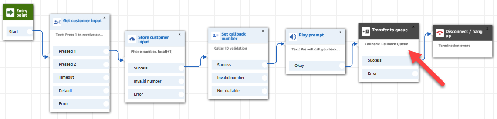
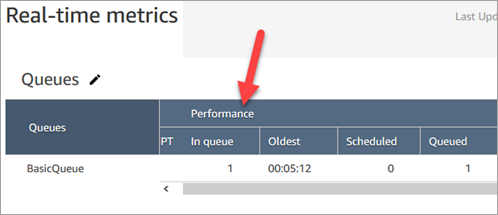
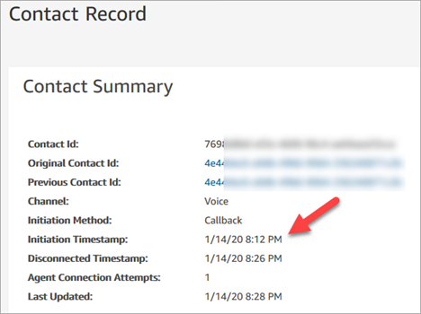

# Queued callbacks in real-time metrics in

Amazon Connect

This topic explains how queued callbacks appear in your real-time metrics reports and
the contact record.

###### Tip

To see only the number of customers who are waiting for a call back, you need to
create a queue that only takes callback contacts. To learn how to do this, see [Set up routing in Amazon Connect](connect-queues.md "connect-queues.md"). Currently there isn't
a way to see the phone numbers of the contacts waiting for callbacks.

1. Callbacks are initiated when the [Transfer to
   queue](transfer-to-queue.md "transfer-to-queue.md") block is triggered to create the callback in a callback queue.
   The following image of a flow shows the **Transfer to queue**
   block at the end of the flow.

 2. After any initial delay is applied, the callback is put into the queue. It
remains there until an agent is available and can be offered the contact. The
following image shows the contact in the **In queue** column on
the **Real-time metrics** page.

 3. When the callback is connected to the agent, a new contact record is created
for the contact. The following diagram shows three contact records. The third
record is for the callback, connected to Agent 3.

 4. The **Initiation Timestamp** in the callback contact record
corresponds to when the callback is initiated in the flow, shown in step 1. The
following image shows the **Initiation Timestamp** field on the
**Contact Record** page.

## How properties in the Transfer to

Queue block affect this flow

The [Transfer to queue](transfer-to-queue.md "transfer-to-queue.md") block has the
following properties, which affect how Amazon Connect handles the
callback:

- **Initial delay**: This property affects when a callback
  is put in queue. Specify how much time has to pass between a callback
  contact being initiated in the flow, and the customer being put in queue for
  the next available agent. For more information, see [How Initial delay affects Scheduled and In
  queue metrics in Amazon Connect](scheduled-vs-inqueue.md "scheduled-vs-inqueue.md").
- **Maximum number of retries**: If this is set to 2, then
  Amazon Connect tries to call the customer at most three times: the
  initial callback, and two retries.
- **Minimum time between attempts**: If the customer
  doesn't answer the phone, this is how long to wait before trying again.

## Callback metrics

Use the following metrics to monitor the number of callbacks in your
business:

- [Callback contacts](metrics-definitions.md#callback-contacts "metrics-definitions.md#callback-contacts"):
  This metric represents the count of contacts that were initiated from a
  queued callback. That is, how many customers opted for queued
  callback.
- [Callback contacts handled](metrics-definitions.md#callback-contacts-handled "metrics-definitions.md#callback-contacts-handled"): This metric counts the
  contacts that were initiated from a queued callback and handled by an agent.
  That is, how many of the callbacks were answered.
- [Callback attempts](metrics-definitions.md#callback-attempts "metrics-definitions.md#callback-attempts"):
  This metric represents the number of contacts where a callback was
  attempted, but the customer did not pick up.
