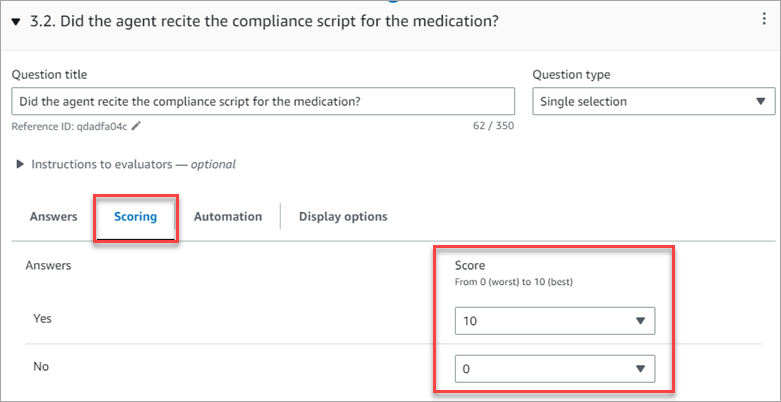
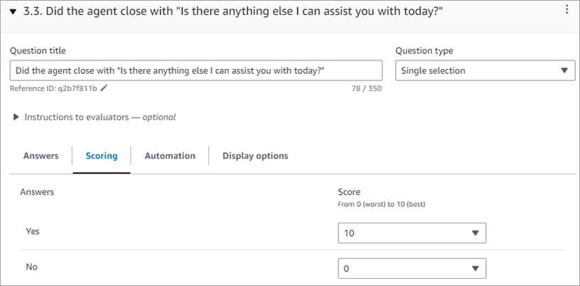
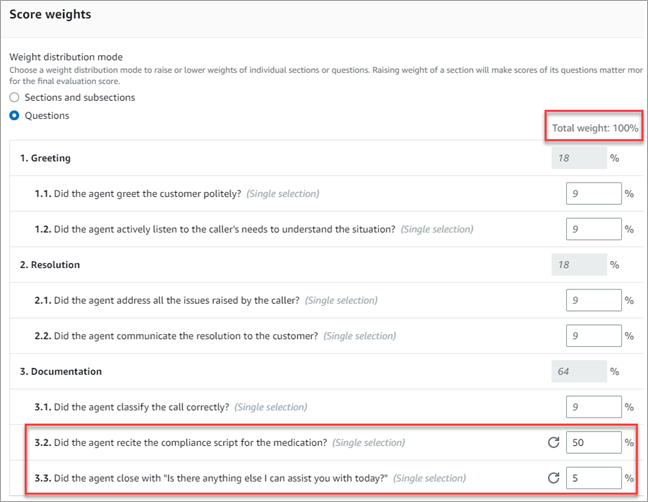
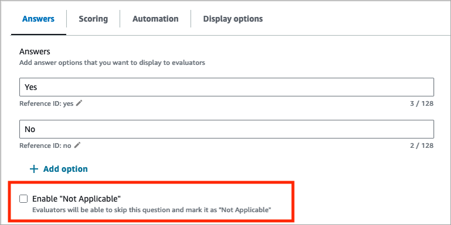

# Use scoring and weights on agent evaluation

forms in Amazon Connect

By using _weights_, you can increase or decrease the impact of a
question or section score on the overall evaluation score.

When scoring is enabled for the evaluation form, you can assign
_weights_ to sections or questions. The weight raises or lowers
the impact of a section or question on the final score of the evaluation.

## Example score

Let's say you are assigning the score to a question is that critically important
to your business. If the answer is a Yes, the agent gets 10 points. For No they get
0 points. This is shown in the following image.

The answer to first question is more important to your business than the answer to
_Did the agent close with "Is there anything else I can assist you with
today?"_, which is also worth 0-10 points, as shown in the following
image.

To differentiate scores of the questions, you indicate that weight of one question
is more than the other.

The following image shows that the answer to _Did the agent recite the
compliance script for the medication_ is 50% of the agent's score.
Whereas the answer to _Did the agent close with "Is there anything else I
can assist you with today"_ weighs only 5% of the score.

The total weight must always equal 100%.

## Weight distribution mode

With **Weight distribution mode**, you choose whether to assign
weight by section or question:

- **Weight by section**: You can evenly distribute the
  weight of each question in the section.
- **Weight by question**: You can lower or raise the weight
  of specific questions.

When you change a weight of a section or question, the other weights are
automatically adjusted so the total is always 100 percent.

For example, in the following image, three of the questions were manually set to
10 percent. The weights that display in italics were adjusted automatically.

## Weights of optional questions

When a question is optional or applicable only in certain scenarios, choose
**Enable "Not Applicable"** as an answer option to the
question. The following image shows this setting on the **Answers**
tab.

After an evaluation is completed, Amazon Connect calculates the evaluation score:

- Questions that are answered as **Not Applicable** do not
  count toward the form's final score.
- Their weight is redistributed proportionally among the remaining questions
  so that the total sum of weights across all questions remains 100%.

For example, consider the following table. It represents a form with four
questions (Q1, Q2, Q3, and Q4) that have weights of 40%, 20%, 20%, and 20%
respectively. Each question has three answer options (A1, A2, and A3) with scores of
10, 5, and 0. An evaluation with answers Q1:A1, Q2:A2, Q3:A2, Q4:A3 would be scored
as shown in the table.

| Question | Question weight | Answer         | Answer score               | Weighted answer score         |
| -------- | --------------- | -------------- | -------------------------- | ----------------------------- | --------------------------------------------------------------------------------------------------------------------------------------------------------------------------- | --------------------- | ----------------------------------------------------------------------------------------------------------------------------------------------------------------------------------------------------------------------------------------------------------------------------------------------------------------------------------------------------------------------- |
| Q1       | 40%             | A1             | 10                         | 40%                           |
| Q2       | 20%             | A2             | 5                          | 10%                           |
| Q3       | 20%             | A2             | 5                          | 10%                           |
| Q4       | 20%             | A3             | 0                          | 0%                            | The form's evaluation score = 40% + 10% + 10% + 0% = 60%. However, if the answer to question Q4 is changed to **Not Applicable**, then the evaluation is scored as follows: |
| Question | Question weight | Answer         | Additional question weight | Redistributed question weight | Answer score                                                                                                                                                                | Weighted answer score |
| ---      | ---             | ---            | ---                        | ---                           | ---                                                                                                                                                                         | ---                   |
| Q1       | 40%             | A1             | 10%                        | 50%                           | 10                                                                                                                                                                          | 50%                   |
| Q2       | 20%             | A2             | 5%                         | 25%                           | 5                                                                                                                                                                           | 12.5%                 |
| Q3       | 20%             | A2             | 5%                         | 25%                           | 5                                                                                                                                                                           | 12.5%                 |
| Q4       | 20%             | Not Applicable | -                          | -                             | -                                                                                                                                                                           | -                     | Here's what's going on:  • Question Q4 is effectively removed from the calculation. Its weight (20%) is distributed among the remaining 3 questions in proportion to their weights.  • Question Q1 has double the weight of questions Q2 and Q3, so it receives double the amount of added weight.  • The form's evaluation score = 50% + 12.5% + 12.5% = 75%. |
