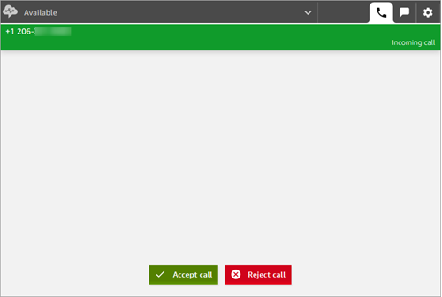
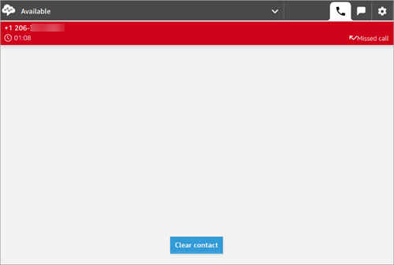

# Accept customer calls using the Amazon Connect Contact Control

Panel (CCP)

1. Whenever you set your status in the CCP to **Available**,
   Amazon Connect can deliver calls to you, based on the settings in your [routing profile](routing-profiles.md "routing-profiles.md").

 2. When a call arrives, choose the **Accept call** button.

###### Note

The **Accept call** button does not appear if your admin
has configured your user profile for [Auto-Accept Call](enable-auto-accept.md "enable-auto-accept.md").

**Firefox users**: If you are using the
Firefox browser and using auto-accept for calls, you must keep the CCP or
Agent Workspace browser tab in focus when you accept and connect to a voice
contact. The CCP conforms to Firefox microphone usage guidance, and only has
access to connect to the user's microphone when the CCP tab is in focus. 3. Before you're connected to the contact, Amazon Connect announces the name of the
originating queue. 4. You're now talking to the contact. 5. You have 20 seconds to accept or reject a contact. If you miss a call, it will
look similar to the following image. Choose **Close contact**
so you can accept another call.

