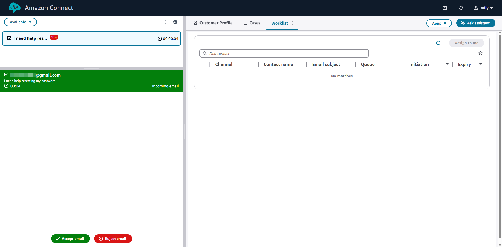
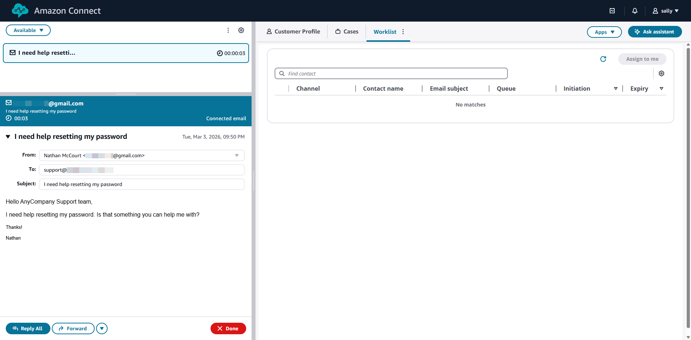
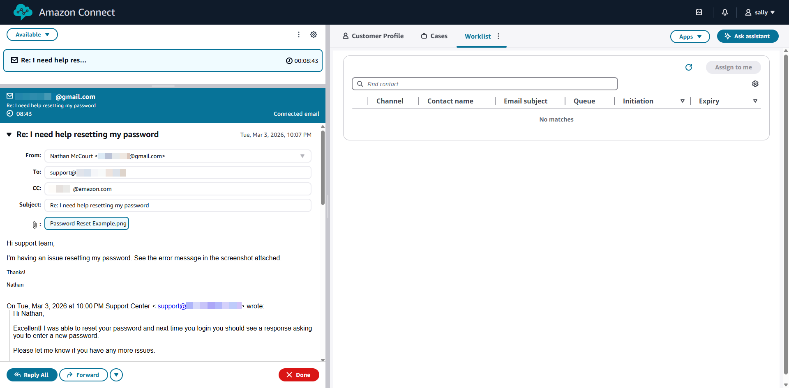
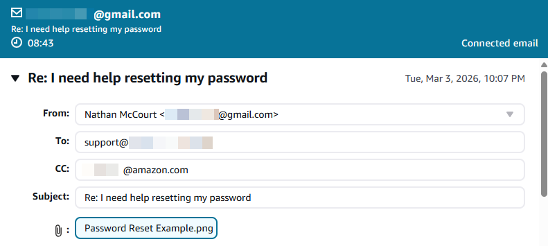
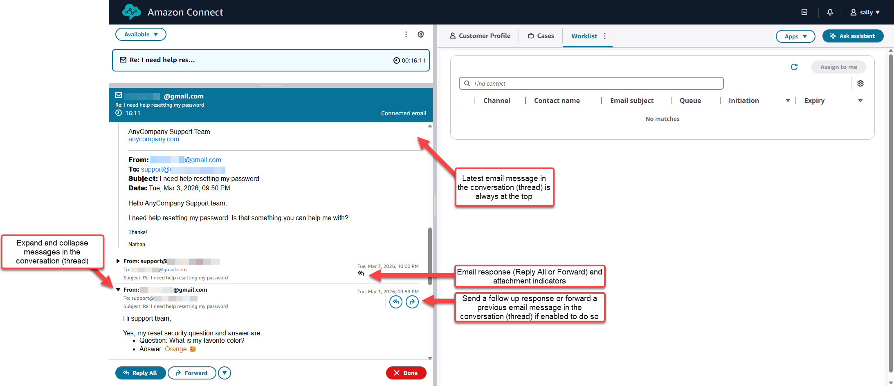
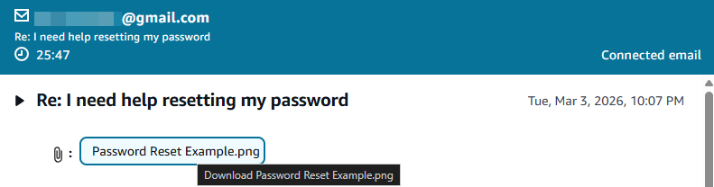
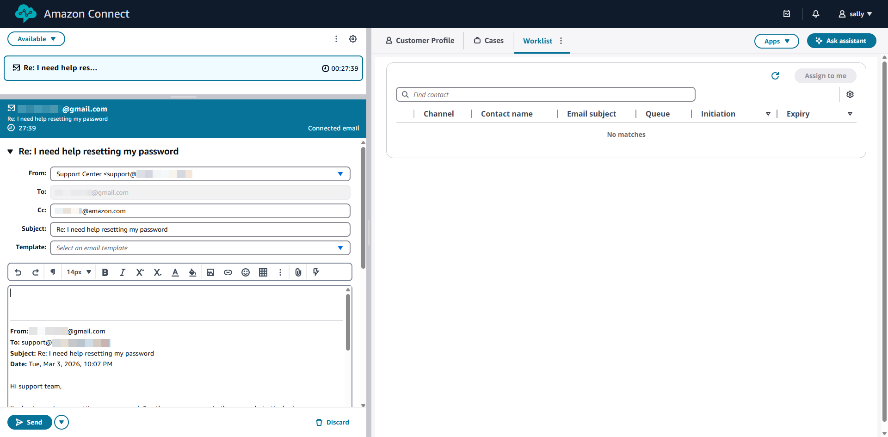

# Accept incoming emails

This topic explains how agents use the Contact Control Panel (CCP) to handle email contacts. Agents can accept incoming emails, review email content and threads, compose responses, and manage email contacts throughout their lifecycle.

## Overview of email contact handling

When an email contact is routed to an agent, it appears in the CCP just like voice and chat contacts. Agents can accept, handle, and complete email contacts using the same familiar interface.

Key capabilities for handling email contacts include:

- Accepting incoming email contacts from the queue
- Viewing email content, including the message body and thread history
- Reading and downloading email attachments
- Composing and sending email responses
- Selecting the appropriate From email address
- Forwarding emails to external addresses
- Transferring email contacts to other agents or queues

## Receiving and accepting email contacts

Email contacts are routed to agents based on their routing profile and queue assignments, similar to other contact types.

### Email contact notifications

When an email contact is offered to an agent:

1. The CCP displays a notification showing an incoming email contact.
2. The notification includes basic information such as the sender's email address and subject line.
3. The agent has a configured amount of time to accept or reject the contact.

### Accepting an email contact

To accept an incoming email contact:

1. When the email contact notification appears in the CCP, choose **Accept**.
2. The email contact opens in the CCP, displaying the email content and available actions.
3. Review the email details, including sender, recipients, subject, and message body.

###### Note

If you don't accept the email contact within the configured timeout period, it will be returned to the queue and might be offered to another agent.

## Email contact interface in the CCP

When an agent accepts an email contact, the CCP displays a dedicated email interface with the following components:

- **Email header**: Displays the From, To, CC, and Subject fields.
- **Message body**: Shows the content of the current email message.
- **Email thread**: Displays previous messages in the conversation, if applicable.
- **Attachments**: Lists any files attached to the email, with options to view or download.
- **Reply area**: Provides a text editor for composing responses.
- **Action buttons**: Includes options to send, transfer, or end the contact.

## Reading and reviewing email content

Agents can review all aspects of an email contact to understand the customer's inquiry and provide an appropriate response.

### Viewing email details

The email header displays key information:

- **From**: The customer's email address
- **To**: The email address(es) that received the message
- **CC**: Any email addresses copied on the message
- **Subject**: The email subject line
- **Date/Time**: When the email was sent

### Viewing email threads

Connect Customer automatically groups related email messages into threads, allowing agents to see the full conversation history. Email threading follows standard email client conventions (RFC 5256).

To view an email thread:

1. In the CCP, the current email message is displayed at the top.
2. Previous messages in the thread appear below, in chronological order.
3. Expand or collapse individual messages to review their content.

Email threads help agents understand the full context of a customer inquiry, including previous interactions and responses.

### Viewing and downloading attachments

If an email includes attachments, they are listed in the attachments section of the CCP.

To view or download an attachment:

1. Locate the attachments section in the email interface.
2. Choose the attachment name to download it to your local device.
3. Open the downloaded file using the appropriate application.

###### Important

Attachments are stored in your organization's Amazon S3 bucket. Make sure you have the necessary permissions to access attachments. If attachment scanning is configured, only attachments that pass security scans will be available for download.

## Composing and sending email responses

After reviewing an email contact, agents can compose and send a response directly from the CCP.

### Composing a response

To compose an email response:

1. In the reply area of the CCP, enter your response message.
2. The CCP automatically populates the To and CC fields based on the incoming email. You cannot modify the To field. You can modify the CC field.
3. The Subject field is automatically populated with "Re: [original subject]". You can modify this if needed.
4. Use the text editor to format your message, if formatting options are available.
5. If needed, add attachments to your response by choosing the attachment option.

### Sending a response

To send your email response:

1. Review your message for accuracy and completeness.
2. Verify that the From email address is correct. See [Select a From email address](agent-select-from-email.md "agent-select-from-email.md") for details on selecting the appropriate sender address.
3. Choose **Send** to send the email.
4. The email is sent through Amazon SES to the customer.

After sending a response, the email contact remains active until you choose to end it. While the email contact is active, you can send multiple messages within the same contact if needed.

### Using message templates

If your organization has configured message templates, you can use them to quickly insert pre-written content into your email responses. For information about message templates, see [Create message templates](create-message-templates1.md "create-message-templates1.md").

## Email contact states

Email contacts move through various states during their lifecycle, similar to other contact types in Connect Customer:

- **Incoming**: The email contact is being offered to the agent.
- **Connected**: The agent has accepted the email contact and is actively handling it.
- **Ended**: The agent has completed handling the email contact.

Unlike voice contacts, email contacts do not have a "hold" state. Agents can work on multiple email contacts simultaneously, switching between them as needed.

## Managing email contacts

Agents have several options for managing email contacts in the CCP.

### Ending an email contact

To end an email contact:

1. After sending your final response or completing your work on the email, choose **End contact** or **Close**.
2. The email contact is marked as complete and removed from your active contacts.
3. Complete any required after-contact work (ACW) if configured.

###### Note

Ending an email contact does not prevent the customer from sending additional emails. If the customer replies after you end the contact, a new email contact will be created and routed according to your flow configuration.

### Handling multiple email contacts

Agents can handle multiple email contacts simultaneously, up to the limits configured in their routing profile. To switch between active email contacts:

1. In the CCP, view the list of your active contacts.
2. Choose the email contact you want to work on.
3. The selected email contact is displayed in the CCP interface.

###### Contents

- [Select From address](agent-select-from-email.md "agent-select-from-email.md")
- [Forward emails](agent-forward-email.md "agent-forward-email.md")
