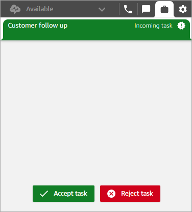
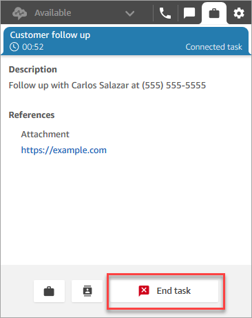
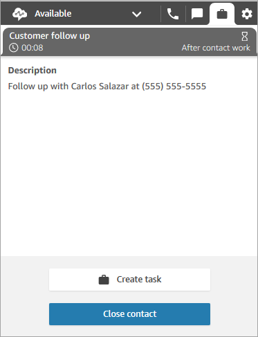

# Accept a task assigned in the Contact Control Panel

(CCP)

The steps in this topic describe how to deliver tasks to an agent when their status is
set to **Available** in the Contact Control Panel
(CCP).

1. Whenever you set your status in the CCP to **Available**,
   Amazon Connect can deliver tasks to you, based on the settings in your [routing profile](routing-profiles.md "routing-profiles.md").

 2. When a task arrives, choose **Accept task**. You have up to
30 seconds to accept a task (10 seconds more than accepting a call or
chat). 3. Review the description of the task, and choose the links as needed to complete
the task.

 4. When you've completed the task, choose **End task**. 5. You will then be in ACW. When finished, choose **Close
contact**.

