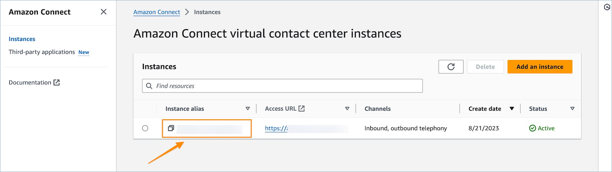
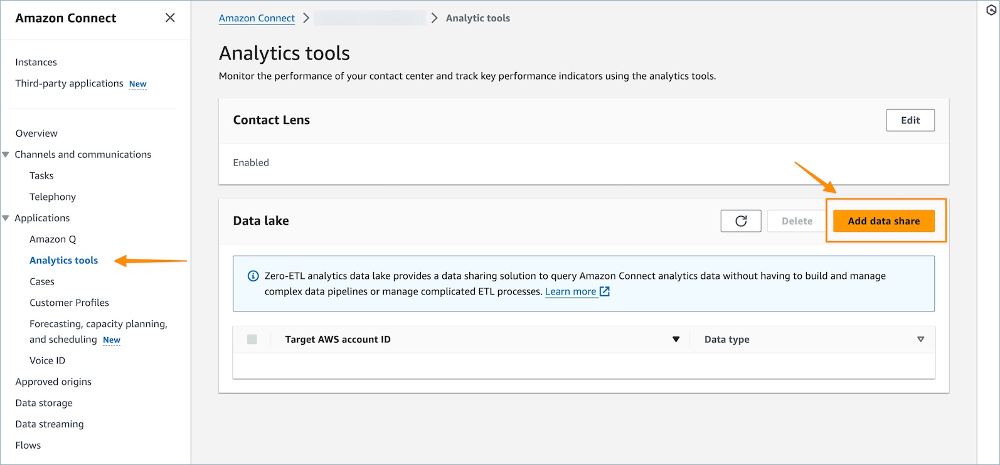
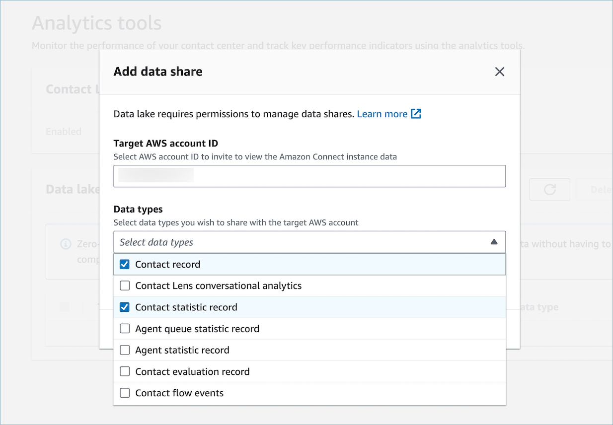

# Access Amazon Connect data lake

To access the data lake, you can use the AWS console, the
[AWS Command Line Interface](https://aws.amazon.com/cli/ "https://aws.amazon.com/cli/") or
[AWS CloudShell](../../../cloudshell/latest/userguide/welcome.md "../../../cloudshell/latest/userguide/welcome.md"). AWS CloudShell is a browser-based, pre-authenticated shell that you can
launch directly from the AWS Management Console.

There are two ways to access the analytics data lake and configure data to be
shared:

- [Option 1: Use the Amazon Connect
  console](#option1-configure-data-to-be-shared "#option1-configure-data-to-be-shared")
- [Option 2: Use CLI or
  CloudShell](#option2-configure-data-to-be-shared "#option2-configure-data-to-be-shared")
  If you are unable to access the scheduling tables by using Option 1, try using
  Option 2.

## Option 1: Use the Amazon Connect

console

1. Open the Amazon Connect console at
   [https://console.aws.amazon.com/connect/](https://console.aws.amazon.com/connect/ "https://console.aws.amazon.com/connect/").
2. On the instances page, choose the instance alias. The instance alias is
   also your instance name, which appears in your Amazon Connect URL. The following
   image shows the Amazon Connect virtual contact center instances page, with a box
   around the instance alias.

 3. On the left navigation menu, choose **Analytics Tools**
and then choose **Add data share**.

 4. For the **Target AWS account ID** specify
the AWS account ID of the account from which you wish to
access data (consumer). This can be the same AWS account as
hosts your Amazon Connect instance or a different AWS account. Select
one or multiple data types you wish to access from the consumer account and
select **Confirm**.



## Option 2: Use CLI or

CloudShell

1.  Generate the `generate Association api` request file by running
    the `aws connect batch-associate-analytics-data-set
--generate-cli-skeleton input > input_batch_association.json`
    command.
2.  Open the JSON file in a text editor and enter the following:

        * **Instance ID** – Your Amazon Connect
         instance ID.
        * **DataSetID** – Enter the
         required tables. For more information about required tables, see
         [Associate tables for the Amazon Connect analytics data
         lake](datalake-tables.md "datalake-tables.md").
        * **TargetAccountId** – Account
         ID to share data.

    Following is an example of the JSON file with all of the [tables](datalake-tables.md "datalake-tables.md").

```
{
"InstanceId": `your_instance_id`,
"DataSetIds": [
  "contact_record",
  "contact_flow_events",
  "contact_statistic_record",
  "contact_lens_conversational_analytics",
  "agent_queue_statistic_record",
  "agent_statistic_record",
  "contact_evaluation_record"
],
"TargetAccountId": `your_account_ID`
}
```

3. Associate the data lake to a single account by running the
   `aws connect batch-associate-analytics-data-set --cli-input-json
file:`///path/to/request/file`` command
   (where this path is based on the location of the JSON file).
