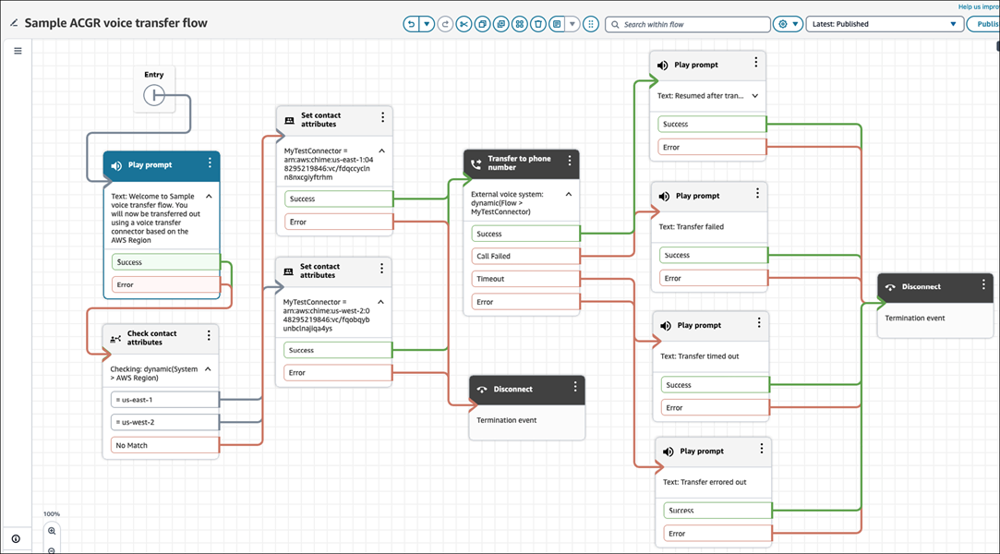

# Set up Amazon Connect Global Resiliency for

external voice transfer

After you [set up Amazon Connect Global Resiliency](get-started-connect-global-resiliency.md#howto-setup-gr "get-started-connect-global-resiliency.md#howto-setup-gr"), make
the following modifications to for external voice transfer:

1.  Create another external voice transfer connector in your replica Amazon Connect
    instance.
2.  Update your Amazon Connect flows to branch based on the AWS Region where the flow is
    running.

        1. Add a [Set contact
         attributes](set-contact-attributes.md "set-contact-attributes.md") to your flow.

        	1. Set the external voice transfer connector ARN as a contact
        	 attribute.
        2. Add a [Transfer to phone
         number](transfer-to-phone-number.md "transfer-to-phone-number.md") block to your
         flow.

        	1. Dynamically set the destination ARN in the block to use the
        	 contact attribute that you specified in the **Set
        	 contact attributes** block.

    The following image shows a sample flow configured with a **Check contact
    attributes** block, **Set contact attributes** block, and
    **Transfer to phone number** block.

