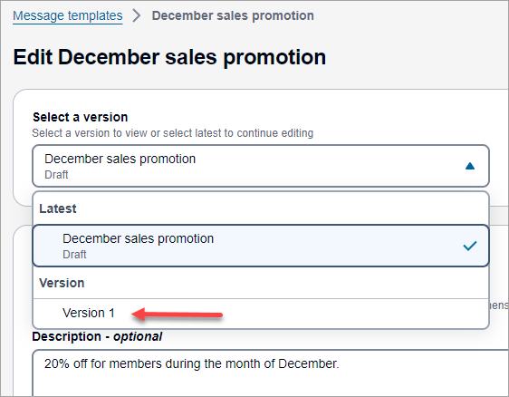
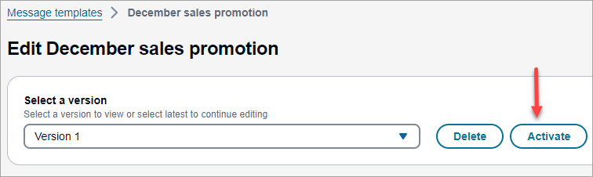

# Activate a message template

To help you manage the development and use of individual message templates, Amazon Connect
supports versioning for all types of message templates. Versioning provides a way for
you to create a history of changes to a template—each version is a snapshot of a
template at a certain point in time. Versioning also provides a way for you to control
the contents and settings of messages that use a template.

You can only activate message templates that have been **Saved as new
version**. This is to prevent accidentally activating templates that are
drafts.

When a template version is **Activated**, it is available to be added
to the [Flow block in Amazon Connect: Send message](send-message.md "send-message.md") and may be available
to agents through the agent workspace.

###### To activate a messaging template

Log in to Amazon Connect admin website with an Admin account or a user account that has **Content
Management** - **Message templates** -
**Create** in it's security profile.

1. On the left navigation menu, choose **Message templates**.
2. On the **Message templates** page, save the template using the **Save as new version**
   option.
3. On the **Messaging templates** page re-open the template you
   just saved.
4. Use the dropdown menu to choose the version of the template to
   activate.

 5. Choose **Activate**.

