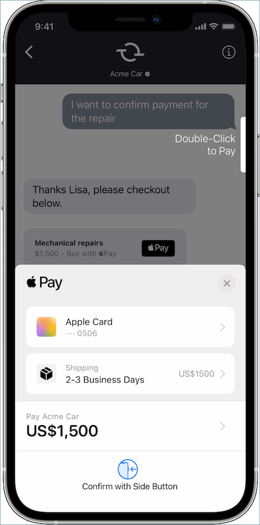
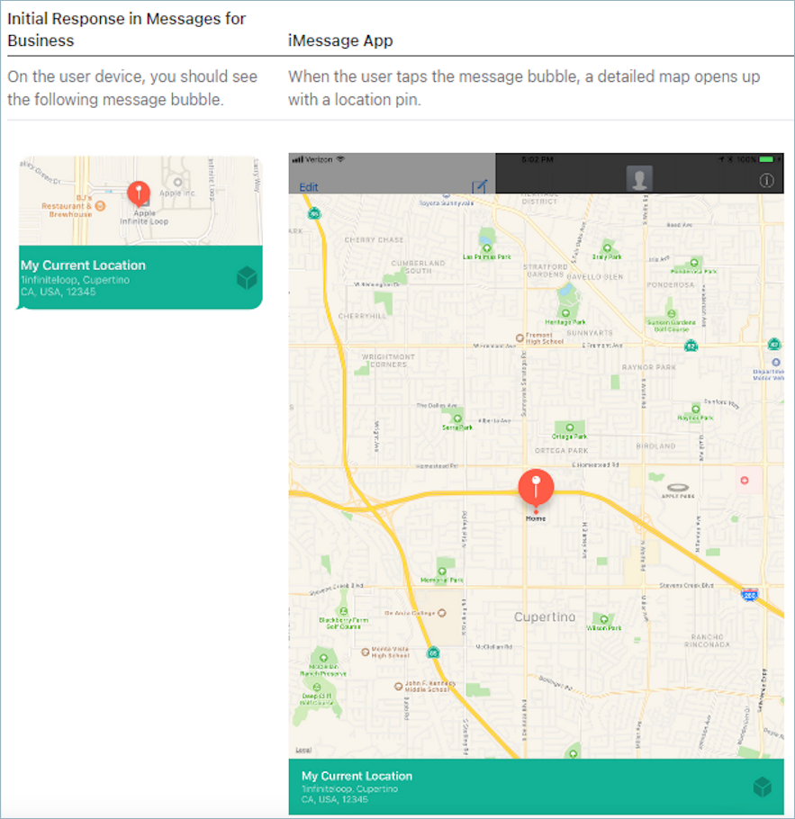
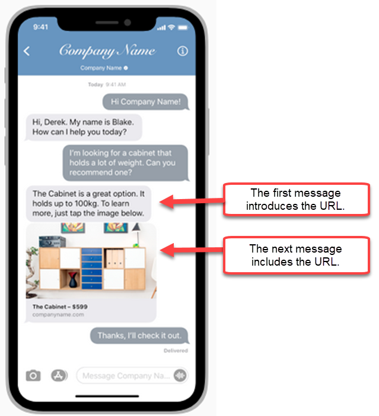

# Add Apple Messages for Business features

## Deflect calls with Apple’s Message Suggest

With [Message Suggest](https://register.apple.com/resources/messages/messaging-documentation/message-with-customers#triggering-message-suggest "https://register.apple.com/resources/messages/messaging-documentation/message-with-customers#triggering-message-suggest") you can allow users to choose between voice and messaging when
tapping on your business phone number in Safari, Maps, Siri, or Search.

To enable Message Suggest, send an email to the Apple Messages for Business Team at
**registry@apple.com** with the following information and Apple
can set up the channel for you:

- Provide all of your primary phone numbers, including high call volume
  phone numbers.
- Provide phone contact hours to set customer expectations for your
  after-hours message.
- Provide intent, group, and body parameters to associate with each phone
  number.
- Provide an estimate of how many customers your agents can support per day.
  This can be increased or decreased depending on operational capacity.

To learn more about enabling Message Suggest, see [Apple’s Message Suggest FAQs](https://register.apple.com/resources/business-chat/faq/business-chat-suggest-faqs.html "https://register.apple.com/resources/business-chat/faq/business-chat-suggest-faqs.html").

## Embed Apple Messages for Business

buttons

To embed Apple Messages for Business buttons on your website or mobile app, do the following:

1. Add Apple’s Messages for Business JS (JavaScript) library to your webpage headers.
2. Add a `div` container to house the button.
3. Customize the banner, fallback support, and button color to meet your
   brand’s needs.

The Messages for Business button must contain the following, at minimum:

- A class attribute to specify the type of container: banner, phone, or
  message.
- A data-apple-business-id attribute with the business ID you received when
  you registered your company with Messages for Business.

## Authentication

Authentication allows customers to sign in to your Identity Provider(s) of choice
during a chat conversation. The authentication feature leverages the OAuth2 and OIDC
framework to verify the identity of the customer upon successful sign in. for more
information, see [Enable
authentication for Apple Messages for Business](enabling-authentication-for-apple-messages-for-business.md "enabling-authentication-for-apple-messages-for-business.md").

## Start a chat from a URL

You can give your customers the ability to start a conversation with you from your
website or an email message.

For example, customers may start a chat using a URL that you provide. When they
click the URL, the system redirects them to Messages so they can send your business
a text message.

You decide how and where to provide the URL. You can include it as a link in an
email message, on your website, or use it as the action for a button in your
app.

Use the URL
**https://bcrw.apple.com/urn:biz:`your-business-id`**,
replacing `your-business-id` with the business ID you
received from Apple after registering with Messages for Business.

Following are optional query string parameters you can include in the URL:

- `biz-intent-id`: Use to specify the intention, or purpose, of
  the chat.
- `biz-group-id`: Use to indicate the group, department, or
  individuals best qualified to handle the customer's specific question or
  problem.
- `body`: Use to prepopulate the message so the customer only
  presses **Send** to start the conversation.

Following is an example of what the URL might look like for a customer with a
credit card question for the billing department:

- `https://bcrw.apple.com/urn:biz:22222222-dddd-4444-bbbb-777777777777?biz-intent-id=account_question&biz-group-id=billing_department&body=Order%20additional%20credit%20card`.

## Add list pickers, time pickers,

forms, attachments, and quick replies

A list picker prompts your customer to select an item, such as a product or the
reason for their inquiry. A time picker prompts your customer to choose an available
time slot, such as to schedule an appointment. A quick reply prompts your customer
to select a simple, inline response. Forms allow you to create rich, multiple page,
interactive flows for customers.

For information about how to set up list pickers, time pickers, forms, and quick
replies, see [Add Amazon Lex interactive messages for customers in
chat](interactive-messages.md "interactive-messages.md").

For information about how to enable attachments, see [Enable attachments to share files using
chat](enable-attachments.md "enable-attachments.md").

## Apple Pay

Apple Pay allows consumers to complete purchases without having to manage paper
bills, coins, or physical bank cards. Using Apple Messages for Business, consumers can complete
transactions with their favorite brands without having to leave the Messages
app.

Apple Pay is a distinct feature, but shares similarities to Apple Pay in-app and
Apple Pay on the Web. When a business asks for payment from a customer who is
purchasing goods and services through Apple Messages for Business, the customer can use Apple Pay to make
the payment.

To learn more about Apple Pay, see [Apple Pay for
developers](https://developer.apple.com/apple-pay/ "https://developer.apple.com/apple-pay/").

For information about how to set up Apple Pay using Connect, see [Add Amazon Lex interactive messages for customers in
chat](interactive-messages.md "interactive-messages.md").

## iMessage Apps

iMessage apps or Apple Custom Interactive Messages (CIM) increase interactivity
between end-customers and business customers, allowing end-customers to receive
iMessage Apps from businesses. These iMessage Apps contain a richer set of
information for end-customers to interact with completely inside of Apple’s Messages
app, allowing the end-customer to remain in the conversation to perform the same
interactions. This makes the Apple CIM more customizable than other existing
interactive message types.

The following figure is an example of an iMessage App sent using an Apple CIM with
a detailed map and location pin:

For information about how to set iMessage Apps using Amazon Connect, see [Add Amazon Lex interactive messages for customers in
chat](interactive-messages.md "interactive-messages.md").

## Use rich links for URLs

Rich links show an inline preview of a URL that contains an image or video. Unlike
normal URLs, customers can view the image or video preview immediately in a chat
without choosing a "Tap to Load Preview" message.

### Requirements for using rich links in

Amazon Connect

To use rich links in Amazon Connect chat messages, your URL and images must meet the
following requirements:

- Your website must use Facebook Open Graph tags. For more information,
  see [A
  Guide to Sharing for Webmasters](https://developers.facebook.com/docs/sharing/webmasters/ "https://developers.facebook.com/docs/sharing/webmasters/").
- The image accompanying the URL must be .jpeg, .jpg, or .png.
- The website must be HTML.

###### Note

When you first use the rich link feature, we recommend that you send the
URL in a message separate from your chat text, as shown in the following
example. The first message introduces the URL. The next message includes the
URL.

## Use Apple Messages for Business contact attributes in

contact flows

Contact attributes enable you to store temporary information about the contact so
you can use it in the flow.

For example, if you have different lines of business using Apple Messages for Business, you can branch
to different flows based on the **AppleBusinessChatGroup** contact
attribute. Or, if you want to route Apple Messages for Business messages differently from other chat
messages, you can branch based on MessagingPlatform.

For more information about contact attributes, see [Use Amazon Connect contact attributes](connect-contact-attributes.md "connect-contact-attributes.md").

Use the following contact attributes to route Apple Messages for Business customers.

| Attribute                     | Description                                                                                                                                                                                                                                                                     | Type         | JSON                                       |
| ----------------------------- | ------------------------------------------------------------------------------------------------------------------------------------------------------------------------------------------------------------------------------------------------------------------------------- | ------------ | ------------------------------------------ |
| MessagingPlatform             | The messaging platform from where the customer request originated. Exact value: **AppleBusinessChat**                                                                                                                                                                           | User-defined | $.Attributes.MessagingPlatform             |
| AppleBusinessChatCustomerId   | The customer’s opaque ID provided by Apple. This remains constant for the AppleID and a business. You can use this to identify if the message is from a new customer or a returning customer.                                                                                   | User-defined | $.Attributes.AppleBusinessChatCustomerId   |
| AppleBusinessChatIntent       | You can define the intent or purpose of the chat. This parameter is included in a URL that initiates a chat session in Messages when a customer chooses the **Business Chat** button.                                                                                           | User-defined | $.Attributes.AppleBusinessChatIntent       |
| AppleBusinessChatGroup        | You define the group which designates the department or individuals best qualified to handle the customer’s particular question or problem. This parameter is included in a URL that initiates a chat session in Messages when a customer chooses the **Business Chat** button. | User-defined | $.Attributes.AppleBusinessChatGroup        |
| AppleBusinessChatLocale       | Defines the language and AWS Region preferences that the user wants to see in their user interface. It consists of a language identifier (ISO 639-1) and a Region identifier (ISO 3166). For example, **en_US**.                                                                | User-defined | $.Attributes.AppleBusinessChatLocale       |
| AppleFormCapability           | Whether the customer device supports forms. If true, the customer device is supported. If false, the device is not supported.                                                                                                                                                   | User-defined | $.Attributes.AppleFormCapability           |
| AppleAuthenticationCapability | Whether the customer device supports Authentication (OAuth2). If true, the customer device is supported. If false, their device is not supported.                                                                                                                               | User-defined | $.Attributes.AppleAuthenticationCapability |
| AppleTimePickerCapability     | Whether the customer device supports time pickers. If true, the customer device is supported. If false, the device is not supported.                                                                                                                                            | User-defined | $.Attributes.AppleTimePickerCapability     |
| AppleListPickerCapability     | Whether the customer device supports list pickers. If true, the customer device is supported. If false, the device is not supported.                                                                                                                                            | User-defined | $.Attributes.AppleListPickerCapability     |
| AppleQuickReplyCapability     | Whether the customer device supports quick replies. If true, the customer device is supported. If false, the device is not supported.                                                                                                                                           | User-defined | $.Attributes.AppleQuickReplyCapability     |
