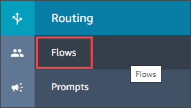
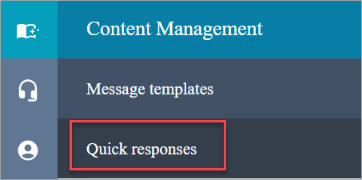
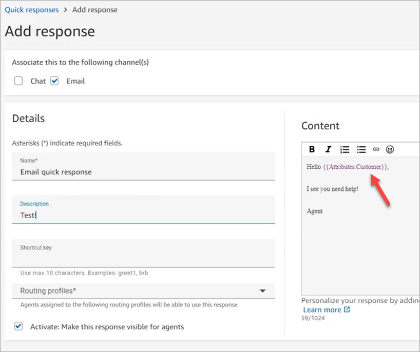

# Add attributes for personalizing quick responses in

Amazon Connect

You can personalize quick responses by adding user-defined attributes. To do so, you use the
Amazon Connect admin website to create responses that include [Amazon Connect contact
attributes](connect-contact-attributes.md "connect-contact-attributes.md"). You can also use the [Set contact
attributes](set-contact-attributes.md "set-contact-attributes.md") block to create user-defined attributes in
flows.

When quick responses contain user-defined attributes, the value of those attributes, such as
customer name, appear when an [agent searches for a response in
CCP](search-qr-ccp.md "search-qr-ccp.md").

The following steps explain how to add user-defined attributes to quick responses. You first
create a set-contact attribute, and then you add the attribute to a quick response.

###### To create a set-contact attribute

1. Log in to the Amazon Connect admin website at https://_instance
   name_.my.connect.aws/. Use an **Admin** account, or an
   account assigned to a security profile that has **Flows - Edit or Create**
   permissions.
2. On the navigation bar, choose **Routing**, then
   **Flows**.

 3. On the **Flows** page, the **Type** column lists each
type of flow. Choose the flow that you want to add attributes to. 4. Follow the steps in [Creating a set contact
attribute](set-contact-attributes.md "set-contact-attributes.md").

###### Note

In the contact attribute configuration, select the **User defined**
namespace, then save and publish the flow. 5. When finished, complete the next set of steps.
You can follow these steps when creating or updating a quick response.

###### To add an attribute to a quick response

1. Log in to the Amazon Connect admin website at https://_instance
   name_.my.connect.aws/. Use an **Admin** account, or an
   account assigned to a security profile that has \*\*Content Management - Quick responses

- Create or Edit\*\* permission.

2. On the left navigation bar, choose **Content Management**, then
   **Quick responses**.

 3. Choose **Add response** to create a response.

—or—

Select the checkbox next to the quick response that you want to personalize, then choose
**Edit**. 4. Choose the content section, enter the quick response content, then use handlebar syntax to
enter a user-defined attribute. Make sure you include the `Attributes` namespace
prefix. For example, `{{Attributes.Customer}}`.

The following image shows a quick response for an email.

 5. Choose **Save**.
The following steps explain how to test attributes in CCP.

###### To test attributes

1. Log in to the Amazon Connect admin website chat testing page at https://_instance
   name_.my.connect.aws/test-chat.
2. Choose the flow with the user-defined attribute.
3. Start a chat and enter `/#*searchText*`, where
   _searchText_ is the assigned shortcut key.

###### Note

For more information, see [Test voice, chat, and task experiences in Amazon Connect](chat-testing.md "chat-testing.md").
