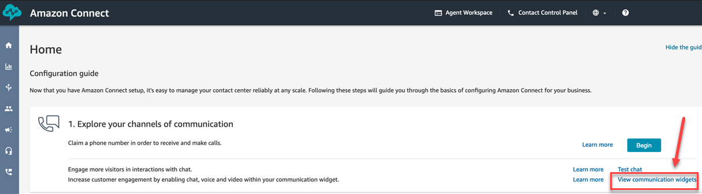
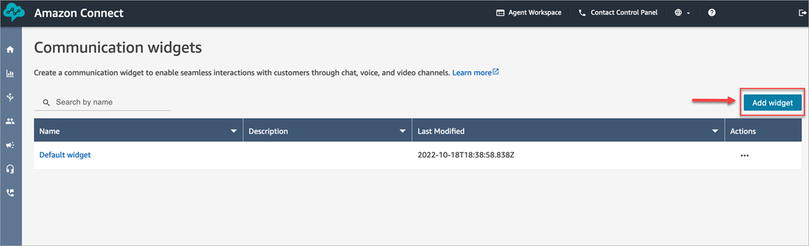
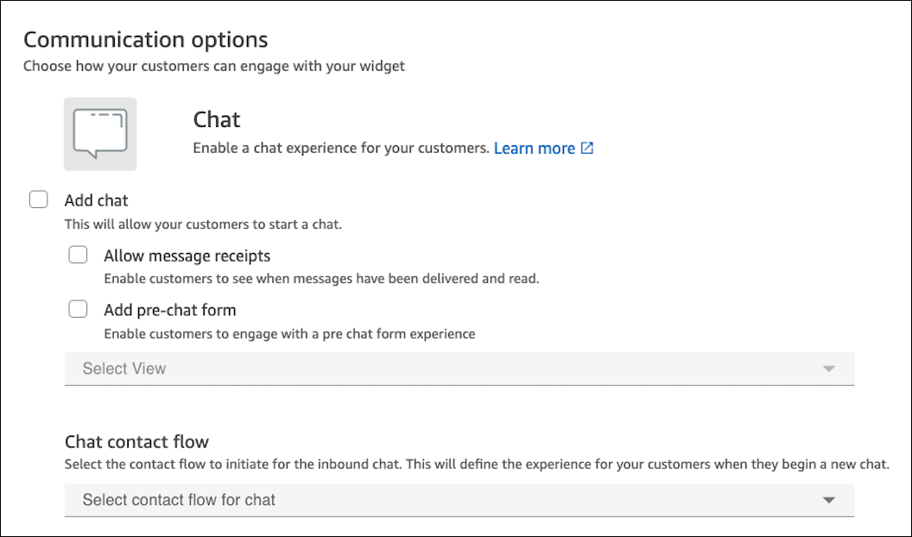
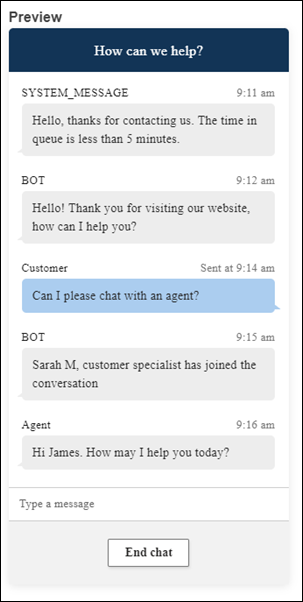
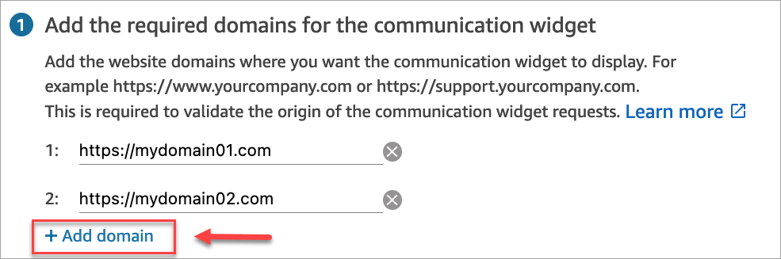
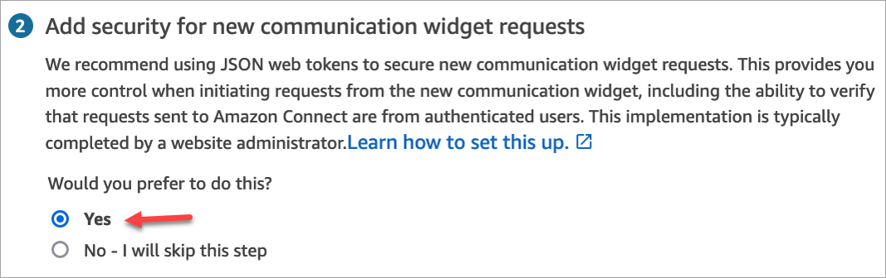
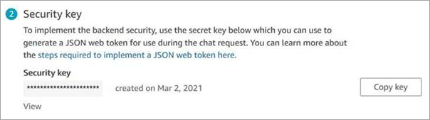
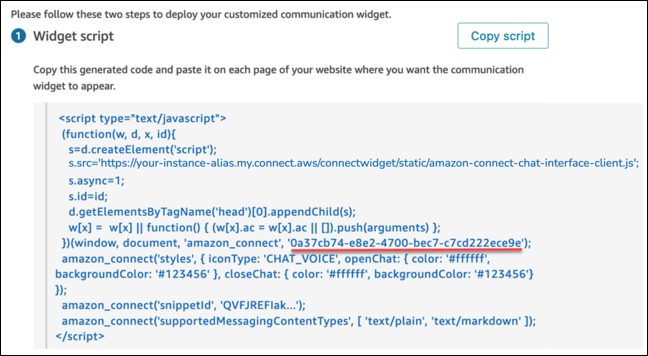
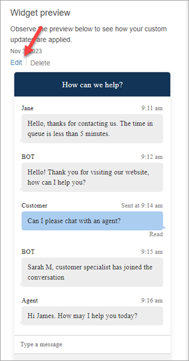

# Add a chat user interface to your website hosted by

Amazon Connect

To support your customers through chat, you can add a communications widget to your website that is
hosted by Amazon Connect. You can configure the communications widget in the Amazon Connect admin website. You can customize the font
and colors, and secure the widget so that it can be launched only from your website. When
finished, you will have a short code snippet that you add to your website.

Because Amazon Connect hosts the widget, it ensures that the latest version is always live on your
website.

###### Tip

Use of the communications widget is subject to default service quotas, such as the number of
required characters for each message. Before launching your communications widget into
production, make sure that your service quotas are set for your organization's needs.
For more information, see [Amazon Connect service quotas](amazon-connect-service-limits.md "amazon-connect-service-limits.md").

###### Contents

- [Supported widget snippet fields that are
  customizable](supported-snippet-fields.md "supported-snippet-fields.md")
- [Supported browsers](#chat-widget-supported-browsers "#chat-widget-supported-browsers")
- [Step 1: Customize your communications widget](#customize-chat-widget "#customize-chat-widget")
- [Step 2: Specify the website domains where you
  expect to display the communications widget](#chat-widget-domains "#chat-widget-domains")
- [Step 3: Confirm and copy
  communications widget code and security keys](#confirm-and-copy-chat-widget-script "#confirm-and-copy-chat-widget-script")
- [Getting error messages?](#chat-widget-error-messages "#chat-widget-error-messages")
- [Customize widget launch behavior
  and button icon](customize-widget-launch.md "customize-widget-launch.md")
- [Pass the customer display
  name](pass-display-name-chat.md "pass-display-name-chat.md")
- [Pass contact
  attributes](pass-contact-attributes-chat.md "pass-contact-attributes-chat.md")
- [Additional customizations for
  your chat widget](pass-customization-object.md "pass-customization-object.md")
- [Download the transcript
  for your chat widget](chat-widget-download-transcript.md "chat-widget-download-transcript.md")
- [Download and customize our open
  source example](download-chat-example.md "download-chat-example.md")
- [Start chats in your applications
  by using Amazon Connect APIs](integrate-with-startchatcontact-api.md "integrate-with-startchatcontact-api.md")
- [Send browser notifications to customers
  when chat messages arrive](browser-notifications-chat.md "browser-notifications-chat.md")
- [Programmatic chat
  disconnect](programmatic-chat-disconnect.md "programmatic-chat-disconnect.md")
- [Pass custom properties to override the
  defaults in the communications widget](pass-custom-styles.md "pass-custom-styles.md")
- [Target your widget button and frame
  with CSS/JavaScript](target-widget-button.md "target-widget-button.md")
- [Troubleshoot issues with your
  communications widget](ts-cw.md "ts-cw.md")
- [Add a pre-contact or pre-chat
  form](add-precontact-form.md "add-precontact-form.md")
- [Post-chat survey](enable-post-chat-survey.md "enable-post-chat-survey.md")

## Supported browsers

The pre-built communications widget supports the following browser versions and higher:

- Google Chrome 85.0
- Safari 13.1
- Microsoft Edge version 85
- Mozilla Firefox 81.0

The communications widget supports browser notifications for desktop devices. For more
information, see [Send browser notifications to customers
when chat messages arrive](browser-notifications-chat.md "browser-notifications-chat.md").

## Step 1: Customize your communications widget

In this step, you customize the experience of the communications widget for your
customers.

1. Log in to the Amazon Connect admin website at https://`instance name`.my.connect.aws/. Choose **Customize communications widget**.

 2. On the **Communications widgets** page, choose **Add
communications widget** to begin customizing a new communications widget experience.
To edit, delete, or duplicate an existing communications widget, choose from the options
under the **Actions** column, as shown in the following image.

 3. Enter a **Name** and **Description** for the
communications widget.

###### Note

The Name must be unique for each communications widget created in an Amazon Connect
instance. 4. In the **Communications options** section, choose how your
customers can engage with your widget, and then choose **Save and
continue**.

###### Note

You can only enable a task or email pre-contact form if chat and voice are
not enabled.

The following image shows options to allow chat, message receipts, and create
a pre-chat form for customers. To enable a pre chat form, you must first create
a [view](view-resources-sg.md "view-resources-sg.md") with a connect action button and
select the `StartChatContact` action. For more information about pre-chat
and pre-contact forms, see [Add the Amazon Connect widget to your
website](connect-widget-on-website.md "connect-widget-on-website.md").

 5. On the **Create communication widget** page, choose the
widget button styles, and display names and styles.

As you choose these options, the widget preview updates automatically so that
you can see what the experience will look like for your customers.



###### Button styles

1. Choose the colors for the button background by entering hex values ([HTML color codes](https://htmlcolorcodes.com/ "https://htmlcolorcodes.com/")).
2. Choose **White** or **Black** for the icon
   color. The icon color can't be customized.

###### Widget header

1. Provide values for header message and color, and widget background color.
2. **Logo URL**: Insert a URL to your logo banner from an Amazon S3
   bucket or another online source.

###### Note

The communications widget preview in the customization page will not display the
logo if it's from an online source other than an Amazon S3 bucket. However, the
logo will be displayed when the customized communications widget is implemented to
your page.

The banner must be in .svg, .jpg or .png format. The image can be 280px
(width) by 60px (height). Any image larger than those dimensions will be scaled
to fit the 280x60 logo component space.

    1. For instructions about how to upload a file such as your logo banner
     to S3, see [Uploading
     objects](../../../AmazonS3/latest/userguide/upload-objects.md "../../../AmazonS3/latest/userguide/upload-objects.md") in the *Amazon Simple Storage Service User
     Guide*.
    2. Make sure that the image permissions are properly set so that the
     communications widget has permissions to access the image. For information about
     how to make a S3 object publicly accessible, see [Step 2: Add a bucket policy](../../../AmazonS3/latest/userguide/WebsiteAccessPermissionsReqd.md#bucket-policy-static-site "../../../AmazonS3/latest/userguide/WebsiteAccessPermissionsReqd.md#bucket-policy-static-site") in the *Setting
     permissions for website access* topic.

###### Chat view

1. **Typeface**: Use the dropdown to choose the font for the text
   in the communications widget.
2. - **System Message Display Name**: Type a new display
     name to override the default. The default is
     **SYSTEM_MESSAGE**.
   - **Bot Message Display Name**: Type a new display name
     to override the default. The default is **BOT**.
   - **Text Input Placeholder**: Type new placeholder text
     override the default. The default is **Type a
     message**.
   - **End Chat Button Text**: Type new text to replace
     the default. The default is **End chat**.
3. **Agent chat bubble color**: Choose the colors for the
   agent's message bubbles by entering hex values ([HTML color codes](https://htmlcolorcodes.com/ "https://htmlcolorcodes.com/")).
4. **Customer chat bubble color**: Choose the colors for the
   customer's message bubbles by entering hex values ([HTML color codes](https://htmlcolorcodes.com/ "https://htmlcolorcodes.com/")).
5. Choose **Save and continue**.

## Step 2: Specify the website domains where you

expect to display the communications widget

1. Enter the website domains where you want to place the communications widget. Chat loads
   only on websites that you select in this step.

Choose **Add domain** to add up to 50 domains.



Domain allowlist behavior:

    * Subdomains are automatically included. For example, if you allow example.com, all
     its subdomains (like sub.example.com) are also allowed.
    * Protocol http:// or https:// must exactly match your configuration. Specify the exact protocol when setting up allowed domains.
    * All URL paths are automatically allowed. For example, if example.com is allowed,
     all pages under it (such as example.com/cart or example.com/checkout) are
     accessible. You cannot allow or block specific subdirectories.

###### Important

    * Double-check that your website URLs are valid and does not contain
     errors. Include the full URL starting with https://.
    * We recommend using https:// for your production websites and
     applications.

2. Under **Add security for your communications widget**, we recommend
   choosing **Yes**, and working with your website administrator
   to set up your web servers to issue JSON Web Tokens (JWTs) for new chat
   requests. This provides you more control when initiating new chats, including
   the ability to verify that chat requests sent to Amazon Connect are from authenticated
   users.



Choosing **Yes** results in the following:

    * Amazon Connect provides a 44-character security key on the next page that you
     can use to create JSON Web Tokens (JWTs).
    * Amazon Connect adds a callback function within the communications widget embed script
     that checks for a JSON Web Token (JWT) when a chat is initiated.


    You must implement the callback function in the embedded snippet, as
     shown in the following example.


    ```
    amazon_connect('authenticate', function(callback) {
      window.fetch('/token').then(res => {
        res.json().then(data => {
          callback(data.data);
        });
      });
    });
    ```

If you choose this option, in the next step you'll get a security key for all
chat requests initiated on your websites. Ask your website administrator to set
up your web servers to issue JWTs using this security key. 3. Choose **Save**.

## Step 3: Confirm and copy

communications widget code and security keys

In this step, you confirm your selections and copy the code for the communications widget and
embed it in your website. If you chose to use JWTs in [Step 2](#chat-widget-domains "#chat-widget-domains"), you can also copy the secret keys for
creating them.

### Security key

Use this 44-character security key to generate JSON web tokens from your web
server. You can also update, or rotate, keys if you need to change them. When you do
this, Amazon Connect provides you with a new key and maintains the previous key until you
have a chance to replace it. After you have the new key deployed, you can come back
to Amazon Connect and delete the previous key.



When your customers interact with the Start chat icon on your website, the
communications widget requests your web server for a JWT. When this JWT is provided, the
widget will then include it as part of the end customer’s chat request to Amazon Connect.
Amazon Connect then uses the secret key to decrypt the token. If successful, this confirms
that the JWT was issued by your web server and Amazon Connect routes the chat request to your
contact center agents.

#### JSON Web Token specifics

- Algorithm: **HS256**
- Claims:

      + **sub**:
       `widgetId`


      Replace `widgetId` with your own widgetId. To find
       your widgetId, see the example at [Communications widget script](#chat-widget-script "#chat-widget-script").
      + **iat**: \*Issued At Time.
      + **exp**: \*Expiration (10 minute
       maximum).
      + **segmentAttributes (optional)**: A set of
       system defined key-value pairs stored on individual contact
       segments using an attribute map. For more information check
       SegmentAttributes in the [StartChatContact](../APIReference/API_StartChatContact.md#connect-StartChatContact-request-SegmentAttributes "../APIReference/API_StartChatContact.md#connect-StartChatContact-request-SegmentAttributes") API.
      + **attributes (optional)**: Object with
       string-to-string key-value pairs. The contact attributes must
       follow the limitations set by the [StartChatContact](../APIReference/API_StartChatContact.md#connect-StartChatContact-request-Attributes "../APIReference/API_StartChatContact.md#connect-StartChatContact-request-Attributes") API.
      + **relatedContactId (optional)**: String with
       valid contact id. The relatedContactId must follow limitations
       set by the [StartChatContact](../APIReference/API_StartChatContact.md "../APIReference/API_StartChatContact.md") API.
      + **customerId (optional)**: This can be either
       an Amazon Connect Customer Profiles ID or a custom identifier from an external system,
       such as a CRM.

  \* For information about the date format, see the following Internet
  Engineering Task Force (IETF) document: [JSON Web Token
  (JWT)](https://tools.ietf.org/html/rfc7519 "https://tools.ietf.org/html/rfc7519"), page 5.

The following code snippet shows an example of how to generate a JWT in
Python:

```
import jwt
import datetime
CONNECT_SECRET = "`your-securely-stored-jwt-secret`"
WIDGET_ID = "`widget-id`"
JWT_EXP_DELTA_SECONDS = 500

payload = {
'sub': WIDGET_ID,
'iat': datetime.datetime.utcnow(),
'exp': datetime.datetime.utcnow() + datetime.timedelta(seconds=JWT_EXP_DELTA_SECONDS),
'customerId': "`your-customer-id`",
'relatedContactId':'your-relatedContactId',
'segmentAttributes': {"connect:Subtype": {"ValueString" : "connect:Guide"}}, 'attributes': {"name": "Jane", "memberID": "123456789", "email": "Jane@example.com", "isPremiumUser": "true", "age": "45"} }
header = { 'typ': "JWT", 'alg': 'HS256' }
encoded_token = jwt.encode((payload), CONNECT_SECRET, algorithm="HS256", headers=header) // CONNECT_SECRET is the security key provided by Amazon Connect

```

### Communications widget script

The following image shows an example of the JavaScript that you embed on the
websites where you want customers to chat with agents. This script displays the
widget in the bottom-right corner of your website.



When your website loads, customers first see the **Start** icon.
When they choose this icon, the communications widget opens and customers are able to send a
message to your agents.

To make changes to the communications widget at any time, choose
**Edit**.

###### Note

Saved changes update the customer experience in a few minutes. Confirm your
widget configuration before saving it.



To make changes to widget icons on the website, you will receive a new code
snippet to update your website directly.

## Getting error messages?

If you encounter error messages, see [Troubleshoot issues with your Amazon Connect communications widget](ts-cw.md "ts-cw.md").
