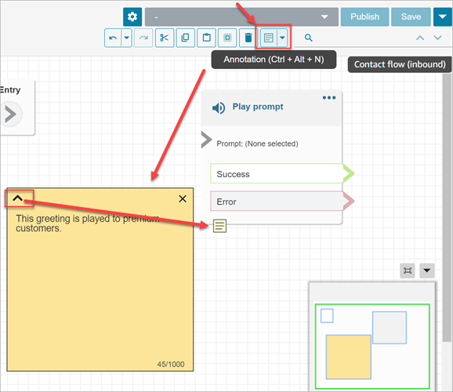
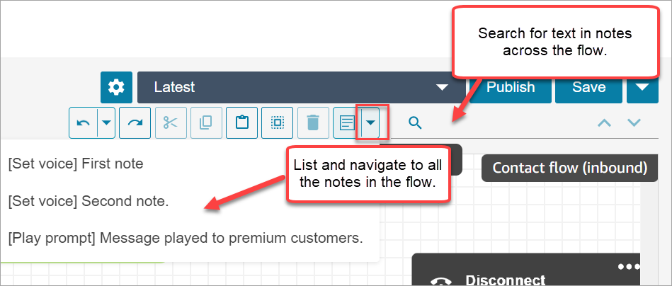

# Add comments to a flow block in the flow designer

in Amazon Connect

To add notes to a block, on the toolbar choose **Annotation**. Or,
with your cursor on the flow designer canvas, use the shortcut keys: Ctrl + Alt +N. A
yellow box opens for you to type up to 1000 characters. This enables you to leave
comments that others can view.

The following image shows the flow designer toolbar, the annotation box, and an
annotation that is attached to a block.

The following GIF shows how to move notes around the flow designer and attach them to
a block.

The following image shows the dropdown menu that allows you to view a list of all the
notes in a flow. Choose a note to navigate to it. Use the search box to search notes
across the flow.

Note the following functionality:

- Unicode and emojis are supported.
- You can copy and paste, undo, and redo into the note box.
- You can search notes across the flow.
- When a block is deleted, the notes are deleted. When a block is restored, the
  notes are restored.

## Limits

| Item             | Limit                    |
| ---------------- | ------------------------ |
| Character limit  | 1000 characters per note |
| Attachment limit | 5 notes per block        |
| Note limit       | 100 notes per flow       |
