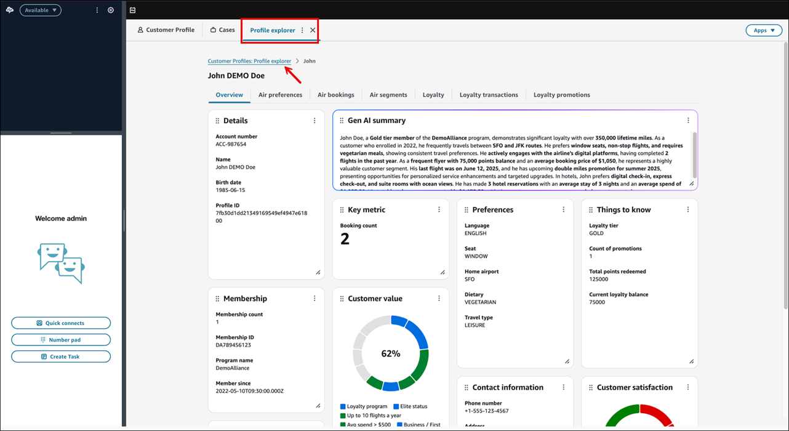
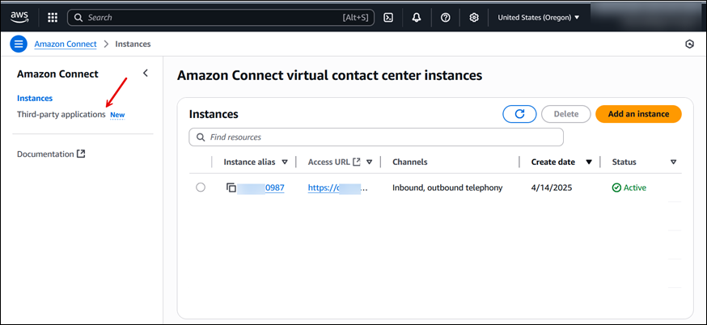
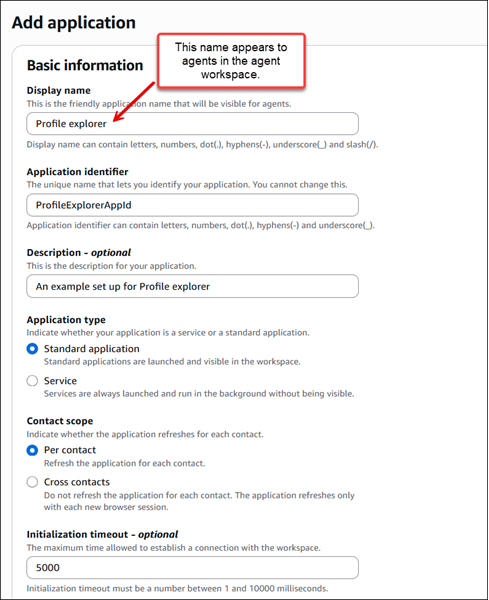
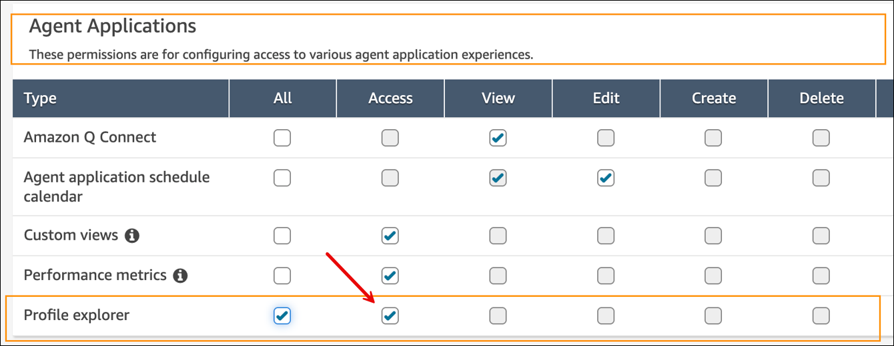
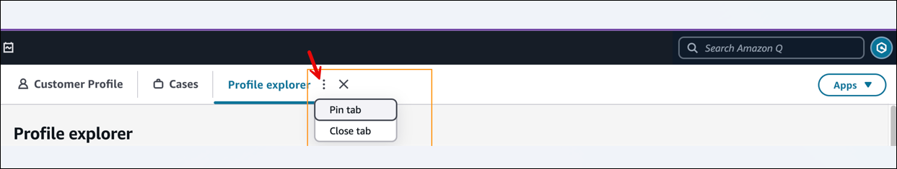

# Add Profile explorer to the

agent workspace

By default users who have the appropriate [security profile permissions](enabling-profile-explorer.md "enabling-profile-explorer.md") can view Profile explorer on the Amazon Connect admin website. You may
also want your agents to have access to Profile explorer in their agent workspace. This
topic explains how to do that.

The following image shows an example of Profile explorer in the agent workspace.



## Create the Profile explorer

layout you want to share with agents

Here's a high-level overview:

1. Ensure you have the [security profile permissions](enabling-profile-explorer.md "enabling-profile-explorer.md")
   to create a Profile explorer layout.
2. Follow the instructions in [Get started with Amazon Connect Customer Profiles Profile
   Explorer](getting-started-profile-explorer.md "getting-started-profile-explorer.md")
   to create and save the layout you
   want to share with agents.

## Add Profile explorer to Amazon Connect as a third-party

app

1. On the Amazon Connect console, in the left navigation, choose **Third-party
   applications**, as shown in the following image.

 2. On the **Third-party applications** page, choose
**Add application**. 3. On the **Add application** page, complete following
fields in the **Basic information** section:

    1. **Display name**: A friendly name for
     the application. **This name is displayed to your agents on
     the tab in the agent workspace**. It is also displayed
     on security profiles. You can come back and change this name.
    2. **Application identifier**: The
     official name that is unique for your application. If you have only
     one application per access URL, we recommend that you use the origin
     of the access URL. You cannot change this name.
    3. **Description (optional)**: You may
     optionally provide any description for this application. This
     description is not displayed to agents.
    4. **Application type**: Choose
     **Standard application**.
    5. **Contact Scope**: Choose
     **Per contact**. This is a required setting for
     incoming call support.
    6. **Initialization timeout**: The
     maximum time, in milliseconds, allowed to establish a connection
     with the workspace.The following image shows the configuration of these fields.

Initialization timeout is set to 5 seconds.

 4. In the **Access** section, complete the following
fields:

    1. **Access URL**: This is the URL where your application is hosted. The
     URL must be secure, starting with https, unless it's a local
     host.


    ###### Important

    The URL must contain `?_appLayoutMode=embedded`.
     For example:

    `https://{CONNECT_INSTANCE}/customer-profiles/profile-explorer?_appLayoutMode=embedded`

    If you don't include `?_appLayoutMode=embedded`,
     the left navigation from the Amazon Connect admin website appears in the agent
     workspace.

    For more details about what is allowed for this field, see
     [How to integrate a third-party
     application](3p-apps.md#onboard-3p-apps-how-to-integrate "3p-apps.md#onboard-3p-apps-how-to-integrate").
    2. **Approved origins - optional**: Allowlist URLs
     that should be permitted, if different than the access URL. The URL
     must be secure, starting with https, unless it's a local
     host.

5. Completing the next two sections—**Permissions**
   and **Iframe configuration**—is optional and not
   required to add the Profile explorer to the agent workspace. For information
   about these sections, see [How to integrate a third-party
   application](3p-apps.md#onboard-3p-apps-how-to-integrate "3p-apps.md#onboard-3p-apps-how-to-integrate").
6. **Instance association**: Choose the instance
   your agents are using.

You can give any instance(s) within this account-region access to this
application. 7. Choose **Add application**.

## Assign agents permission to the new

security profile

In this step you need to assign agents permissions to access the new third-party
application AND view permission to the Profile explorer.

1.  In the Amazon Connect admin website, navigate to the **Agent** security profile.
2.  On the **Edit security profile** page, assign the
    following permissions:

        * **Customer Profiles** - **Profile
         explorer** - **View**
        * **Agent Applications** - **name of your
         third-party app** - **Access**

    The following image shows an example of permissions added for a new
    third-party application named **Profile explorer**.



## Tell agents to pin the new

application

Using your normal communication method, tell agents to pin the new application to
their agent workspace. This allows them to access Profile explorer across workspace
instances.

- In the agent workspace, choose the more icon, then choose **Pin
  tab**, as shown in the following image.



## Supported functionality

After you complete the above steps, Profile explorer supports lookups on incoming
contacts. The following are supported:

- Phone and chat: Full support
- Custom contact attributes: Full support for user-defined attributes
  that Profile explorer reads. You can set user-defined attributes within a flow to support any
  customer use case. For example:

```
{
"profileSearchKey": "_phone",
"profileSearchValue": "<Phone number>" }

```

For more information, see [Automatically populate customer
profiles](auto-pop-customer-profile.md "auto-pop-customer-profile.md").
