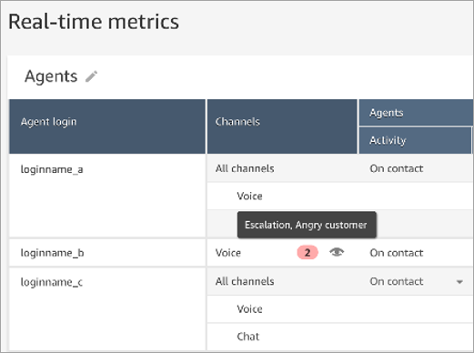
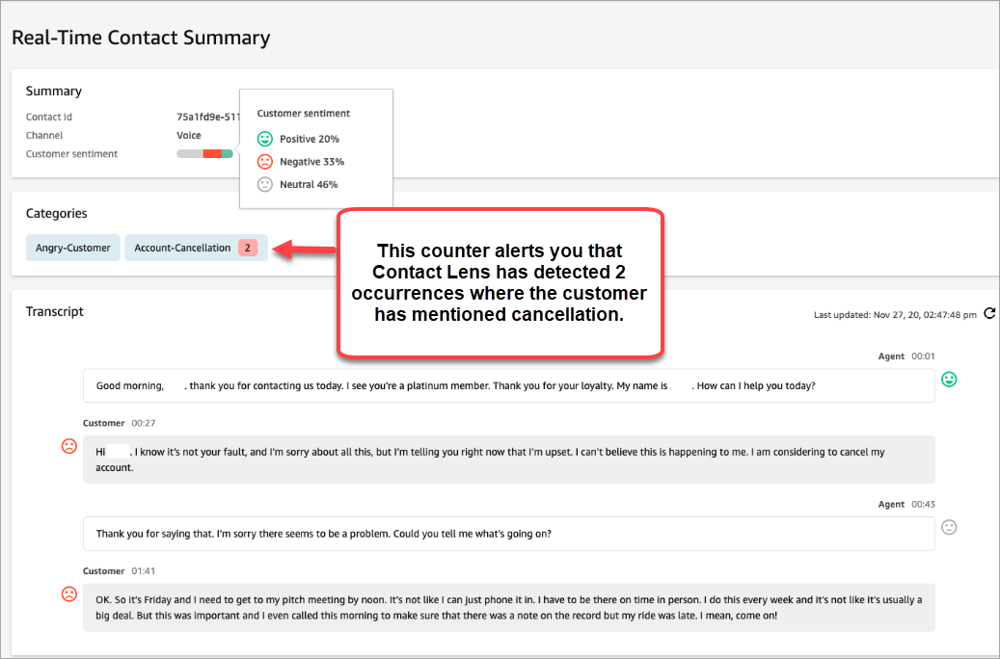

# Add real-time alerts to

Contact Lens for supervisors based on keywords and phrases in a
call

After you [enable real-time analytics](enable-analytics.md "enable-analytics.md")
in your flow, you can add rules that automatically alert supervisors when a
customer experience issue occurs.

For example, Contact Lens can automatically send an alert when certain
keywords or phrases are mentioned during the conversation, or when it detects
other criteria. The supervisor sees the alert on the real-time metrics
dashboard. From there, supervisors can listen in to the live call, and provide
guidance to the agent over chat to help them resolve the issue faster.

The following image shows an example of what a supervisor would see on the
real-time metrics report when they get an alert. In this case,
Contact Lens has detected an angry customer situation.

When the supervisor listens in to a live call, Contact Lens provides
them with a real-time transcript and customer sentiment trend that helps them
understand the situation and assess the appropriate action. The transcript also
eliminates the need for customers to repeat themselves if they are transferred
to another agent.

The following image shows a sample real-time transcript.

## Add rules for real-time

alerts for calls

1. Log in to Amazon Connect with a user account that is assigned the
   **CallCenterManager** security profile, or that
   is enabled for **Rules** permissions.
2. On the navigation menu, choose **Analytics and
   optimization**, **Rules**.
3. Select **Create a rule**,
   **Conversational analytics**.
4. Assign a name to the rule.
5. Under **When**, use the dropdown list to choose
   **real-time analysis**.
6. Choose **Add condition**, and then choose the
   type of match:
   - **Exact Match**: Finds only the exact
     words or phrases.
   - **Pattern Match**: Finds matches that may
     be less than 100 percent exact. You can also specify the
     distance between words. For example, you might look for
     contacts where the word "credit" was mentioned, but you do
     not want to see any mention of the words "credit card." You
     can define a pattern matching category to look for the word
     "credit" that is not within a one-word distance of the word
     "card."

###### Tip

Semantic Match isn't available for real-time analysis. 7. Enter the words or phrases, separated by a comma, that you want to
highlight. Real-time rules only support any keywords or phrases that
**were mentioned**.

 8. Choose **Add**. Each word or phrase separated by
a comma gets its own line.

The logic that Contact Lens uses to read these words or
phrases is: (Talk OR to OR your OR manager) OR (this OR is OR not OR
helpful) OR (speak OR to OR your OR supervisor), etc. 9. To add more words or phrases, choose **Add group of words
or phrases**. In the following image, the first group
of words or phrases are what the agent might utter. The second group
is what the customer might utter.

    1. In this first card, Contact Lens reads each line as
     an OR. For example: (Hello) OR (thank OR you OR for OR
     calling OR Example OR Corp) OR (we OR value OR your OR
     business).
    2. The two cards are connected with an AND. This means, one
     of the rows in the first card needs to be uttered AND then
     one of the phrases in the second card needs to be
     uttered.

The logic that Contact Lens uses to read the two cards of
words or phrases is (card 1) AND (card 2). 10. Choose **Add condition** to apply the rules
to:

    * Specific queues
    * When contact attributes have certain values
    * When sentiment scores have certain values

For example, the following image shows a rule that applies when an
agent is working the BasicQueue or Billing and Payments queues, the
customer is for auto insurance, and the agent is located in
Seattle.

 11. When done, choose **Next**. 12. In the **Assign contact category** box, add a
name for the category. For example, **Compliant**
or **Not_Compliant**. 13. Choose **Next**, then choose **Save and
publish**.
