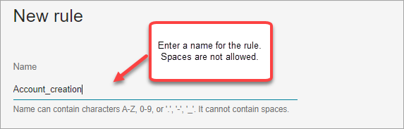
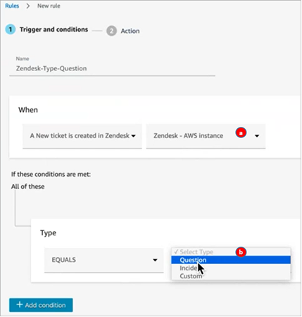
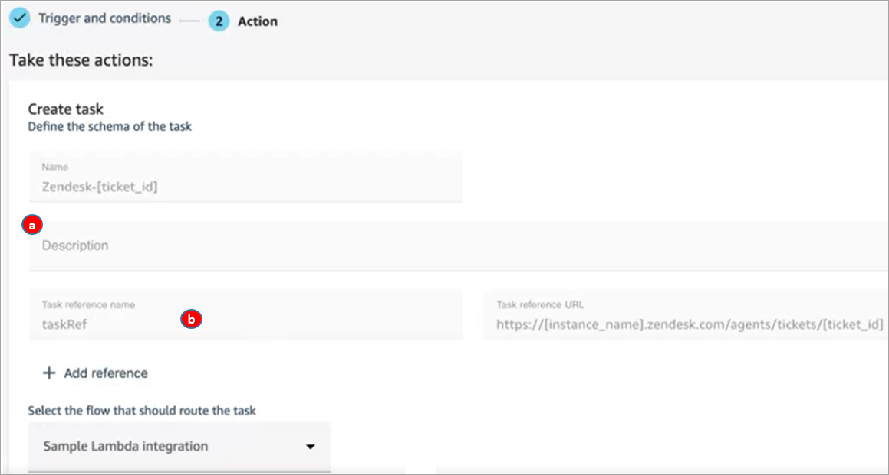

# Create rules that generate tasks for third-party

integrations in Amazon Connect

After you set up an external application to generate tasks automatically, you need to
build rules that tell Amazon Connect when to create tasks, and how to route them.

1. Log in to Amazon Connect with a user account that is assigned the
   **CallCenterManager** security profile, or that is enabled for
   **Rules** permissions.
2. In Amazon Connect, on the navigation menu, choose **Rules**.
3. On the **Rules** page, use the **Create a rule**
   dropdown list to choose **External application**.
4. At the **Trigger and conditions** page, assign a name to the
   rule. Spaces are not allowed in the name of a rule.

 5. Choose the event that will generate a task, and the instance of the external
application where the event must occur. For example, the following image shows the trigger is when
a new ticket is created in Zendesk. The condition that must be met is when
the type equals a question. Then a task is generated.

    1. Select the instance for the external application.
    2. Choose the conditions that must be met to generate the task.

6. Choose **Next**.
7. On the **Action** page, specify the task to be generated when the
   rule is met, as shown in the following image

    1. The description of the task appears to the agent in their Contact Control
     Panel (CCP).
    2. The task reference name appears to the agent as a link to the specified
     URL.

8. Choose **Save**.

## Test the rule

1. Go the external application and create the event that initiates the action.
   For example, in Zendesk, create a ticket that's type
   **Question**.
2. Go to **Analytics and optimization**, **Contact
   search**.
3. Under **Channel**, choose **Task**, and then
   choose **Search**.
4. Verify the task was created.
