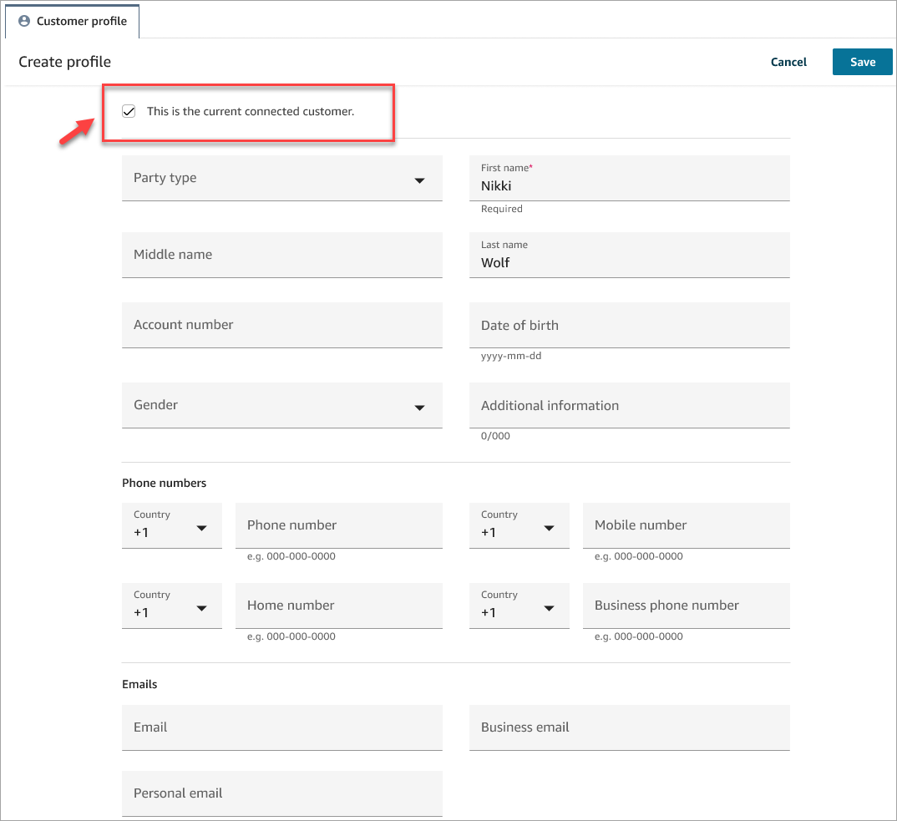
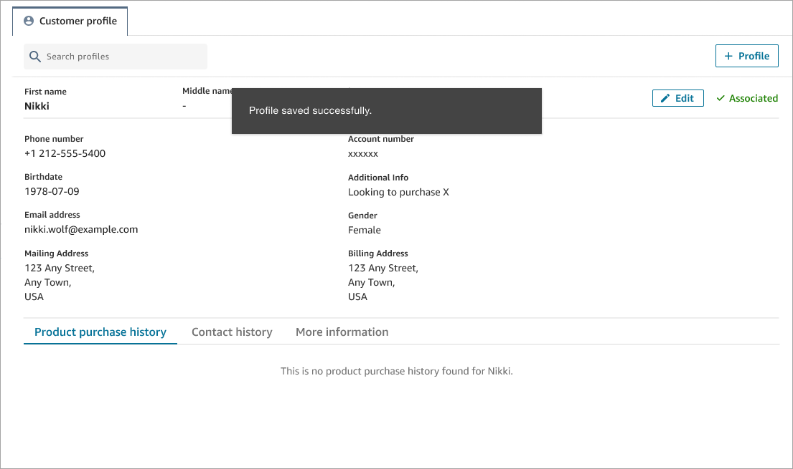

# Create a new customer profile in the Amazon Connect agent

workspace

Let's say you're on a chat and there's no customer profile for the contact. You
can create a new customer profile for them.

1. Choose **Create profile**.

 2. Choose **This is the current connected customer**. This
tells Amazon Connect to link the customer profile to the contact ID for the current
customer.

If you don't select this check box, the profile isn't associated with the
current contact. This is useful when a contact is calling from someone
else's number.

Enter information in the required boxes, and then choose
**Save**.

###### Tip

Agents can use any of these customer Identifiers in the Agent
Workspace to find the profile that belongs to the customer on the
interaction.

 3. You'll receive a verification page that the contact has been
created.

 4. You can continue the conversation with the
customer.
