# Accept incoming contacts with Amazon Connect Customer

Profiles

When a call or chat is connected to your Contact Control Panel (CCP), Amazon Connect Customer Profiles, in the
same browser window, automatically populates the customer profile that may match the
incoming phone number for a voice interaction and _Name_ for a chat
interaction.

###### Tip

You can change autopopulation behavior if you wish. For more information, see
[Use contact
attributes to autopopulate customer profiles](auto-pop-customer-profile.md "auto-pop-customer-profile.md").

Before agents can access customer profiles, the Amazon Connect administrator must enable the
Customer Profiles feature, grant agents the appropriate permissions, and integrate
Customer Profiles into your agent workspace. For more information, see [Enable Customer Profiles for your Amazon Connect instance](enable-customer-profiles.md "enable-customer-profiles.md").

###### Contents

- [Auto-populate the
  customer profile](#example1-select-customer-profile "#example1-select-customer-profile")
- [Accept incoming
  contact, no customer profile found](#example2-select-customer-profile "#example2-select-customer-profile")
- [Search when not on
  contact](#example3-select-customer-profile "#example3-select-customer-profile")
- [Autopopulate results in multiple profiles found](#example4-autopop-multiple-customer-profiles "#example4-autopop-multiple-customer-profiles")
- [Create a new customer
  profile](ag-cp-create.md "ag-cp-create.md")
- [Search for a customer profile in the agent
  workspace](ag-cp-search.md "ag-cp-search.md")

## Example 1: Auto-populate the

customer profile

As soon as Amazon Connect Customer Profiles matches the phone number (voice) or customer
name (chat) with an existing customer profile, it automatically displays the profile
even though you may not have accepted the contact yet.

The following image shows what your Contact Control Panel (CCP) may look like when
there's an incoming chat. A customer profile has been found that matches the
customer, and Amazon Connect is loading the data.

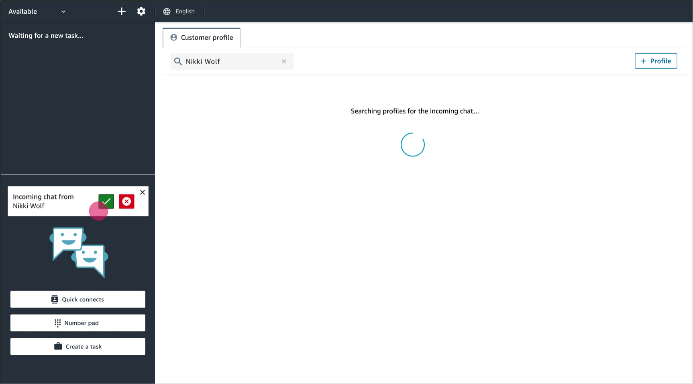

This next example shows what it might look like after you've accepted and joined
the chat, and Amazon Connect displays the customer's profile. In this case, Amazon Connect found the
customer's profile based on their email address. If this were a voice call, by
default Amazon Connect would match the customer's profile based on their phone number. Your
IT department can [customize](auto-pop-customer-profile.md "auto-pop-customer-profile.md") this
behavior to search for the profile based on other information about the
contact.

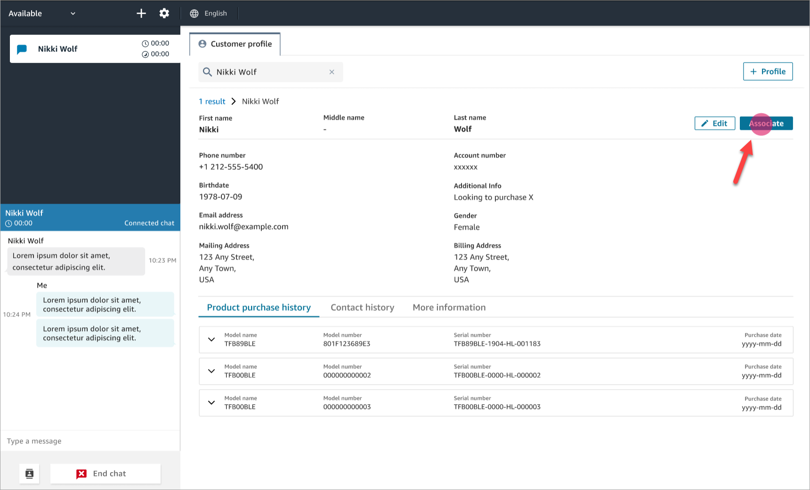

- Choose **Associate** to associate the contact record of
  the current contact with the customer profile, and then choose
  **Confirm**.

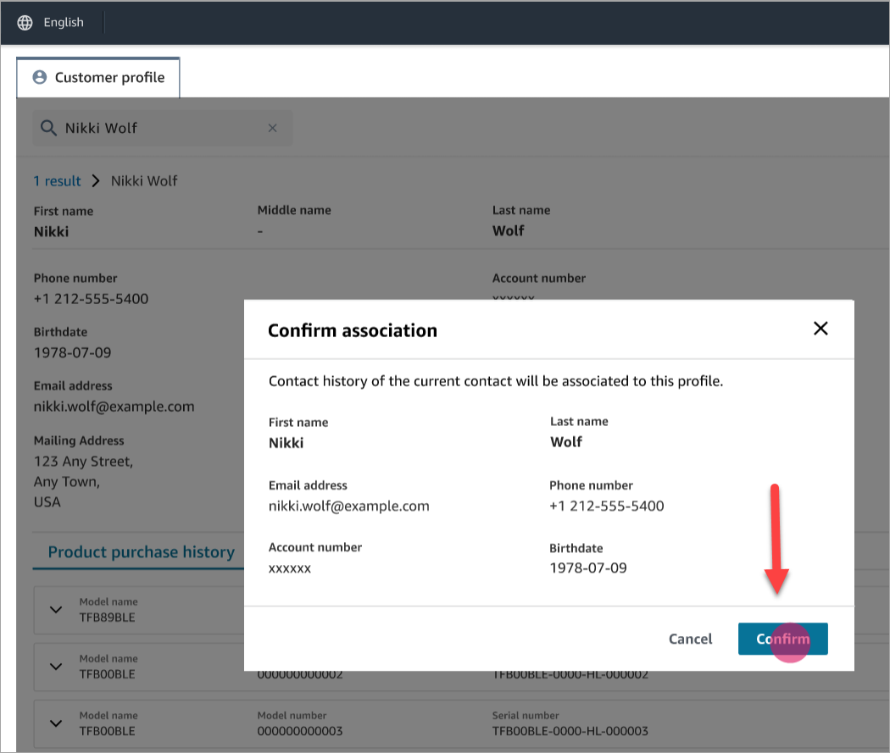

- If you choose **Associate** by mistake, you can continue
  to browse other customer profiles, and associate the contact with a
  different customer profile. Or, if you have been [assigned Create
  permission](assign-security-profile-customer-profile.md "assign-security-profile-customer-profile.md"), you can create a new profile.

You can associate a contact with customer profile multiple times during an
interaction, including during After Contact Work (ACW) time. Only the most
recent association remains, before you clear the contact.

## Example 2: Accept incoming

contact, no customer profile found

If no results are returned when a call or chat comes in, do the following:

1. Search for the customer's profile using any search key available in the
   search drop down menu. For example: phone, name, email, account id, or any
   [custom search terms](create-object-type-mapping.md#step2-how-to-map-attributes "create-object-type-mapping.md#step2-how-to-map-attributes") you specify. For example, if you have
   _Social security number_ (SSN) defined as one of your
   identifiers, SSN will automatically be available as a search term for agents
   to use in the Agent Workspace.

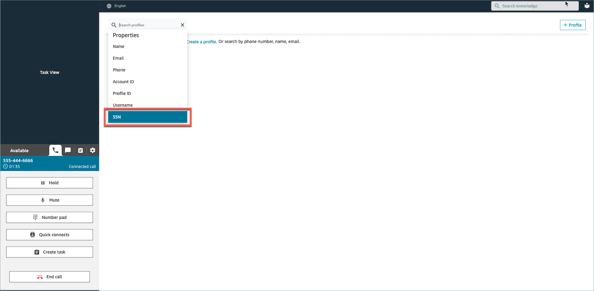

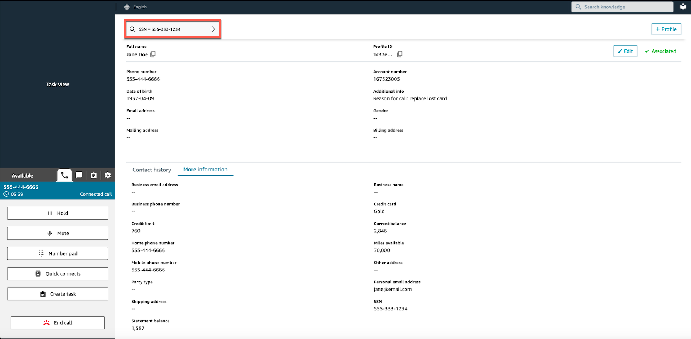 2. If no customer profile is found, [create a new
profile](ag-cp-create.md "ag-cp-create.md") for the contact. The only required information is first
name.

In the following image, the agent searched for **John Doe**. No
matches were found so they chose **Create profile**.

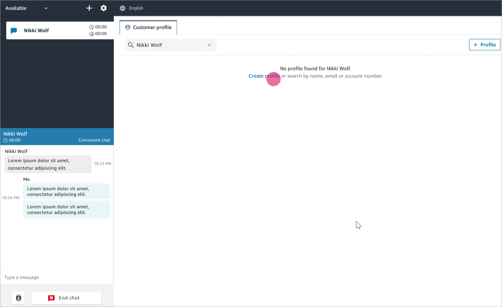

## Example 3: Search when not on

contact

When there are no incoming contacts, you can search for customer profiles using
any search key available in search drop down menu. For example, phone, name, email,
or account id. For example, you might want to use this time to search for previous
contacts, or completing a profile.

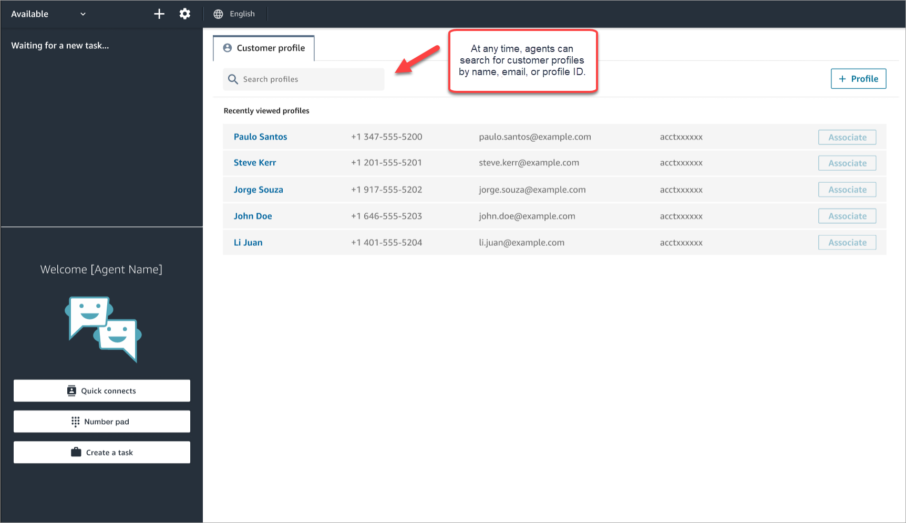

## Example 4:

Autopopulate results in multiple profiles found

In some cases, multiple profiles may be returned for the same call or chat. Use
the profile information to verify the customer's identity. For example, ask the
customer to verify their email address or account number, and then associate the
contact with the right customer profile. Agents can also ask customers for
additional information they can use in search and identify the right profile in
order to associate it to the interaction.

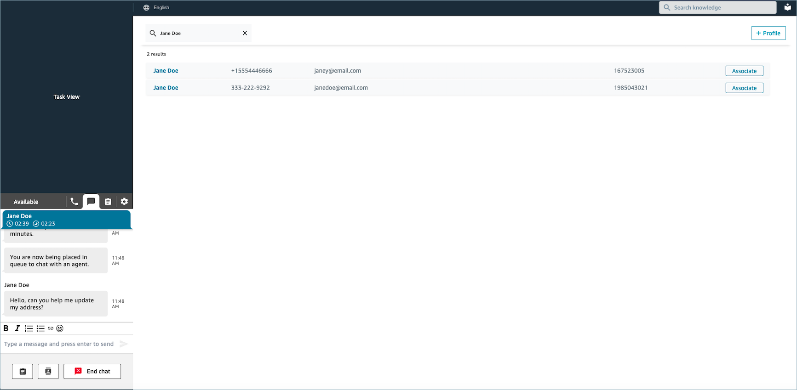

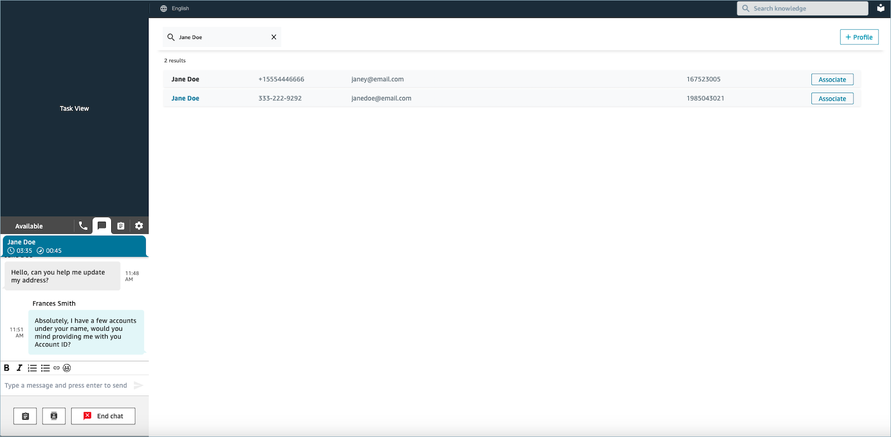

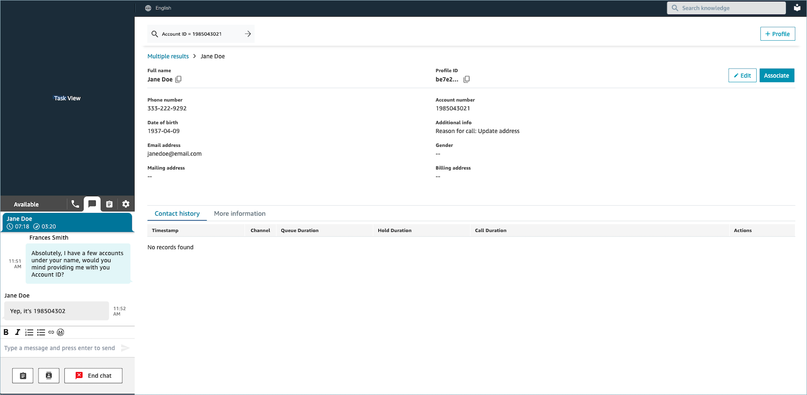

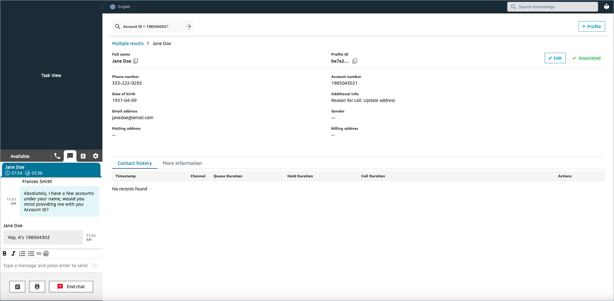
