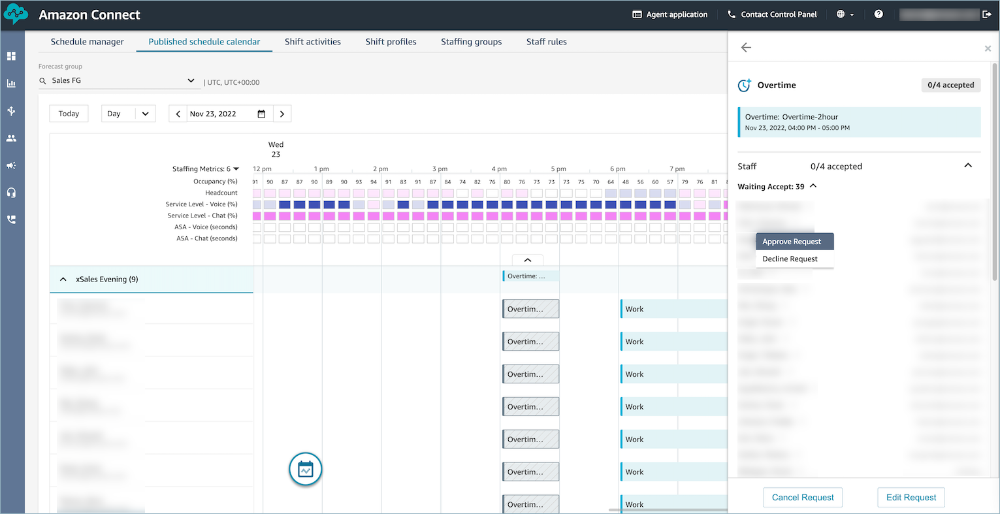
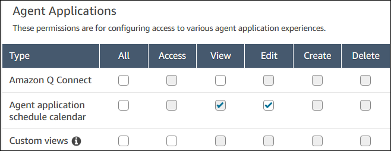
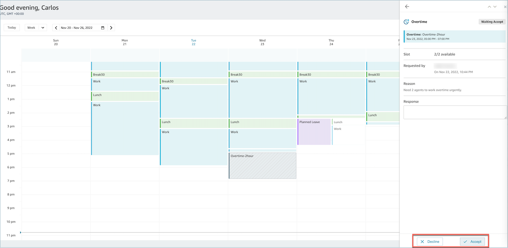

# How contact center agents accept or

decline a time off request

The contact center manager and agents will see the pending voluntary time off
requests in the agent calendars.

Agents can accept or decline voluntary time off (VTO) in the Agent application
schedule calendar. To do this, agents need **Edit** security
profile permissions. For more information about security profile permissions, see
[Update security
profiles](update-security-profiles.md "update-security-profiles.md").

## Required security profile

permissions

To accept or decline the request, an agent must have **Agent
application schedule calendar - Edit** permissions in their
security profile. This permission is shown in the following image of
Agent Applications permissions on the security profiles
page.

## Accept and Decline

buttons for agents

The following image shows the **Accept** and
**Decline** buttons on the agent application.

