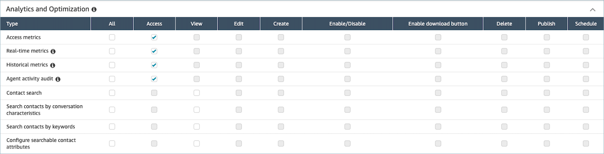
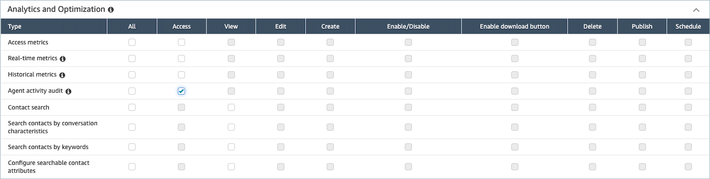

# Agent activity audit report in

Amazon Connect

The agent activity audit is like a report version of the [agent event stream](agent-event-streams.md "agent-event-streams.md"). All of the data in this
report is also in the agent event stream.

For example, if there's something in the audit report you want to recreate, or if
you want to recreate a different time period, you can do so using the agent event
stream.

###### Contents

- [Run the agent activity audit
  report](#access-agent-activity-audit "#access-agent-activity-audit")
- [Status definitions](#agent-activity-status-definitions "#agent-activity-status-definitions")
- [When is the status Agent
  Disconnected, Contact Missed, or Rejected?](#rejected-missed-disconnected "#rejected-missed-disconnected")
- [Required
  permissions](#agent-activity-audit-permissions "#agent-activity-audit-permissions")
- [Agent activity audit tag-based access control](agent-activity-audit-tag-based-access-control.md "agent-activity-audit-tag-based-access-control.md")

## Run the agent activity audit

report

For a list of required permissions to perform this procedure, see [Assign
permissions](dashboard-required-permissions.md "dashboard-required-permissions.md").

1. Log in to the Amazon Connect admin website at https://`instance name`.my.connect.aws/.
2. Choose **Analytics and optimization**,
   **Historical metrics**,
   **Agents**, **Agent activity
   audit**.
3. Choose the agent login, date, and timezone, and then choose
   **Generate Report**.
4. To download the results, choose **Download
   CSV**.

## Status definitions

The following values may appear in the **Status** column on
agent activity audit report.

- **Available**: The agent has set their status in the
  Contact Control Panel (CCP) to **Available**. Contacts
  can be routed to them.
- **Offline**: The agent has set their status in the
  Contact Control Panel (CCP) to **Offline**. Contacts
  can not be routed to them.
- **Custom status**: The agent has set their status in
  the Contact Control Panel (CCP) to a custom status. Contacts can not be
  routed to them.
- **Joining Customer**: The state between an inbound
  contact arriving in the flow and routing to the agent.
- **Connecting Agent**: The state between an inbound
  contact being routed to an agent and the agent receiving the
  contact.
- **Connected**: When an inbound contact has been
  established by the agent choosing **Accept** in their
  CCP.
- **Busy**: The agent is interacting with a
  customer.
- **Agent Disconnected**: When the agent doesn't choose
  **Accept** on the inbound voice contact in 20
  seconds, or they choose **Reject**.
- **Calling Customer**: The state before an outbound
  call is established.
- **Contact Missed**: When the agent misses a chat or
  task contact.
- **Missed Call Agent**: When an agent accepts a
  callback, but they end the call before ringing the customer has
  finished.
- **Paused**: When a contact has been paused after
  being connected to an agent using the CCP or public API.
- **Telecom issue**: When an outbound call is ended
  before the call is established. For example, there was an error with the
  agent's soft phone connection.

###### Note

If a status appears in your report but is not listed on this page, it is a
custom status created by your organization. Contact your Amazon Connect
admin to learn the definition.

## When is the status Agent

Disconnected, Contact Missed, or Rejected?

Following is a summary of when the **Status** column can be
**Agent Disconnected**, **Contact
Missed**, or **Rejected**:

- Voice contact
  - When anyone misses a voice contact, the status in the agent
    audit is **Agent Disconnected**.
  - When anyone rejects a voice contact, the status in the agent
    audit is **Agent Disconnected**.

- Chat contact
  - When anyone misses a chat contact, the status in the agent
    audit is **Contact Missed**.
  - When anyone rejects a chat contact, the status in the agent
    audit is **Contact Missed**.

- Task contact
  - When anyone misses a task contact, the status in the agent
    audit is **Contact Missed**.
  - When anyone rejects a task contact, the status in the agent
    audit is **Rejected**.

- Email contact
  - When anyone misses an email contact, the status in the agent
    audit is **Contact Missed**.
  - When anyone rejects an email contact, the status in the agent
    audit is **Rejected**.

## Permissions required to view

agent activity audit reports

To view real-time metrics reports, you need to be assigned to a security
profile that has either the **Access metrics - Access**
permission or the **Real-time metrics - Access** permission.
Note the following behavior when you assign these permissions:

- When **Access metrics - Access** is selected, the
  **Real-time metrics**, **Historical
  metrics**, and **Agent activity audit**
  permissions are also automatically assigned.
- When **Access metrics - Access** is assigned, you
  have access to all real-time and historical metrics reports.

If only **Agent activity audit - Access** is selected, you
have access to only agent activity audit report and no other analytics pages or
reports. The following image shows the **Analytics and
Optimization** section, with only **Agent activity audit -
Access** selected.

