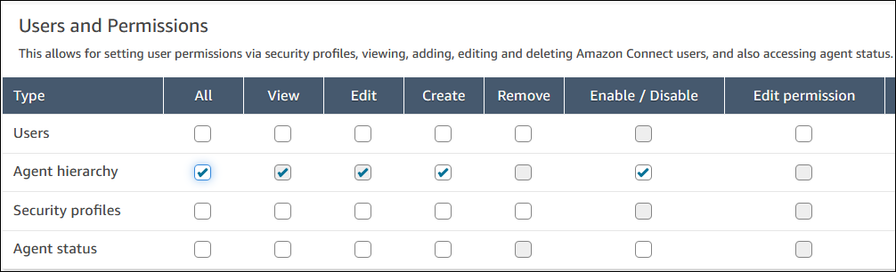
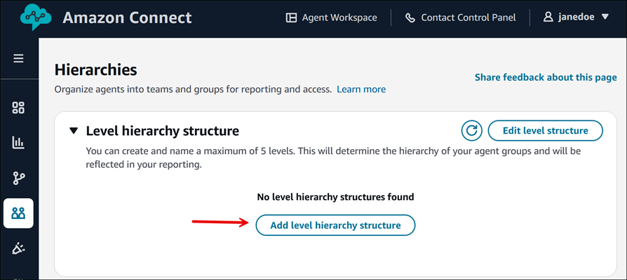
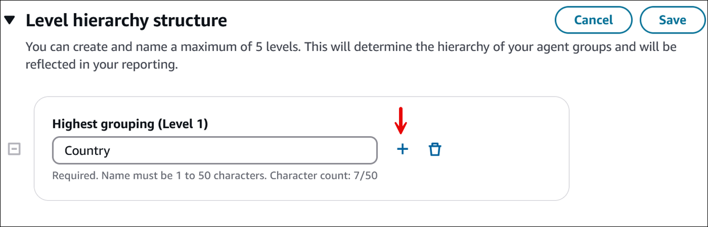
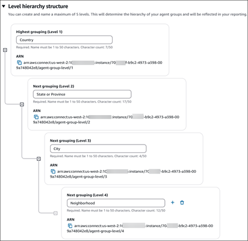
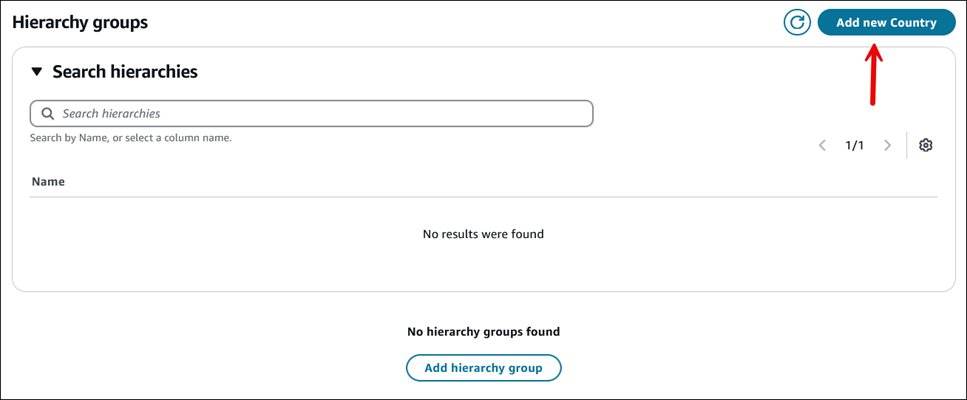
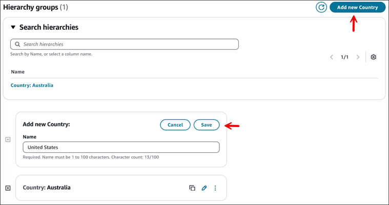
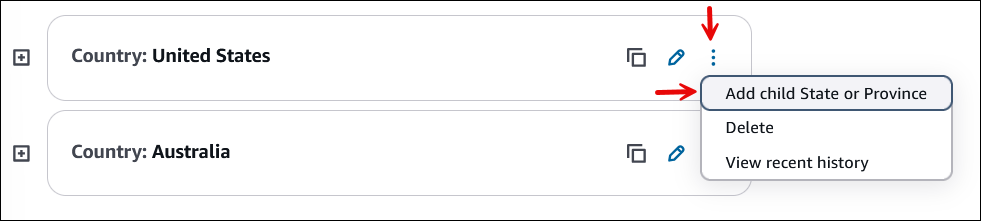
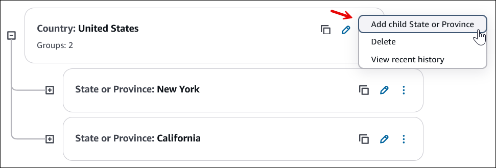
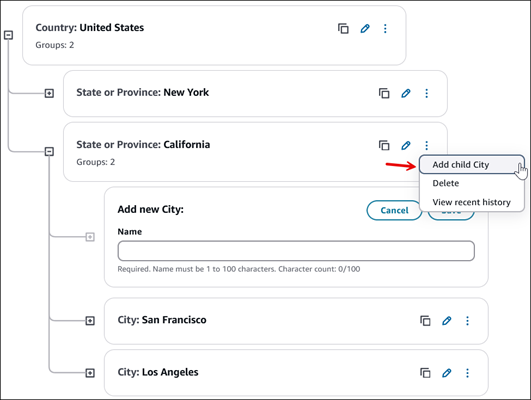
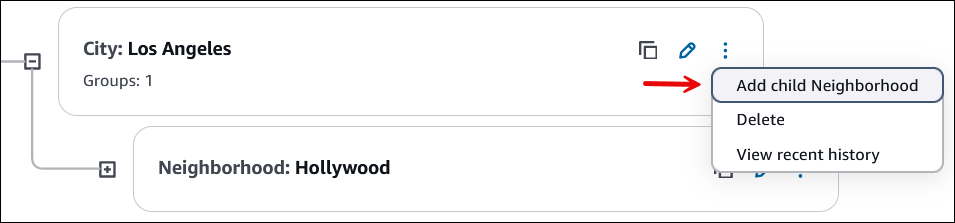

# Organize agents into teams and groups for reporting

and access by creating hierarchies

Agent hierarchies are a way for you to organize agents into teams and groups for
reporting purposes. It's useful to organize them based on their location and their skill
sets. For example, you might want to create large groups, such as all agents who work on
a specific continent, or smaller groups such as all agents working in a specific
department.

You can also configure hierarchies with up to five levels, and segment agents or
teams. Here are a couple of things to note about using hierarchies:

- Removing agents from a level affects historical reporting.
- When you use the **Restrict contact access** security profile
  permission, you can restrict contact search results based on the agent's
  hierarchy. For more information, see [Manage who can search for
  contacts and access detailed information](contact-search.md#required-permissions-search-contacts "contact-search.md#required-permissions-search-contacts").

###### Contents

- [Required permissions](#permissions-agent-hierarchy "#permissions-agent-hierarchy")
- [Define your organization's hierarchy
  levels](#new-agent-hierarchy "#new-agent-hierarchy")
- [Define groups and teams in your
  hierarchy](#add-groups-teams-agents-hierarchy "#add-groups-teams-agents-hierarchy")
- [Delete an agent hierarchy](#delete-agent-hierarchy "#delete-agent-hierarchy")

## Required permissions

To create agent hierarchies, you need to be assigned to a security profile that
has the **Users and Permissions** - **Agent
hierarchy** - **Create** permission.

###### Note

Since agent hierarchies may include location and skill set data, you also need
**Agent hierarchy** - **View** permission
to view the agent hierarchy information in a real-time metrics report.

The following image shows the **Users and Permissions - Agent
hierarchy** permissions on the **Security profile
permissions** page.

## Define your organization's hierarchy

levels

You can specify up to 5 levels or tiers for your organization's hierarchy groups.
For example, if your teams are organized by geography your levels might be
Continent, Country, Region, State, Team. Levels need to be put in place before you
can describe the groupings that you want to assign agents and other users to.

1. Log in to the Amazon Connect admin website with an **Admin** account, or an
   account assigned to a security profile that has **Users and
   Permissions** - **Agent hierarchy** -
   **Create** permission.
2. Choose **Users**, **Hierarchies**, and
   then choose **Add level hierarchy structure**, as shown in
   the following image.

 3. Enter a name for the first level. Choose the **+** icon
to add another level, such as Level 2, Start or Province. You can add up to
five levels. In the following image, we've named Level 1
**Country**.

The following image shows a hierarchy structure with four levels for
Country, State or Province, City, Neighborhood.

###### Tip

After you [add
groups](#add-groups-teams-agents-hierarchy "#add-groups-teams-agents-hierarchy") to these levels, you must delete the groups before you
can delete the level. 4. Choose **Save** to apply the changes, or
**Cancel** to undo them. If the
**Save** button isn't active, you don't have [permissions](#permissions-agent-hierarchy "#permissions-agent-hierarchy") in your
security profile to create or edit the agent hierarchy.

## Define groups and teams in your

hierarchy

After you create hierarchy levels, you can add the groups that call within each,
from the top down.

1. Scroll down the **Hierarchies** page to the
   **Hierarchy groups** section. Choose **Add new
   `Level1_Name`**. For example, in
   the following image the name of Level 1 is **Country**.

 2. Enter the name for the group, such as Australia, and then choose
**Save**. Choose **Add new Country**
to add another country. The following image shows we added Australia and
United States.

 3. Next to the name of the group, choose **Add child State or
Province**, as shown in the following image.

Choose **Add child State or Province** each time you want
to add a group to level 2. When you're done, choose
**Save**.

The following image shows we added New York and California.

 4. For each state, choose **Add child City** each time you
want to add group to level 3. When you're done, choose
**Save**. The following image shows we added Los
Angeles and San Francisco.

 5. Choose **Add child Neighborhood** to add groups to Level
4, as shown in the following image. We added Hollywood to Los Angeles.

Choose **View historical changes** to view the change history.
You can filter changes by date (between two dates) or by user name. If you cannot
see the link, ensure that you have the proper permissions to view these
changes.

## Delete an agent hierarchy

###### Important

Deleting a hierarchy level severs the link to existing contacts. This action
can not be reversed.
